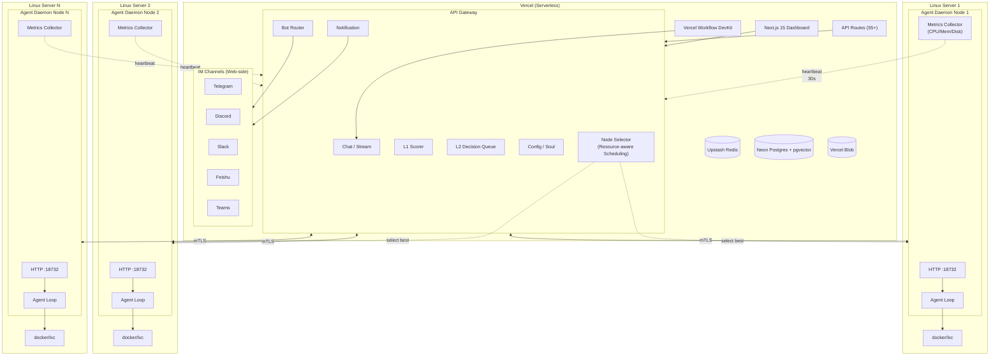

# AgentBoster (WIP)

<p align="center">
	
</p>

<p align="center">
	<a href="./README.md">中文: README</a>
</p>

<p align="center">
	
	
	
	
</p>

> [!NOTE]
>
> Until version 1.0 is released, I suggest you treat this as a preview. We cannot guarantee backwards compatibility at this stage.
>
> 在版本号没有达到 1.0 之前，我建议你可以把本项目当作一个尝鲜，我们不保证向前的兼容性。


AgentBoster is a **Serverless AI Agent platform** consisting of two parts:

- **AgentBoster Web** — A Next.js 15 frontend Dashboard deployed on Vercel, providing chat UI, configuration management, IM Bot adapters, and Vercel Workflow DevKit-powered persistent agent execution
- **Agent Daemon** — A Go 1.26 Linux daemon running on the user's server, providing sandbox execution, security review, and task scheduling. The Daemon does not interact with IM or send notifications; all IM notifications are handled by AgentBoster Web

AgentBoster covers the core features you need from an AI Agent: Chat, Skills, Memory (RAG), Soul, Multi-Channel Bot (Telegram/Discord/Slack/Feishu/Teams), MCP, Sandbox, Workflow — and it's **Serverless**.

---

## Architecture



---

## Project Structure

```
app/                     # Next.js App Router pages & API routes
├── (auth)/              #   Login
├── (chat)/              #   Chat, files, schedules
├── (config)/            #   Config, monitoring, audit logs
├── (memory)/            #   Memory/RAG management
├── (schedule)/          #   Schedule management
├── (skill)/             #   Skill management
├── api/                 #   Public API
│   ├── agentd/v1/       #     Daemon callbacks (L1/L2)
│   ├── bot/[secret]/    #     IM webhooks
│   ├── config/          #     Config, audit, monitoring
│   ├── notifications/   #     Notifications
│   ├── pair/            #     Daemon pairing
│   ├── sandbox/         #     Sandbox tools
│   ├── sessions/        #     Session revert
│   ├── soul/            #     Agent persona
│   └── tasks/           #     Task history
├── (chat)/api/          # Daemon-facing API (35+ endpoints)
│   ├── agentd/v1/       #     Agent config, blob, health,
│   │                    #     rules, notifications, sandboxes,
│   │                    #     sessions, tasks, workspaces, memory
│   └── ai/              #     AI chat, stream, message, pause, status
└── .well-known/workflow/#   Workflow DevKit callbacks (no auth)
components/              # React components (shadcn/ui)
├── ui/                  #   shadcn/ui primitives (19)
├── config/              #   Config forms
└── ...                  #   Chat, messages, sidebar, timelines
lib/                     # Core logic
├── ai/                  #   AI SDK provider factory (Anthropic/Google/OpenAI)
├── auth/                #   Auth (bcryptjs, cookies)
├── bot/                 #   Bot adapters & webhook routing
├── chat/                #   Chat transport, streaming, slash commands
├── core/                #   Infrastructure: DB (Drizzle+Neon), KV (Redis), Blob, Sandbox
├── extra/               #   Server-side business logic
│   ├── agent/           #     Daemon client, parallel exec, skills
│   ├── auth/            #     API keys, JWT, users
│   ├── channels/        #     TG/Discord/Slack/Feishu adapters
│   ├── config/          #     Config management
│   ├── cron/            #     Cron scheduling
│   ├── memory/          #     Memory management
│   ├── prompts/         #     System prompt fragments
│   ├── sandbox/         #     Vercel Sandbox management
│   └── security/        #     L0/L1/L2 security engine
├── mcp/                 #   Built-in MCP (Context7, Firecrawl, GitHub, Web)
├── memory/              #   Memory: builtin, RAG long-term, session
├── security/            #   Web-side security (L1 scorer, L2 queue)
├── utils/               #   Utilities
└── workflow/            #   Vercel Workflow DevKit
    ├── agent/           #     Agent workflow (hooks/steps/tools/security)
    └── scheduled/       #     Scheduled workflow
hooks/                   # React hooks (config draft, validation, mobile, nav)
types/                   # TypeScript types (config/memory/skills/workflow)
agentd/                  # Go 1.26 Daemon
├── cmd/agentd/main.go   #   Entry point
├── agentd.toml.example  #   Example config
└── internal/
    ├── agent/           #   CodeAct loop, tools, context
    ├── sandbox/         #   Providers: docker / docker-strict / lxc
    ├── security/        #   L0 rules, L2 auth, OS enforcement
    ├── session/         #   Session persistence, LRU, archiving
    ├── worker/          #   Worker pool, dispatcher
    ├── server/          #   Gin HTTP routes & middleware
    ├── clawless/        #   Web API client
    ├── config/          #   Viper config loading
    ├── certs/           #   mTLS certificates
    ├── cache/           #   Internal cache
    ├── eventbus/        #   Internal event bus
    ├── identity/        #   Daemon identity & pairing
    ├── lifecycle/       #   Startup/shutdown orchestration
    ├── metrics/         #   Runtime metrics
    └── persistence/     #   Local state persistence
```

---

## Features

### AgentBoster Web (Next.js)
- **Chat** — Multi-session, streaming, history, search/pin, slash commands
- **Skills** — Dynamic loading (ClawHub marketplace)
- **Memory** — Builtin, RAG vector long-term, session
- **Soul** — Agent persona/identity, per-session customization
- **Config** — Provider, Channel, Agent, Tools, MCP, Autonomy, Appearance
- **Sandbox** — Vercel Sandbox management & monitoring
- **Multi-Channel Bot** — Telegram, Discord, Slack, Feishu, Teams
- **Multi-Channel Notification** — Unified notification routing to all IM
- **Workflow** — Vercel Workflow DevKit persistent agent execution
- **MCP** — Built-in MCP (Context7, Firecrawl, GitHub, Web)
- **Security** — L1 AI scoring, L2 user authorization queue
- **Audit & Monitoring** — Audit logs, runtime metrics, Daemon node status
- **Daemon Pairing** — One-click pair key for secure Daemon registration
- **Multi-Node Scheduling** — Intelligent scheduling across nodes based on CPU/memory/disk resources

### Agent Daemon (Go)
- **CodeAct Agent Loop** — Tool calling, multi-step reasoning, Sub-agent branching
- **18+ Tools** — File I/O, Shell, Git, Web, memory, skills, media, CodeAct, Sub-agent, task summary
- **Three-Layer Security** — L0 rule filtering → L1 AI scoring → L2 user authorization
- **Unified Decision Queue** — L2 auth + LLM questions + conflict resolution + task branching
- **Three Sandbox Types** — docker (lightweight daily), docker-strict (high-risk isolation), lxc (persistent containers)
- **OS-Level Enforcement** — seccomp, capability drop, network isolation, readonly paths
- **Worker Pool** — Dynamic auto-scaling (task/review/sandbox/memory/cleanup)
- **Session Management** — LRU eviction, archiving, Sub-agent state tracking, abort control
- **Webhook Callbacks** — Notifies Web on task completion or user decision
- **Node Registration** — Node registration, heartbeat reporting, resource monitoring (CPU model/usage, memory usage, disk usage)
- **Agent Self-Selection** — AI agents can query node status and autonomously choose execution nodes (multi-node only)

### Best of Many Projects

AgentBoster is not an attempt to invent everything from scratch. It stands on several strong projects, takes the parts that proved useful, and combines them into a new kind of system.

**ClawLess is the foundation.** AgentBoster's frontend stack — the Next.js full-stack app, Vercel Serverless deployment, multi-channel IM integration, Vercel Sandbox fallback, Vercel Workflow engine, Neon Postgres persistence, and Upstash Redis cache — is based on ClawLess. One-click deployment, near-zero startup cost, and an always-online frontend are the core advantages that separate AgentBoster from most self-hosted agents. AgentBoster adds the Agent Daemon remote execution layer on top of ClawLess, turning it from a lightweight chat agent into a secure asynchronous task agent.

**The execution skeleton comes from Asika.** The Event Bus + dynamic Worker Pool + Writer Actor concurrency architecture has been validated in cross-platform PR management workloads. Agent Daemon's sandbox scheduling, sub-agent parallelism, batched review-log writes, and multi-node dispatch all run on this skeleton. Asika's 13 workers ran PR management workloads for two years without concurrency issues, and AgentBoster reuses that reliability. Asika's Label Rules and Spam Detector inspired the L0 rule engine, while its Webhook Health Checker and poller patterns became Agent Daemon heartbeat checks and node health monitoring.

**Frontend design borrows from AstrBot.** The Chat UI and Settings UI take design inspiration from AstrBot's Vue Dashboard, helping AgentBoster reach a product-grade chat and configuration experience. AstrBot's polish in the Chinese IM ecosystem helped shape AgentBoster's front-end interaction model.

**Security philosophy comes from Manboster.** Manboster's Hachimi gatekeeper proved that AI can evaluate the safety of tool calls. AgentBoster borrows the idea but takes a different route: instead of a dedicated gatekeeper model, it uses a general Flash model for L1 scoring, combines it with an L0 rule engine, and adds L2 time-window user authorization. Manboster trusts Hachimi; AgentBoster trusts the user. OS-level enforcement (cap-drop + seccomp-bpf + mount namespace + network namespace) extends the WASM sandbox idea into the Linux kernel boundary.

**Sandboxing and memory reference Memoh.** Memoh's containerized workspace and hybrid retrieval memory engine are among the more detailed designs in open-source agent frameworks. AgentBoster borrows its isolation ideas but changes the granularity from "one bot, one container" to "one task, one sandbox": Docker for light tasks and LXC for persistent projects. The memory system also borrows Memoh's hybrid retrieval and LLM extraction prompts, trimmed into structured summary memory for task agents.

**Context engineering comes from Cahciua/Edelweiss.** Cahciua's DCP deterministic context pipeline treats LLM context as a pure-function state machine, and Edelweiss extends that with sub-agents and skill files. AgentBoster borrows the idea of maintaining the construction process of context rather than treating context as opaque state, and applies it to session compression and deterministic long-running task summaries.

**The memory system learns from Loong Recall.** Semantic encoding, dual-path retrieval fusion, memory type classification, TTL expiration, hot/cold archiving, and memory decay are all ideas Loong Recall designed for AI coding assistants. AgentBoster follows most of these capabilities. Its memory system is roughly on par with Loong Recall in feature completeness, and extends further for task-agent needs: Built-in Memory, Session Memory versioning, and a separate Daemon memory channel.

**OpenCode clarifies terminal-agent limits.** OpenCode shows how efficient terminal AI coding assistants can be, but also exposes the limitation of synchronous interaction: the user has to watch the terminal and wait. AgentBoster moves the interaction model from synchronous to asynchronous, and from terminal to IM, keeping execution power while freeing the user's time.

**Product thinking comes from LobeHub.** LobeHub's agent collaboration, structured personal memory, and visual schedule management show how agent tools move from "usable tools" to "good products". Monitoring tabs, audit-log viewers, L2 authorization management, task history, and notification centers all borrow from LobeHub's product language.

**CyberGroupmate informs sandbox layout.** CyberGroupmate's `workspace/` layout — memory database, session state, skill files, media assets, and downloads in separate locations — provides a reference template for AgentBoster's chroot/LXC sandbox. Both agent and user know what each directory is for, and backup or migration is easier to reason about.

**AgentBoster is not "yet another AI assistant".** It is the result of combining ClawLess's full-stack foundation, Asika's concurrency skeleton, AstrBot's frontend design, Manboster's security philosophy, Memoh's sandbox ideas, Cahciua's context engineering, Loong Recall's memory system, OpenCode's interaction lessons, LobeHub's product thinking, and CyberGroupmate's sandbox layout. Stitching proven ideas together is not a drawback. It means fewer parts need to be invented from zero, more components have been validated elsewhere, and AgentBoster can spend its energy on its differentiating capability — an asynchronous secure execution chain.

---

## Tech Stack

### AgentBoster Web
| Category | Technology |
|----------|------------|
| Framework | Next.js 15.5 (App Router, RSC) |
| UI | React 19, Tailwind CSS 3, shadcn/ui, Framer Motion, Lucide |
| State | TanStack React Query |
| AI | Vercel AI SDK 6 (Anthropic/Google/OpenAI/OpenAI-compatible) |
| Chat SDK | @chat-adapter/* v4 (Telegram, Discord, Slack, Feishu, Teams) |
| Database | Drizzle ORM + Neon Postgres (pgvector) |
| Cache | Upstash Redis |
| Storage | Vercel Blob |
| Workflow | Vercel Workflow DevKit + @workflow/ai |
| Sandbox | Vercel Sandbox |
| MCP | @ai-sdk/mcp (Context7, Firecrawl, GitHub, Web) |
| Scheduling | Multi-node resource-aware scheduling (CPU/Memory/Disk scoring algorithm) |
| Tools | Biome, TypeScript 6, Yarn |

### Agent Daemon
| Category | Technology |
|----------|------------|
| Language | Go 1.26 (Linux-only) |
| HTTP | Gin 1.12 |
| Config | Viper (TOML) + environment |
| Events | Asika Event Bus |
| Worker Pool | Asika Worker Pool (auto-scaling) |
| Sandbox | Docker + LXC |
| Security | seccomp, capability drop, cgroup |
| Communication | mTLS + API Key |
| Monitoring | CPU model collection, resource metrics reporting (30s heartbeat) |

---

## Deploy

### AgentBoster Web → Vercel

You don't need to download locally or own a VPS. You only need:

- A Vercel account (free tier)
- An API key compatible with OpenAI/Anthropic/Gemini
- Click the deploy button below

<p align="center">
	<a href=https://vercel.com/new/clone?repository-url=https://github.com/NekoSekaiMoe/agentboster&stores=[{"type":"blob"},{"type":"integration","productSlug":"upstash-kv","integrationSlug":"upstash"},{"type":"integration","protocol":"storage","productSlug":"neon","integrationSlug":"neon"}]&env=AUTH_SECRET,USERNAME,PASSWORD,BLOB_ACCESS&envDescription=Do_not_disclose_AUTH_SECRET_USERNAME_PASSWORD._Set_BLOB_ACCESS_to_private_for_Vercel_Blob_private_stores.&project-name=agentboster&repository-name=agentboster target="_blank">
		
	</a>
</p>

### Agent Daemon → Linux Server

```bash
git clone https://github.com/NekoSekaiMoe/agentboster.git
cd agentboster/agentd

# Build (Go 1.26+ required)
go build -o agentd ./cmd/agentd/

# Generate default config, edit, then start
./agentd -config agentd.toml
vim agentd.toml
./agentd
```

---

---

## IM Commands

AgentBoster supports the following commands via IM channels (Telegram/Discord/Slack/Feishu/Teams):

### Session Management
- `/start` - Show welcome message and available commands
- `/new` - Create a new session
- `/sessions` - List all sessions
- `/session [id]` - Switch to or show current session
- `/switch <index|id>` - Switch to specified session
- `/delete_session [id]` - Delete session

### Execution Control
- `/stop` - Stop current workflow run
- `/cancel` - Cancel current request
- `/retry` - Retry last failed request
- `/compact` - Request context compaction

### Configuration Management
- `/model [model-id]` - Show or switch model
- `/provider` - Manage model providers
- `/config [path] [value]` - Show or set configuration
- `/lang [code]` - Switch language (supports en-US/zh-CN/zh-TW/ja/ko, etc.)

### Security Review
- `/approve <toolCallId> [note]` - Approve pending tool call
- `/reject <toolCallId> [note]` - Reject pending tool call
- `/decisions` - List pending decisions (L2 auth + questions)
- `/reset` - Reset session state, clear all pending approvals

### Others
- `/status` - Show session status
- `/help` - Show help information
- `/version` - Show version information
- `/id` - Show current session and user ID
- `/init` - Generate or update AGENTS.md
- `/memory <query>` - Search memories
- `/pair <code>` - Pair IM account

All command responses support multiple languages (automatically switch based on user's `/lang` setting).

---

## Quick Start

### 1. Configure Environment Variables

Deployment requires `AUTH_SECRET`, `USERNAME`, `PASSWORD`, and `BLOB_ACCESS`. **Do not expose** `AUTH_SECRET`, `USERNAME`, or `PASSWORD`; set `BLOB_ACCESS` to `private` for Vercel Blob private stores.

### 2. Log In and Configure

Open the deployment → Log in → Go to "Config" → Add a Provider (OpenAI Legacy) → Set `Default Model` and `Embedding Model`.

### 3. Configure Agent Daemon

In `agentd.toml`:

```toml
[server]
listen = ":18732"
tls_cert_path = "./certs/server-cert.pem"
tls_key_path = "./certs/server-key.pem"
ca_path = "./certs/ca-cert.pem"
clawless_api_key = "sk-clawless-xxx"

[clawless]
base_url = "https://your-agentboster.vercel.app"
client_cert_path = "./certs/client-cert.pem"
client_key_path = "./certs/client-key.pem"
ca_path = "./certs/ca-cert.pem"

[sandbox]
default = "docker"
docker_socket = "unix:///var/run/docker.sock"
docker_image = "alpine:edge"
allowed_images = ["ubuntu:22.04", "ubuntu:24.04", "alpine:latest", "golang:1.22", "node:20", "python:3.12"]
os_enforce = true
network_isolate = true
```

### 4. Connect IM

Go to Channel config → Set IM Bot Token → Configure Webhook → Set whitelist.

### 5. Start Chatting

Chat via Web UI or IM.

---

## Sandbox

Sandbox type is auto-selected by `SelectSandbox` strategy:

| Type | Implementation | Isolation | Persistent | Default Resources | Use Case |
|------|---------------|-----------|------------|------------------|----------|
| **docker** | DockerLightProvider | Medium (OS policy + seccomp) | No (`--rm`) | 0.25 CPU / 256MB | Daily tasks, code execution |
| **docker-strict** | DockerProvider | High (no network, readonly, cap-drop ALL) | No | 1.0 CPU / 512MB | High-risk/untrusted code |
| **lxc** | LXCPersistentProvider | Medium (cgroup + OS policy) | Yes | 1.0 CPU / 512MB | Long-running tasks, git clone, builds |

Selection priority:
1. User explicit → 2. High-risk → `docker-strict` → 3. Needs persistence → `lxc` → 4. Agent default → 5. Fallback → `docker`

Docker light uses `alpine:edge`, applies OS enforcement (cap-drop ALL with selective keep, seccomp, no-new-privileges, readonly rootfs, network isolation). Docker strict enforces image whitelist, `--network none`, `--read-only`, `--pids-limit 128`.

LXC uses `lxc-create`/`lxc-start`/`lxc-attach` with init commands, cgroup limits, OS security policies. Supports stop-only (preserve rootfs) and full destroy modes.

---

## Security

- **L0** — Predefined rules rejecting dangerous commands (`rm -rf /`, `mkfs`, `dd if=`, `sudo`, etc.)
- **L1** — LLM scoring (local_ollama / remote API) with caching, risk levels: low/medium/high/critical
- **L2** — High-risk commands require user confirmation (pass_once / pass_until / reject_once / reject_until)
- **Decision Queue** — Unified queue for L2 auth + LLM questions + conflict resolution + task branching
- **OS Enforcement** — seccomp, capability drops, network isolation, masked/readonly paths
- **Prompt Injection Defense** — Built-in rules in System Prompt
- **Docker Whitelist** — strict mode only allows whitelisted images
- **mTLS** — Bidirectional TLS between Web ↔ Daemon. Daemon stores no IM tokens

---

## Development

```bash
# Web (Next.js)
yarn install          # Install dependencies
yarn dev              # Start dev server (localhost:3000)
yarn run check        # Typecheck + Biome lint/format
yarn build            # Production build
yarn db:generate      # Drizzle generate migrations
yarn db:push          # Drizzle push schema
yarn db:studio        # Drizzle Studio

# Agent Daemon (Go)
cd agentd
go build -o agentd ./cmd/agentd/
./agentd -config agentd.toml
```

Requires `.env.local` (gitignored) with `DATABASE_URL`, `REDIS_URL`, etc.

---

## Others

If you have ideas or find issues, please open a Pull Request or create an Issue. Contributions are welcome in any form.

The frontend UI is based on [ClawLess](https://github.com/Niapya/clawless). Thanks to the ClawLess project for providing the Dashboard foundation and inspiration.

Thanks to OpenClaw and Manus for inspiration, to Vercel as the deployment platform, to all the open source projects used here — and to **you**.

This project is licensed under the MIT License.
