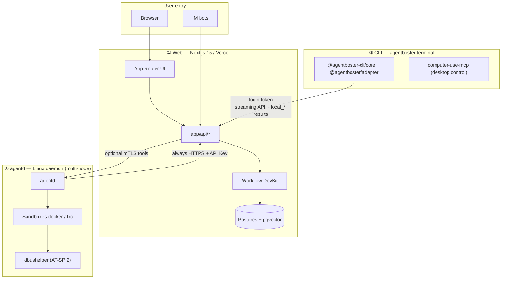

# AgentBoster (WIP)

<p align="center">
  
</p>

<p align="center">
  <a href="./README.md">中文: README</a>
</p>

<p align="center">
  
  
  
  
  <a href="https://deepwiki.com/NekoSekaiMoe/agentboster">
    
  </a>
</p>

> [!NOTE]
> Before 1.0, APIs and behavior may change. Upgrade compatibility is not guaranteed.

AgentBoster is a multi-surface AI platform made of **three independently deployable parts**:

- **Web (Next.js 15)**: browser UI, sessions and config, IM integration, durable Workflow orchestration, L2 approvals, and node registry (Postgres)
- **agentd (Go)**: Linux daemon for sandboxed tools, L0/L1/L2 security, local session runtime, and multi-node heartbeats
- **CLI ([`agentboster`](./subpackage/cli), based on [pi](https://github.com/earendil-works/pi))**: terminal coding agent; pairs to the Web backend with `agentboster login`. All model calls, model/tool orchestration, and session persistence are owned by Web; the CLI is a thin client for local TUI UX and `local_*` tools (shell / file I/O on the user's machine).

Three additional supporting subpackages:

- **[computer-use-mcp](./subpackage/computer-use-mcp) (Rust)**: cross-platform MCP server providing screenshot capture, mouse/keyboard input and accessibility tree queries for the CLI desktop app
- **[dbushelper](./subpackage/dbushelper) (Go)**: pure-Go AT-SPI2 accessibility D-Bus client, runs inside the agentd LXC sandbox and powers `desktop_inspect` / `desktop_a11y_click` / `desktop_a11y_type` tools
- **[sdk](./subpackage/sdk) (TypeScript)**: public SDK package (`@agentboster/sdk`) for building extensions, skills, prompts, and themes. Ships as TypeScript source (compiled at load by jiti); re-exports public types from the CLI runtime.

Web owns UX and orchestration, the daemon owns execution isolation and safety, and the CLI owns local developer terminals. They cooperate over HTTPS APIs and can be upgraded on different schedules.

---

## Platform architecture



### Responsibility split

| Layer | Owns | Does not own |
|-------|------|----------------|
| **Web** | Sessions, IM routing, config UI, workflow state, L2 UX, node table | Long-lived shell in your VPC (unless delegated to agentd) |
| **agentd** | Sandbox exec/file/browser tools, host L0/L1, local cache and metrics | Primary DB persistence (syncs via Web APIs) |
| **CLI** | TUI / print mode, `agentboster login` pairing, local `local_*` execution | Server-side IM, model/tool orchestration, or authoritative workflow state |

### Platform pillars

AgentBoster's engineering trade-offs revolve around four axes that span the Web / agentd / CLI tiers.

#### Hard layering — Web is the sole authority, exec tiers only execute

Session state, model orchestration, tool routing, the Workflow runtime, credentials and audit logs all belong to the **Web** (Next.js + Postgres + pgvector + Workflow DevKit). Neither `agentd` nor the CLI carries authoritative local state:

- **agentd** is a stateless exec node — registration, heartbeat and tool results are all POSTed to Web; it keeps only the sandbox plus local caches/metrics and re-pulls node identity from Web after a restart.
- **CLI** is a thin client — no model inference, no session persistence; the local session file is only a temporary mirror of Web data (`SessionManager` writes to tmpdir and is wiped on exit). `--resume` / `/resume` rebuilds context directly from `GET /api/cli/sessions/[id]/messages`.

This "exec tiers are disposable" constraint lets agentd nodes and CLI processes scale and restart freely without breaking session continuity.

#### Strong async — Workflow-driven, event stream reflow

Every LLM call, tool loop and sub-agent orchestration runs not on the request thread but as a **resumable Workflow DevKit step**:

- User submit → `chatMain` starts/resumes a workflow run → every step delta is persisted (`persistStepDeltaAndUsageStep`) to the `messages` table.
- Tool calls pass through L0/L1/L2 security and are dispatched via the event bus (agentd `POST /api/agentd/v1/*` callbacks, or CLI `local-tool-request` SSE).
- If any exec tier dies, the workflow pauses and waits for the next `route-message` / agentd callback; on recovery it resumes from the breakpoint instead of restarting.

CLI's `trigger: 'regenerate-message'` reuses the same chatMain: Web truncates downstream messages via `deleteMessagesAfterUiMessageId` → re-runs, while the CLI only PATCHes the edited text and `versions[]` metadata upstream.

#### Loose coupling — three tiers evolve independently, narrow contracts

The three tiers communicate only through **narrow HTTP contracts** — no shared code paths, shared DB schema or shared in-process state:

| Direction | Contract | Auth |
|-----------|----------|------|
| CLI → Web | `POST /api/cli/chat` + `GET/PATCH /api/cli/{sessions,messages}/*` | Bearer `clawless-auth` + device revocation check |
| agentd → Web | `POST /api/agentd/v1/nodes/{register,heartbeat}` + tool callbacks | `AGENTD_API_KEY` (HTTPS) |
| Web → agentd | `POST /api/v1/tools/exec` (optional, only when node URL is reachable) | `AGENTD_CLIENT_*` mTLS |

- Web does not need to know agentd / CLI internals — it only speaks HTTP bodies and event schemas.
- agentd is an independent Go module (`subpackage/agentd/`), CLI is an independent Yarn Classic monorepo (`subpackage/cli/`); each has its own `AGENTS.md`, toolchain and release cycle.
- The model context window size (`resolveModelContextLimit`) is resolved in one place on Web and shipped to CLI and IM via `/api/cli/models`, so the three tiers never maintain divergent context tables.

#### Strong security — three defense lines + mutual auth

Tool execution always crosses **three independent security checks**, any one of which can veto:

| Layer | Where | Purpose |
|-------|-------|---------|
| **L0** | Rule blacklist (exec tier) | Statically blocks known-dangerous patterns like `rm -rf /`, fork bombs |
| **L1** | LLM scoring (agentd / Web) | Scores command risk; above threshold it reports up or escalates to L2 |
| **L2** | User approval (Web UI / CLI TUI) | High-risk operations require human approve/deny |

- **CLI `--yolo`** skips all three (for trusted CI / `--print` runs) but only affects the CLI's local `local_*` tools; tools dispatched to agentd via Web still run the full pipeline.
- **Web ↔ agentd** is HTTPS + API Key by default; when a node has a public URL or frp tunnel, mTLS is added (`AGENTD_CLIENT_*`) so Web verifies the daemon cert and the daemon verifies the Web client cert.
- **Web ↔ CLI** uses a device-paired token from `agentboster login`, with server-side revocation (`withCliAuth` checks device state on every request); the CLI never touches the user's master password or session cookie.
- agentd sandbox isolation supports three tiers — `docker` / `docker-strict` / `lxc` — with progressively tightened filesystem, network and capabilities.

---

## Core capabilities (summary)

### Web

- Multi-session streaming chat, search, slash commands
- Multi-channel bots (Telegram/Discord/Slack/Feishu/Teams) and unified notifications
- Skills, providers, tools, MCP, Soul, audit and monitoring
- Durable workflows with L1/L2 security
- RAG / builtin memory; multi-node scheduling (see `lib/workflow/scheduled/dispatch.ts` and `app/api/agentd/v1/nodes/*`)

### Daemon

- Multi-step agent and CodeAct-style tool loop
- Sandboxes: `docker`, `docker-strict`, `lxc`
- L0 rules → L1 scoring → L2 user approval
- Node registration, heartbeats, resource metrics
- Event bus and dynamic worker pools
- AT-SPI2 accessibility tools (dbushelper): `desktop_inspect`, `desktop_a11y_click`, `desktop_a11y_type`

### CLI

- Interactive TUI and `--print` non-interactive mode
- `agentboster login` writes `~/.agentboster/config.json` and pairs with the Web backend
- All LLM calls, model/tool orchestration, and session persistence are owned by Web; the CLI only runs `local_*` tools (local shell / file I/O)
- Yarn Classic monorepo: `packages/ai` → `packages/agent` → `packages/agentboster-adapter` → `packages/coding-agent`
- `packages/desktop` is a separate Tauri desktop app and is not part of the CLI root workspace build chain
- Desktop app uses `computer-use-mcp` for computer control capabilities (screenshot capture, mouse/keyboard input, accessibility tree queries)
- Release: `yarn bundle` / `yarn package` under `subpackage/cli/`

| CLI package | Role |
|-------------|------|
| `@agentboster-cli/core` (`packages/coding-agent`) | `agentboster` bin, TUI / print mode, local tools, extensions, session tree, HTML export |
| `@agentboster/adapter` (`packages/agentboster-adapter`) | Stored auth, remote model catalog, Web SSE stream, security helpers |
| `@agentboster-cli/agent` (`packages/agent`) | Agent loop and session primitives |
| `@agentboster-cli/ai` (`packages/ai`) | Type and event-stream surface, compatibility stubs; no provider SDKs |
| `@agentboster-cli/desktop` (`packages/desktop`) | Separate private Tauri desktop shell, outside the root workspace |

---

## Quick deployment

### 1) Web (Vercel)

1. Set `AUTH_SECRET`, `USERNAME`, `PASSWORD`, `BLOB_ACCESS`
2. Set `DATABASE_URL` in production (Neon, etc.)
3. Set `AGENTD_API_KEY` and `AGENTD_URL` when using agentd
4. Optional `TAVILY_API_KEY` for web search
5. Deploy to Vercel

<p align="center">
  <a href="https://vercel.com/new/clone?repository-url=https://github.com/NekoSekaiMoe/agentboster&stores=[{%22type%22:%22blob%22},{%22type%22:%22integration%22,%22productSlug%22:%22upstash-kv%22,%22integrationSlug%22:%22upstash%22},{%22type%22:%22integration%22,%22protocol%22:%22storage%22,%22productSlug%22:%22neon%22,%22integrationSlug%22:%22neon%22}]&env=AUTH_SECRET,USERNAME,PASSWORD,BLOB_ACCESS,TAVILY_API_KEY,AGENTD_URL,AGENTD_API_KEY&envDescription=Required:%20AUTH_SECRET,%20USERNAME,%20PASSWORD,%20BLOB_ACCESS.%20Optional:%20TAVILY_API_KEY%20(web%20search),%20AGENTD_URL%20(daemon%20connection,%20format:%20https://host:port),%20AGENTD_API_KEY%20(daemon%20auth)&project-name=agentboster&repository-name=agentboster" target="_blank">
    
  </a>
</p>

### 2) Daemon (Linux)

```bash
cd subpackage/agentd
go build -o agentd ./cmd/agentd/
cp agentd.toml.example agentd.toml
# Edit base_url, clawless_api_key, sandbox
sudo ./agentd -config agentd.toml
```

Full guide: [`subpackage/agentd/README.md`](./subpackage/agentd/README.md).

### 3) CLI (local)

```bash
cd subpackage/cli
yarn install
yarn build
node packages/coding-agent/dist/cli.js --help
node packages/coding-agent/dist/cli.js login   # pair with Web backend
```

Full guide: [`subpackage/cli/README.md`](./subpackage/cli/README.md).

---

## Environment variables (Web)

| Variable | Purpose |
|----------|---------|
| `AUTH_SECRET`, `USERNAME`, `PASSWORD` | Login and cookies |
| `DATABASE_URL` | Required in production |
| `BLOB_ACCESS` / `BLOB_READ_WRITE_TOKEN` | Attachments |
| `AGENTD_API_KEY` | Must match daemon `clawless_api_key`; accepts a comma-separated list (e.g. `key1,key2`) for multiple daemons or key rotation |
| `AGENTD_URL` | **Required** (when using agentd): Web server direct connection URL to daemon, format `https://host:port`. Without this, LLM code execution will fallback to Vercel sandbox (limited functionality) |
| `AGENTD_CLIENT_CERT_PATH`, `AGENTD_CLIENT_KEY_PATH`, `AGENTD_CA_PATH` | Optional mTLS certificate paths; only needed when Web actively calls daemon (direct connection mode). Used with `AGENTD_URL` |
| `TAVILY_API_KEY` | Optional |

CLI usually needs no env vars; login writes `~/.agentboster/config.json`. Optional debug/override vars include `AGENTBOSTER_HOME`, `AGENTBOSTER_SESSION_ID`, `AGENTBOSTER_CLIENT_ID`, `AGENTBOSTER_MODEL`, and `PI_OFFLINE` (see the CLI README).

---

## Common commands

| Scope | Commands |
|-------|----------|
| Web | `yarn dev`, `yarn build`, `yarn lint:check`, `yarn test`, `yarn db:push` |
| agentd | `go test ./...`, `go build -o agentd ./cmd/agentd/` (from `subpackage/agentd/`) |
| CLI | `yarn build`, `yarn check:lint`, `yarn bundle`, `yarn package` (from `subpackage/cli/`) |
| computer-use-mcp | `cargo build`, `cargo test` (from `subpackage/computer-use-mcp/`) |
| dbushelper | `go test ./...`, `go build ./...` (from `subpackage/dbushelper/`) |

---

## IM commands (selected)

`/start`, `/new`, `/session`, `/stop`, `/cancel`, `/retry`, `/model`, `/approve`, `/reject`, `/compact`, `/help`, `/memory`

---

## Related documentation

| Document | Content |
|----------|---------|
| [`README.md`](./README.md) | Chinese README (same scope) |
| [`subpackage/README.md`](./subpackage/README.md) | Subpackage overview |
| [`subpackage/agentd/README.md`](./subpackage/agentd/README.md) | Daemon |
| [`subpackage/cli/README.md`](./subpackage/cli/README.md) | Terminal CLI |
| [`subpackage/computer-use-mcp/README.md`](./subpackage/computer-use-mcp/README.md) | Desktop control MCP server |
| [`subpackage/dbushelper/README.md`](./subpackage/dbushelper/README.md) | AT-SPI2 accessibility client |
| [`subpackage/sdk/README.md`](./subpackage/sdk/README.md) | Extension SDK (`@agentboster/sdk`) |
| [`AGENTS.md`](./AGENTS.md) | Contributors and OpenCode notes |

---

## Contributing

Open issues or submit PRs. MIT licensed.
