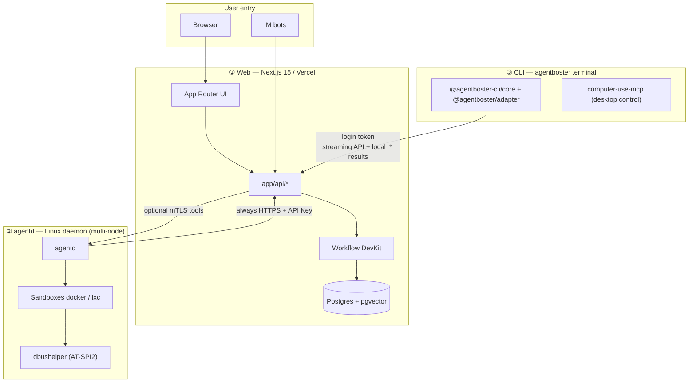

# AgentBoster (WIP)

<p align="center">
  
</p>

<p align="center">
  <a href="./README.md">中文: README</a>
</p>

<p align="center">
  
  
  
  
  <a href="https://deepwiki.com/NekoSekaiMoe/agentboster">
    
  </a>
</p>

> A multi-surface AI platform — browser, terminal, IM and desktop, one orchestration layer, sandboxed execution.

> [!NOTE]
> Before 1.0, APIs and behavior may change. Upgrade compatibility is not guaranteed.

Three independently deployable parts:

- **Web (Next.js 15)**: browser UI, sessions, IM integration, durable Workflow orchestration, L2 approvals (Postgres)
- **agentd (Go)**: Linux daemon for sandboxed tools, L0/L1/L2 security, multi-node heartbeats
- **CLI ([`agentboster`](./subpackage/cli), based on [pi](https://github.com/earendil-works/pi))**: terminal coding agent; pairs to Web with `agentboster login`. Model calls and orchestration are owned by Web; the CLI only runs local `local_*` tools

Supporting subpackages: [computer-use-mcp](./subpackage/computer-use-mcp) (desktop control), [dbushelper](./subpackage/dbushelper) (AT-SPI2 accessibility), [sdk](./subpackage/sdk) (cross-tier types).

---

## ✨ Why AgentBoster

| 🌐 Multi-surface | 🏛️ Hard layering |
|:---|:---|
| Browser, terminal, IM (Telegram / Discord / Slack / Feishu / Teams), desktop — one session across every channel | Web is the sole authority; agentd nodes and the CLI can be dropped, scaled, or restarted at will — sessions never break |

| ♻️ Durable Workflow | 🛡️ Three security lines |
|:---|:---|
| LLM calls and tool loops land as resumable steps — if an exec tier dies, it **resumes from the breakpoint** | L0 rule block + L1 model scoring + L2 human approval, any layer can veto independently |

| 🔒 Sandboxed exec | 🚀 Flexible deploy |
|:---|:---|
| `docker` / `docker-strict` / `lxc` isolation tiers, tightening filesystem / network / capabilities per tier | One-click Vercel, or fully self-hosted; all three tiers upgrade independently |

---

## 🚀 Get started in 5 minutes

**Web (Vercel)** — set `AUTH_SECRET` / `USERNAME` / `PASSWORD` / `BLOB_ACCESS` (add `DATABASE_URL` in production; `AGENTD_API_KEY` if using agentd), then deploy.

<p align="center">
  <a href="https://vercel.com/new/clone?repository-url=https://github.com/NekoSekaiMoe/agentboster&stores=[{%22type%22:%22blob%22},{%22type%22:%22integration%22,%22productSlug%22:%22upstash-kv%22,%22integrationSlug%22:%22upstash%22},{%22type%22:%22integration%22,%22protocol%22:%22storage%22,%22productSlug%22:%22neon%22,%22integrationSlug%22:%22neon%22}]&env=AUTH_SECRET,USERNAME,PASSWORD,BLOB_ACCESS,TAVILY_API_KEY,AGENTD_API_KEY&envDescription=Required:%20AUTH_SECRET,%20USERNAME,%20PASSWORD,%20BLOB_ACCESS.%20Optional:%20TAVILY_API_KEY%20(web%20search),%20AGENTD_API_KEY%20(daemon%20auth)&project-name=agentboster&repository-name=agentboster" target="_blank">
    
  </a>
</p>

**CLI (local)**

```bash
cd subpackage/cli && yarn install && yarn build
node packages/coding-agent/dist/cli.js login   # pair with Web backend
```

**Daemon (Linux)**

```bash
cd subpackage/agentd && go build -o agentd ./cmd/agentd/
cp agentd.toml.example agentd.toml   # edit base_url / clawless_api_key / sandbox
sudo ./agentd -config agentd.toml
```

---

## 🏗️ Platform architecture



Web owns orchestration and authoritative state, agentd owns sandboxed execution and the security boundary, and the CLI owns the local terminal. They cooperate over HTTPS and upgrade independently.

---

## 📚 Related docs

| Document | Content |
|----------|---------|
| [`README.md`](./README.md) | Chinese README |
| [`subpackage/README.md`](./subpackage/README.md) | Subpackage overview |
| [`subpackage/agentd/README.md`](./subpackage/agentd/README.md) · [`subpackage/cli/README.md`](./subpackage/cli/README.md) | Daemon / CLI (full env vars & commands) |
| [`subpackage/computer-use-mcp/README.md`](./subpackage/computer-use-mcp/README.md) · [`subpackage/dbushelper/README.md`](./subpackage/dbushelper/README.md) · [`subpackage/sdk/README.md`](./subpackage/sdk/README.md) | Desktop control / accessibility / cross-tier SDK |
| [`AGENTS.md`](./AGENTS.md) | Contributors & development notes |

---

## Contributing

Open issues or submit PRs. MIT licensed.
