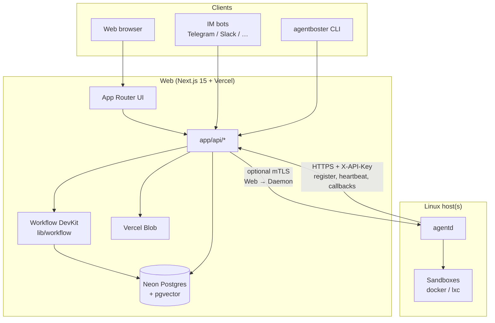
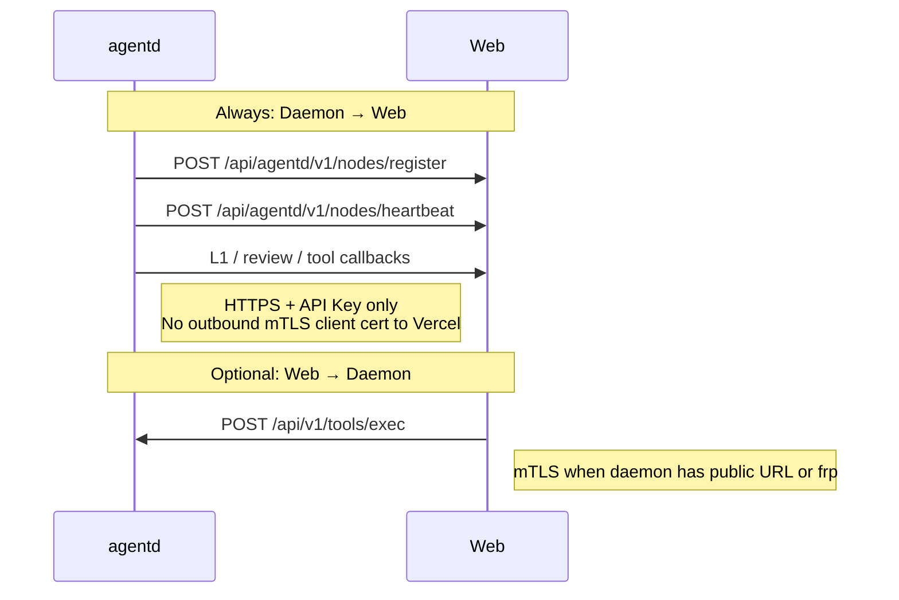
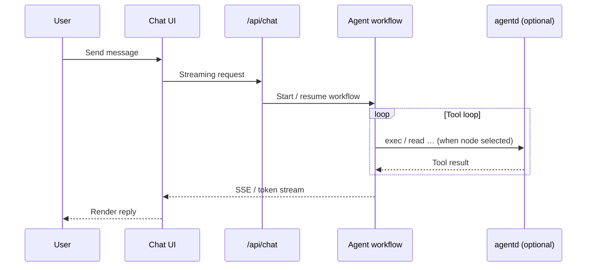

# AgentBoster (WIP)

<p align="center">
  
</p>

<p align="center">
  <a href="./README.md">中文: README</a>
</p>

<p align="center">
  
  
  
  
</p>

> [!NOTE]
> Before 1.0, APIs and behavior may change. Upgrade compatibility is not guaranteed.

AgentBoster is a multi-surface AI platform made of **three independently deployable parts**:

- **Web (Next.js 15)**: browser UI, sessions and config, IM integration, durable Workflow orchestration, L2 approvals, and node registry (Postgres)
- **agentd (Go)**: Linux daemon for sandboxed tools, L0/L1/L2 security, local session runtime, and multi-node heartbeats
- **CLI (`agentboster`)**: terminal coding agent; direct provider APIs or the same Web streaming backend via `login` + `AGENTBOSTER_URL`

Web owns UX and orchestration, the daemon owns execution isolation and safety, and the CLI owns local developer terminals. They cooperate over HTTPS APIs and can be upgraded on different schedules.

---

## Platform architecture



### Responsibility split

| Layer | Owns | Does not own |
|-------|------|----------------|
| **Web** | Sessions, IM routing, config UI, workflow state, L2 UX, node table | Long-lived shell in your VPC (unless delegated to agentd) |
| **agentd** | Sandbox exec/file/browser tools, host L0/L1, local cache and metrics | Primary DB persistence (syncs via Web APIs) |
| **CLI** | TUI / print mode, local provider keys, `agentboster login` remote stream | Server-side IM or authoritative workflow state |

### Communication directions (required reading)



- **Daemon → Web**: always `HTTPS` + `AGENTD_API_KEY` (same as `clawless_api_key`). On Vercel, **do not** set `[clawless].ca_path` or other custom CA on this path — TLS validation will fail.
- **Web → Daemon**: only when the node URL is reachable; Web uses `AGENTD_CLIENT_*` env vars for mTLS client certificates.

### Typical chat path (Web UI)



CLI remote mode skips the browser UI but hits the same Web APIs; workflows decide whether to dispatch work to agentd. See [`cli/README.md`](./cli/README.md).

---

## Repository layout

```
app/                    # Next.js App Router (pages + API)
  (auth)/              # Login
  (chat)/              # Chat, files
  (config)/            # System config
  (memory)/            # Memory & RAG
  (schedule)/          # Schedules / tasks
  (skill)/             # Skills
  api/                 # Web API (agentd callbacks, IM webhooks)
  .well-known/workflow/ # Workflow callbacks (auth bypass)
components/             # React + shadcn
hooks/
lib/                    # Core logic (workflow, chat, db, …)
types/
scripts/
agentd/                 # Go daemon (Linux only)
  cmd/agentd
  internal/
cli/                    # agentboster CLI monorepo
  packages/coding-agent       # Command entry
  packages/agentboster-adapter # Web adapter
```

---

## Core capabilities (summary)

### Web

- Multi-session streaming chat, search, slash commands
- Multi-channel bots (Telegram/Discord/Slack/Feishu/Teams) and unified notifications
- Skills, providers, tools, MCP, Soul, audit and monitoring
- Durable workflows with L1/L2 security
- RAG / builtin memory; multi-node scheduling (`MULTI-NODE-SCHEDULING.md`)

### Daemon

- Multi-step agent and CodeAct-style tool loop
- Sandboxes: `docker`, `docker-strict`, `lxc`
- L0 rules → L1 scoring → L2 user approval
- Node registration, heartbeats, resource metrics
- Event bus and dynamic worker pools

### CLI

- Interactive TUI and `--print` non-interactive mode
- `agentboster login` → `~/.agentboster/config.json`
- `AGENTBOSTER_URL` and related env for Web; or local provider API keys only
- Release: `npm run bundle` / `npm run package` under `cli/`

---

## Quick deployment

### 1) Web (Vercel)

1. Set `AUTH_SECRET`, `USERNAME`, `PASSWORD`, `BLOB_ACCESS`
2. Set `DATABASE_URL` in production (Neon, etc.)
3. Set `AGENTD_API_KEY` when using agentd
4. Optional `TAVILY_API_KEY` for web search
5. Deploy to Vercel

### 2) Daemon (Linux)

```bash
cd agentd
go build -o agentd ./cmd/agentd/
cp agentd.toml.example agentd.toml
# Edit base_url, clawless_api_key, sandbox
sudo ./agentd -config agentd.toml
```

Full guide: [`agentd/README.md`](./agentd/README.md).

### 3) CLI (local)

```bash
cd cli
npm install
npm run build
node packages/coding-agent/dist/cli.js --help
agentboster login   # when using Web backend
```

Full guide: [`cli/README.md`](./cli/README.md).

---

## Environment variables (Web)

| Variable | Purpose |
|----------|---------|
| `AUTH_SECRET`, `USERNAME`, `PASSWORD` | Login and cookies |
| `DATABASE_URL` | Required in production |
| `BLOB_ACCESS` / `BLOB_READ_WRITE_TOKEN` | Attachments |
| `AGENTD_API_KEY` | Must match daemon `clawless_api_key` |
| `AGENTD_CLIENT_CERT_PATH`, etc. | Only when Web calls daemon directly |
| `TAVILY_API_KEY` | Optional |

CLI: `AGENTBOSTER_URL`, `AGENTBOSTER_SESSION_ID`, `AGENTBOSTER_CLIENT_ID` (see cli README).

---

## Common commands

| Scope | Commands |
|-------|----------|
| Web | `yarn dev`, `yarn build`, `yarn lint:check`, `yarn test`, `yarn db:push` |
| agentd | `go test ./...`, `go build -o agentd ./cmd/agentd/` (from `agentd/`) |
| CLI | `npm run build`, `npm run check` (from `cli/`) |

---

## IM commands (selected)

`/start`, `/new`, `/session`, `/stop`, `/cancel`, `/retry`, `/model`, `/approve`, `/reject`, `/compact`, `/help`, `/memory`

---

## Related documentation

| Document | Content |
|----------|---------|
| [`README.md`](./README.md) | Chinese README (same scope) |
| [`agentd/README.md`](./agentd/README.md) | Daemon |
| [`cli/README.md`](./cli/README.md) | Terminal CLI |
| [`AGENTS.md`](./AGENTS.md) | Contributors and OpenCode notes |

---

## Contributing

Open issues or submit PRs. MIT licensed.