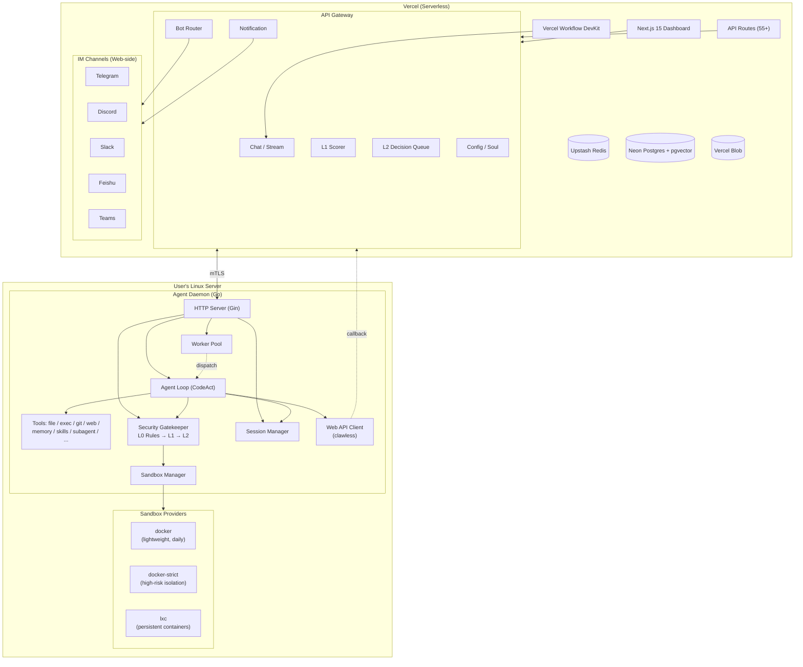

# AgentBoster (WIP)

<p align="center">
	
</p>

<p align="center">
	<a href="./README.md">中文: README</a>
</p>

<p align="center">
	
	
	
	
</p>

> [!NOTE]
>
> Until version 1.0 is released, I suggest you treat this as a preview. We cannot guarantee backwards compatibility at this stage.
>
> 在版本号没有达到 1.0 之前，我建议你可以把本项目当作一个尝鲜，我们不保证向前的兼容性。


AgentBoster is a **Serverless AI Agent platform** consisting of two parts:

- **AgentBoster Web** — A Next.js 15 frontend Dashboard deployed on Vercel, providing chat UI, configuration management, IM Bot adapters, and Vercel Workflow DevKit-powered persistent agent execution
- **Agent Daemon** — A Go 1.26 Linux daemon running on the user's server, providing sandbox execution, security review, and task scheduling. The Daemon does not interact with IM or send notifications; all IM notifications are handled by AgentBoster Web

AgentBoster covers the core features you need from an AI Agent: Chat, Skills, Memory (RAG), Soul, Multi-Channel Bot (Telegram/Discord/Slack/Feishu/Teams), MCP, Sandbox, Workflow — and it's **Serverless**.

---

## Architecture



---

## Project Structure

```
app/                     # Next.js App Router pages & API routes
├── (auth)/              #   Login
├── (chat)/              #   Chat, files, schedules
├── (config)/            #   Config, monitoring, audit logs
├── (memory)/            #   Memory/RAG management
├── (schedule)/          #   Schedule management
├── (skill)/             #   Skill management
├── api/                 #   Public API
│   ├── agentd/v1/       #     Daemon callbacks (L1/L2)
│   ├── bot/[secret]/    #     IM webhooks
│   ├── config/          #     Config, audit, monitoring
│   ├── notifications/   #     Notifications
│   ├── pair/            #     Daemon pairing
│   ├── sandbox/         #     Sandbox tools
│   ├── sessions/        #     Session revert
│   ├── soul/            #     Agent persona
│   └── tasks/           #     Task history
├── (chat)/api/          # Daemon-facing API (35+ endpoints)
│   ├── agentd/v1/       #     Agent config, blob, health,
│   │                    #     rules, notifications, sandboxes,
│   │                    #     sessions, tasks, workspaces, memory
│   └── ai/              #     AI chat, stream, message, pause, status
└── .well-known/workflow/#   Workflow DevKit callbacks (no auth)
components/              # React components (shadcn/ui)
├── ui/                  #   shadcn/ui primitives (19)
├── config/              #   Config forms
└── ...                  #   Chat, messages, sidebar, timelines
lib/                     # Core logic
├── ai/                  #   AI SDK provider factory (Anthropic/Google/OpenAI)
├── auth/                #   Auth (bcryptjs, cookies)
├── bot/                 #   Bot adapters & webhook routing
├── chat/                #   Chat transport, streaming, slash commands
├── core/                #   Infrastructure: DB (Drizzle+Neon), KV (Redis), Blob, Sandbox
├── extra/               #   Server-side business logic
│   ├── agent/           #     Daemon client, parallel exec, skills
│   ├── auth/            #     API keys, JWT, users
│   ├── channels/        #     TG/Discord/Slack/Feishu adapters
│   ├── config/          #     Config management
│   ├── cron/            #     Cron scheduling
│   ├── memory/          #     Memory management
│   ├── prompts/         #     System prompt fragments
│   ├── sandbox/         #     Vercel Sandbox management
│   └── security/        #     L0/L1/L2 security engine
├── mcp/                 #   Built-in MCP (Context7, Firecrawl, GitHub, Web)
├── memory/              #   Memory: builtin, RAG long-term, session
├── security/            #   Web-side security (L1 scorer, L2 queue)
├── utils/               #   Utilities
└── workflow/            #   Vercel Workflow DevKit
    ├── agent/           #     Agent workflow (hooks/steps/tools/security)
    └── scheduled/       #     Scheduled workflow
hooks/                   # React hooks (config draft, validation, mobile, nav)
types/                   # TypeScript types (config/memory/skills/workflow)
agentd/                  # Go 1.26 Daemon
├── cmd/agentd/main.go   #   Entry point
├── agentd.toml.example  #   Example config
└── internal/
    ├── agent/           #   CodeAct loop, tools, context
    ├── sandbox/         #   Providers: docker / docker-strict / lxc
    ├── security/        #   L0 rules, L2 auth, OS enforcement
    ├── session/         #   Session persistence, LRU, archiving
    ├── worker/          #   Worker pool, dispatcher
    ├── server/          #   Gin HTTP routes & middleware
    ├── clawless/        #   Web API client
    ├── config/          #   Viper config loading
    ├── certs/           #   mTLS certificates
    ├── cache/           #   Internal cache
    ├── eventbus/        #   Internal event bus
    ├── identity/        #   Daemon identity & pairing
    ├── lifecycle/       #   Startup/shutdown orchestration
    ├── metrics/         #   Runtime metrics
    └── persistence/     #   Local state persistence
```

---

## Features

### AgentBoster Web (Next.js)
- **Chat** — Multi-session, streaming, history, search/pin, slash commands
- **Skills** — Dynamic loading (ClawHub marketplace)
- **Memory** — Builtin, RAG vector long-term, session
- **Soul** — Agent persona/identity, per-session customization
- **Config** — Provider, Channel, Agent, Tools, MCP, Autonomy, Appearance
- **Sandbox** — Vercel Sandbox management & monitoring
- **Multi-Channel Bot** — Telegram, Discord, Slack, Feishu, Teams
- **Multi-Channel Notification** — Unified notification routing to all IM
- **Workflow** — Vercel Workflow DevKit persistent agent execution
- **MCP** — Built-in MCP (Context7, Firecrawl, GitHub, Web)
- **Security** — L1 AI scoring, L2 user authorization queue
- **Audit & Monitoring** — Audit logs, runtime metrics, Daemon node status
- **Daemon Pairing** — One-click pair key for secure Daemon registration

### Agent Daemon (Go)
- **CodeAct Agent Loop** — Tool calling, multi-step reasoning, Sub-agent branching
- **18+ Tools** — File I/O, Shell, Git, Web, memory, skills, media, CodeAct, Sub-agent, task summary
- **Three-Layer Security** — L0 rule filtering → L1 AI scoring → L2 user authorization
- **Unified Decision Queue** — L2 auth + LLM questions + conflict resolution + task branching
- **Three Sandbox Types** — docker (lightweight daily), docker-strict (high-risk isolation), lxc (persistent containers)
- **OS-Level Enforcement** — seccomp, capability drop, network isolation, readonly paths
- **Worker Pool** — Dynamic auto-scaling (task/review/sandbox/memory/cleanup)
- **Session Management** — LRU eviction, archiving, Sub-agent state tracking, abort control
- **Webhook Callbacks** — Notifies Web on task completion or user decision
- **Daemon Identity** — Node registration, heartbeat, pairing

---

## Tech Stack

### AgentBoster Web
| Category | Technology |
|----------|------------|
| Framework | Next.js 15.5 (App Router, RSC) |
| UI | React 19, Tailwind CSS 3, shadcn/ui, Framer Motion, Lucide |
| State | TanStack React Query |
| AI | Vercel AI SDK 6 (Anthropic/Google/OpenAI/OpenAI-compatible) |
| Chat SDK | @chat-adapter/* v4 (Telegram, Discord, Slack, Feishu, Teams) |
| Database | Drizzle ORM + Neon Postgres (pgvector) |
| Cache | Upstash Redis |
| Storage | Vercel Blob |
| Workflow | Vercel Workflow DevKit + @workflow/ai |
| Sandbox | Vercel Sandbox |
| MCP | @ai-sdk/mcp (Context7, Firecrawl, GitHub, Web) |
| Tools | Biome, TypeScript 6, Yarn |

### Agent Daemon
| Category | Technology |
|----------|------------|
| Language | Go 1.26 (Linux-only) |
| HTTP | Gin 1.12 |
| Config | Viper (TOML) + environment |
| Events | Custom Event Bus |
| Worker Pool | Custom (auto-scaling) |
| Sandbox | Docker + LXC |
| Security | seccomp, capability drop, cgroup |
| Communication | mTLS + API Key |

---

## Deploy

### AgentBuster Web → Vercel

You don't need to download locally or own a VPS. You only need:

- A Vercel account (free tier)
- An API key compatible with OpenAI/Anthropic/Gemini
- Click the deploy button below

<p align="center">
	<a href=https://vercel.com/new/clone?repository-url=https://github.com/Niapya/agentboster&stores=[{"type":"blob"},{"type":"integration","productSlug":"upstash-kv","integrationSlug":"upstash"},{"type":"integration","protocol":"storage","productSlug":"neon","integrationSlug":"neon"}]&env=AUTH_SECRET,USERNAME,PASSWORD&envDescription=Do_not_disclose_them_and_keep_them_safe.&project-name=agentboster&repository-name=agentboster&redirect-url=https://niapya.github.io/agentboster target="_blank">
		
	</a>
</p>

### Agent Daemon → Linux Server

```bash
git clone https://github.com/Niapya/agentboster.git
cd agentboster/agentd

# Build (Go 1.26+ required)
go build -o agentd ./cmd/agentd/

# Generate default config, edit, then start
./agentd -config agentd.toml
vim agentd.toml
./agentd
```

---

## Quick Start

### 1. Configure Environment Variables

Deployment requires `AUTH_SECRET`, `USERNAME`, and `PASSWORD`. **Do not expose them.**

### 2. Log In and Configure

Open the deployment → Log in → Go to "Config" → Add a Provider (OpenAI Compatible) → Set `Default Model` and `Embedding Model`.

### 3. Configure Agent Daemon

In `agentd.toml`:

```toml
[server]
listen = ":18732"
tls_cert_path = "./certs/server-cert.pem"
tls_key_path = "./certs/server-key.pem"
ca_path = "./certs/ca-cert.pem"
clawless_api_key = "sk-clawless-xxx"

[clawless]
base_url = "https://your-agentboster.vercel.app"
client_cert_path = "./certs/client-cert.pem"
client_key_path = "./certs/client-key.pem"
ca_path = "./certs/ca-cert.pem"

[sandbox]
default = "docker"
docker_socket = "unix:///var/run/docker.sock"
docker_image = "alpine:edge"
allowed_images = ["ubuntu:22.04", "ubuntu:24.04", "alpine:latest", "golang:1.22", "node:20", "python:3.12"]
os_enforce = true
network_isolate = true
```

### 4. Connect IM

Go to Channel config → Set IM Bot Token → Configure Webhook → Set whitelist.

### 5. Start Chatting

Chat via Web UI or IM.

---

## Sandbox

Sandbox type is auto-selected by `SelectSandbox` strategy:

| Type | Implementation | Isolation | Persistent | Default Resources | Use Case |
|------|---------------|-----------|------------|------------------|----------|
| **docker** | DockerLightProvider | Medium (OS policy + seccomp) | No (`--rm`) | 0.25 CPU / 256MB | Daily tasks, code execution |
| **docker-strict** | DockerProvider | High (no network, readonly, cap-drop ALL) | No | 1.0 CPU / 512MB | High-risk/untrusted code |
| **lxc** | LXCPersistentProvider | Medium (cgroup + OS policy) | Yes | 1.0 CPU / 512MB | Long-running tasks, git clone, builds |

Selection priority:
1. User explicit → 2. High-risk → `docker-strict` → 3. Needs persistence → `lxc` → 4. Agent default → 5. Fallback → `docker`

Docker light uses `alpine:edge`, applies OS enforcement (cap-drop ALL with selective keep, seccomp, no-new-privileges, readonly rootfs, network isolation). Docker strict enforces image whitelist, `--network none`, `--read-only`, `--pids-limit 128`.

LXC uses `lxc-create`/`lxc-start`/`lxc-attach` with init commands, cgroup limits, OS security policies. Supports stop-only (preserve rootfs) and full destroy modes.

---

## Security

- **L0** — Predefined rules rejecting dangerous commands (`rm -rf /`, `mkfs`, `dd if=`, `sudo`, etc.)
- **L1** — LLM scoring (local_ollama / remote API) with caching, risk levels: low/medium/high/critical
- **L2** — High-risk commands require user confirmation (pass_once / pass_until / reject_once / reject_until)
- **Decision Queue** — Unified queue for L2 auth + LLM questions + conflict resolution + task branching
- **OS Enforcement** — seccomp, capability drops, network isolation, masked/readonly paths
- **Prompt Injection Defense** — Built-in rules in System Prompt
- **Docker Whitelist** — strict mode only allows whitelisted images
- **mTLS** — Bidirectional TLS between Web ↔ Daemon. Daemon stores no IM tokens

---

## Development

```bash
# Web (Next.js)
yarn install          # Install dependencies
yarn dev              # Start dev server (localhost:3000)
yarn check            # Typecheck + Biome lint/format
yarn build            # Production build
yarn db:generate      # Drizzle generate migrations
yarn db:push          # Drizzle push schema
yarn db:studio        # Drizzle Studio

# Agent Daemon (Go)
cd agentd
go build -o agentd ./cmd/agentd/
./agentd -config agentd.toml
```

Requires `.env.local` (gitignored) with `DATABASE_URL`, `REDIS_URL`, etc.

---

## Others

If you have ideas or find issues, please open a Pull Request or create an Issue. Contributions are welcome in any form.

The frontend UI is based on [ClawLess](https://github.com/Niapya/clawless). Thanks to the ClawLess project for providing the Dashboard foundation and inspiration.

Thanks to OpenClaw and Manus for inspiration, to Vercel as the deployment platform, to all the open source projects used here — and to **you**.

This project is licensed under the MIT License.
