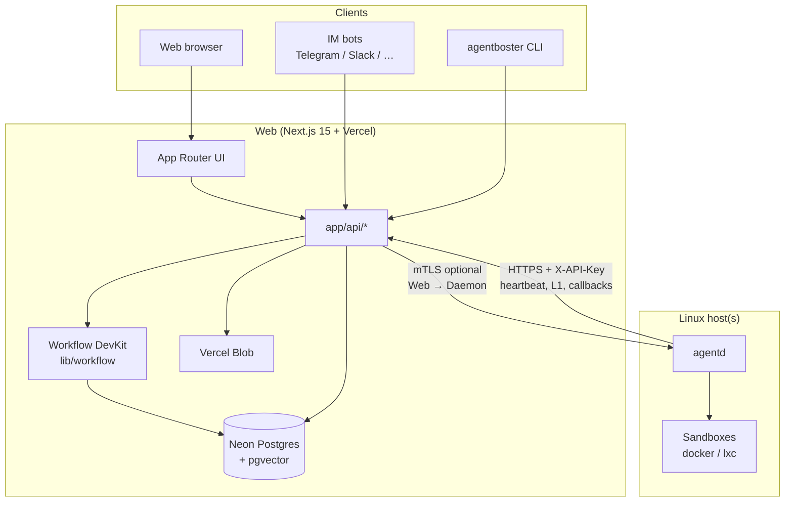
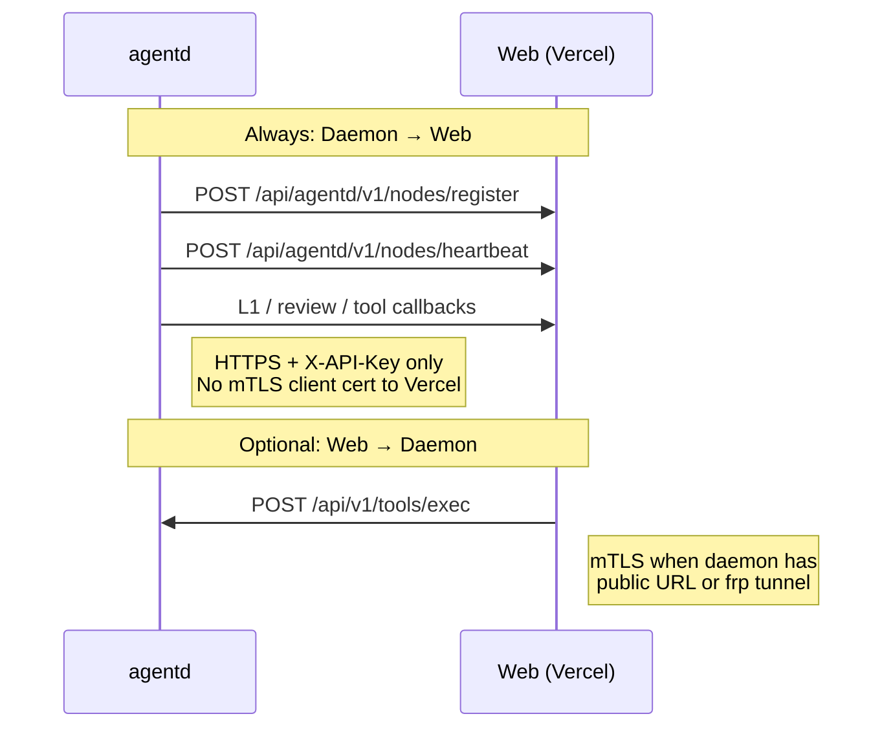
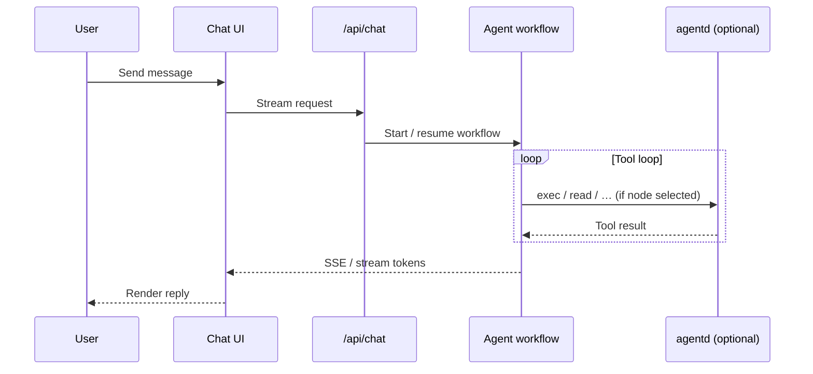
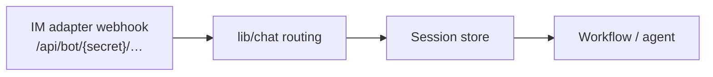
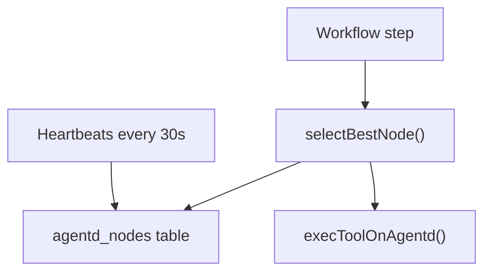
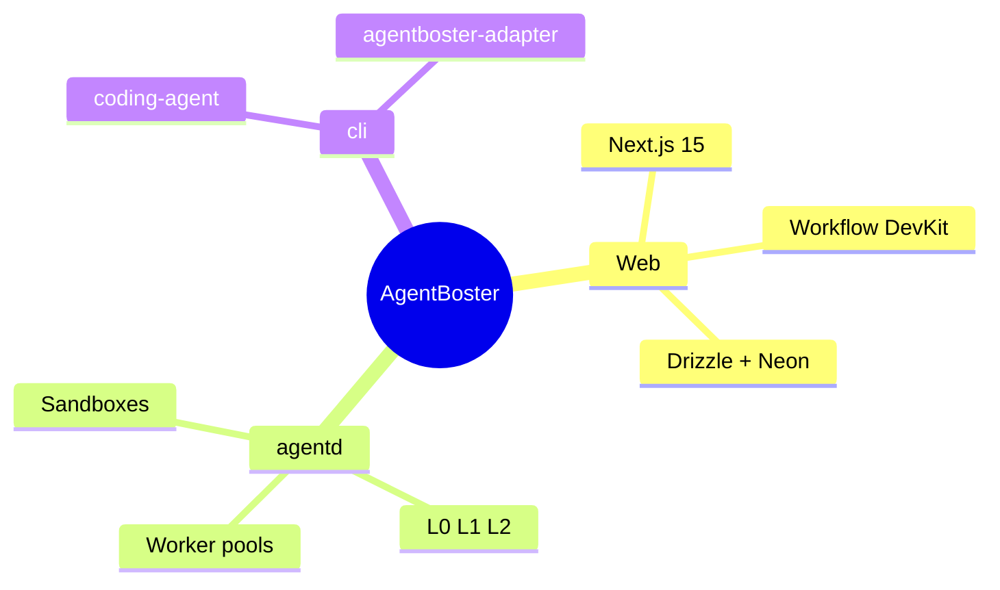
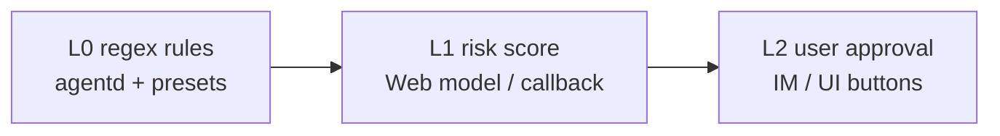
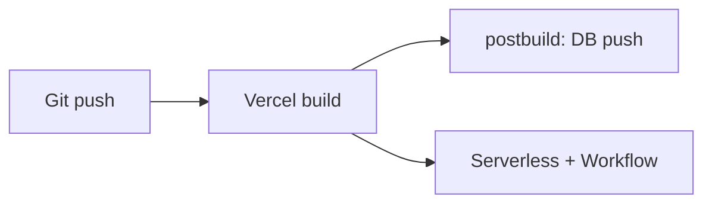
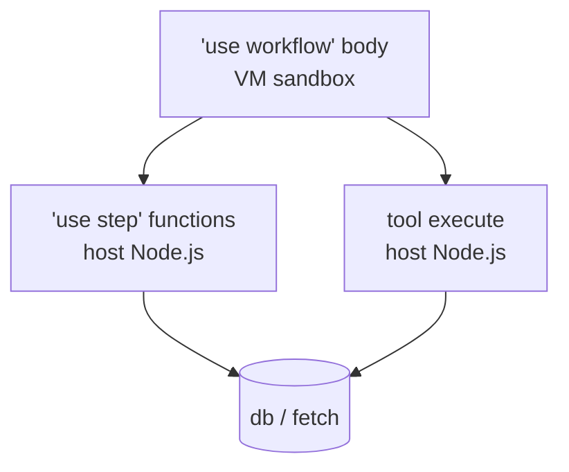

# AgentBoster (WIP)

<p align="center">
  
</p>

<p align="center">
  <a href="./README.md">中文: README</a>
</p>

<p align="center">
  
  
  
  
</p>

> [!NOTE]
> Before 1.0, APIs and behavior may change. Upgrade compatibility is not guaranteed.

AgentBoster is a multi-surface AI platform: a **Web app** for chat, IM, configuration, and durable workflows; a **Linux daemon (`agentd`)** for sandboxed execution and security enforcement; and an optional **CLI** for local coding-agent sessions that can attach to the same backend.

---

## Platform architecture



### Responsibility split

| Layer | Owns | Does not own |
|-------|------|----------------|
| **Web** | Sessions, IM routing, config UI, workflow persistence, L2 UX, node registry in DB | Long-running shell inside your VPC (unless delegated) |
| **agentd** | Tool exec in sandboxes, L0/L1 gate on host, local session cache, metrics | Primary user database (syncs via API) |
| **CLI** | Terminal UX, local provider keys, optional remote stream via adapter | Server-side IM or workflow state |

### Communication directions (critical)



- **Daemon → Web:** always `HTTPS` + `AGENTD_API_KEY` / `clawless_api_key`. Do **not** set `[clawless].ca_path` for Vercel — it breaks Let's Encrypt validation.
- **Web → Daemon:** only when a node URL is reachable; uses mTLS client certs from `AGENTD_CLIENT_*` env vars.

---

## End-to-end request flows

### Chat message (web UI)



### IM slash command



Bot webhooks bypass cookie auth; the secret is embedded in the URL path. See `middleware.ts` bypass list.

### Multi-node dispatch

When several `agentd` instances register, the Web picks a node using CPU, memory, disk, heartbeat age, and sandbox support (`lib/workflow/agent/dispatch.ts`). Details: `MULTI-NODE-SCHEDULING.md`.



---

## Repository layout

```
agentboster/
├── app/                      # Next.js App Router
│   ├── (auth)/               # Login
│   ├── (chat)/               # Chat, files
│   ├── (config)/             # System configuration
│   ├── (memory)/             # Memory & RAG
│   ├── (schedule)/           # Schedules / tasks
│   ├── (skill)/              # Skills
│   ├── api/                  # REST + streaming APIs
│   │   ├── agentd/v1/        # Daemon callbacks (API key)
│   │   ├── bot/              # IM webhooks
│   │   └── internal/         # Server-to-server
│   └── .well-known/workflow/ # Workflow DevKit callbacks
├── components/               # React + shadcn/ui
├── hooks/
├── lib/
│   ├── core/db/              # Drizzle schema & migrations
│   ├── workflow/agent/       # Durable agent workflows
│   ├── chat/                 # IM adapters & routing
│   ├── mcp/                  # MCP & browser tools
│   └── extra/agent/          # agentd HTTP client
├── agentd/                   # Go daemon (Linux only)
├── cli/                      # agentboster CLI monorepo
├── scripts/
└── types/
```



---

## Web capabilities

### Chat and sessions

- Multi-session streaming chat with history search
- Slash commands in web and IM (`/new`, `/model`, `/approve`, …)
- File attachments via Blob storage
- Pending L2 decisions surfaced in UI and IM

### Integrations

- **IM:** Telegram, Discord, Slack, Feishu, Microsoft Teams (Chat SDK adapters)
- **MCP:** Configurable MCP servers; browser tools mirrored on daemon (`tools_browser_v2`)
- **Skills:** Repo-local and managed skills; workflow skills under `.agents/skills/`

### Security and governance



- **L0:** Command/path/network/output rules (`agentd/internal/security/l0_rules`)
- **L1:** Scoring via Web-configured model or callback
- **L2:** User time-boxed allow/deny; confirm hits `POST /api/v1/l2-confirm` on daemon

### Data and memory

- Postgres via Drizzle; migrations in `lib/core/db/migrations/`
- pgvector for RAG / memory features (`yarn db:ensure-vector` on fresh DBs)
- Workflow state survives restarts (Vercel Workflow DevKit)

### Configuration surfaces

- Providers, models, tools, Soul, audit, monitoring
- Agentd node list and health (from heartbeats)
- Notification channel preferences

---

## Daemon capabilities (summary)

Full detail: [`agentd/README.md`](./agentd/README.md).

- Sandboxes: `docker` (light), `docker-strict`, `lxc` (persistent)
- CodeAct-style agent loop with tool registry (files, exec, git, web, memory, sub-agent, browser, …)
- Event bus + dynamic worker pools
- Singleton lock: unix socket + PID file + port probe

---

## CLI capabilities (summary)

Full detail: [`cli/README.md`](./cli/README.md).

- Interactive TUI or `--print` non-interactive mode
- `agentboster login` for server bearer token (`~/.agentboster/config.json`)
- `AGENTBOSTER_URL` routes inference through Web when configured

---

## Deployment guide

### Web on Vercel

1. Create a Vercel project linked to this repo.
2. Set required env vars (see table below).
3. Provision Neon (or compatible Postgres) and set `DATABASE_URL`.
4. Deploy; production `postbuild` runs `db:ensure-vector` and `db:push` when `VERCEL_ENV=production`.



### Daemon on Linux

1. Build binary on amd64 Linux (or cross-compile with `GOOS=linux GOARCH=amd64`).
2. Align `AGENTD_API_KEY` (Web) with `[server].clawless_api_key` (daemon).
3. Set `[clawless].base_url` to your production Web URL (not `localhost` unless Web runs locally).
4. Install Docker or LXC per sandbox strategy.
5. Optional: frp or public IP + mTLS for Web→Daemon tool calls.

### CLI for developers

```bash
cd cli && npm install && npm run build
node packages/coding-agent/dist/cli.js --help
```

---

## Environment variables (Web)

| Variable | Required | Purpose |
|----------|----------|---------|
| `AUTH_SECRET` | Yes | Cookie signing |
| `USERNAME` / `PASSWORD` | Yes | Basic login |
| `DATABASE_URL` | Prod | Postgres connection |
| `BLOB_ACCESS` | Yes | Blob feature gate |
| `BLOB_READ_WRITE_TOKEN` | If using Vercel Blob | Storage token |
| `AGENTD_API_KEY` | If using agentd | Daemon→Web auth |
| `AGENTD_CLIENT_CERT_PATH` | If Web calls daemon | mTLS client cert |
| `AGENTD_CLIENT_KEY_PATH` | If Web calls daemon | mTLS client key |
| `AGENTD_CA_PATH` | If Web calls daemon | CA for daemon server cert |
| `TAVILY_API_KEY` | Optional | Web search tool |

Daemon env overrides use prefix `AGENTD_` (e.g. `AGENTD_SERVER_LISTEN`). See `agentd.toml.example`.

---

## Development commands

| Command | Where | Action |
|---------|-------|--------|
| `yarn dev` | repo root | Next dev (Turbopack) |
| `yarn build` | repo root | Production Next build |
| `yarn lint:check` | repo root | `tsc --noEmit && biome check .` |
| `yarn test` | repo root | Vitest |
| `yarn db:generate` | repo root | New Drizzle migration |
| `yarn db:push` | repo root | Apply schema |
| `yarn build:agentd` | repo root | Build Go binary |
| `go test ./...` | `agentd/` | Daemon unit tests |
| `npm run build` | `cli/` | Build CLI packages |
| `npm run check` | `cli/` | Biome + tsgo |

Always run `yarn lint:check` before pushing Web changes — `next build` ignores TS/eslint errors.

---

## Workflow DevKit notes

Agent orchestration lives under `lib/workflow/agent/`. Workflow function bodies run in an isolated VM **without** `fetch`, `db`, or `__dirname`. Any DB or HTTP from the workflow tree must use `'use step'` functions. Tool `execute` callbacks run on the host and may call `db` directly. See root `AGENTS.md`.



---

## IM commands (reference)

| Command | Description |
|---------|-------------|
| `/start` | Welcome / bind session |
| `/new` | New session |
| `/session` | Session info |
| `/stop` / `/cancel` | Stop generation |
| `/retry` | Retry last turn |
| `/model` | Model selection |
| `/approve` / `/reject` | L2 decisions |
| `/compact` | Context compaction |
| `/memory` | Memory shortcuts |
| `/help` | Help text |

Exact behavior depends on adapter and config.

---

## Auth and middleware

Cookie auth protects most routes. Exceptions include:

- Login paths
- `/api/bot/{AUTH_SECRET}/…` webhooks
- `/api/agentd/v1/*` and `/api/soul/*` (API key / mTLS)
- `/api/internal/im-stream`
- `/.well-known/workflow/*`
- Static assets (paths with file extensions)

---

## Testing strategy

- **Web:** Vitest for `lib/**`, `app/**`, `hooks/**`, `components/**`
- **agentd:** `go test ./...` (Docker/LXC tests skip if unavailable)
- **cli:** Vitest per package; `npm run check` at workspace root

---

## Packaging and release

- Web: deploy via Vercel (`yarn deploy` → `vercel --prod`)
- Daemon: ship `agentd` binary + `agentd.toml` on your servers
- CLI: `npm run package` in `cli/` → `agentboster-cli-<version>.tar.gz`

Root `push.py` automates commit/push and strips vendored `ref/` from the index — intentional.

---

## Troubleshooting (platform)

| Symptom | Likely cause |
|---------|----------------|
| Tools always use Vercel sandbox | No online agentd node or no public node URL |
| Daemon cannot register | `AGENTD_API_KEY` mismatch or wrong `base_url` |
| `fetch is not defined` in workflow | DB/API called from workflow body without `'use step'` |
| IM bot 401 | Wrong webhook secret path |
| DB migration fails on fresh Neon | Run `yarn db:ensure-vector` before push |

---

## Related documentation

| Document | Content |
|----------|---------|
| [`agentd/README.md`](./agentd/README.md) | Daemon install, mTLS, API, sandboxes |
| [`agentd/LAYOUT.MD`](./agentd/LAYOUT.MD) | Go package map |
| [`cli/README.md`](./cli/README.md) | CLI build, flags, env |
| [`cli/AGENTS.md`](./cli/AGENTS.md) | CLI repo conventions |
| [`AGENTS.md`](./AGENTS.md) | OpenCode / contributor guide (Web + agentd) |
| [`MULTI-NODE-SCHEDULING.md`](./MULTI-NODE-SCHEDULING.md) | Node scoring algorithm |
| [`BUILD_OPTIMIZATION.md`](./BUILD_OPTIMIZATION.md) | Build performance notes |

---

## Security practices

- Never commit secrets; use Vercel env and `agentd.toml` on hosts only
- Prefer rootless Docker and `[security].run_as_user` on daemon
- Rotate `AGENTD_API_KEY` and IM webhook secrets on compromise
- Review L0 presets when exposing exec tools to untrusted prompts

---

## Roadmap context (WIP)

Pre-1.0 areas that may still move:

- Workflow bundle boundaries and step coverage
- Multi-node failover and sticky sessions
- CLI ↔ Web feature parity for skills and extensions

Track issues on the project repository.

---

## License and contribution

MIT licensed. Open issues or submit PRs. For large changes, mention affected surfaces (Web / agentd / cli) and include `yarn lint:check` or `npm run check` output as appropriate.

---

## Glossary

| Term | Meaning |
|------|---------|
| **ClawLess** | Legacy internal name for Web↔daemon API client paths |
| **CodeAct** | Agent loop that emits executable code steps in sandbox |
| **Soul** | Persona / system prompt configuration feature |
| **Node** | One registered `agentd` instance in `agentd_nodes` |
| **Workflow** | Durable Vercel Workflow DevKit orchestration unit |

---

## Quick links

- English README (this file): `README.EN.md`
- Chinese README: `README.md`
- Daemon config template: `agentd/agentd.toml.example`
- Example production Web URL pattern: `https://<project>.vercel.app`

---

*Document target length: ~400 lines including diagrams and tables.*