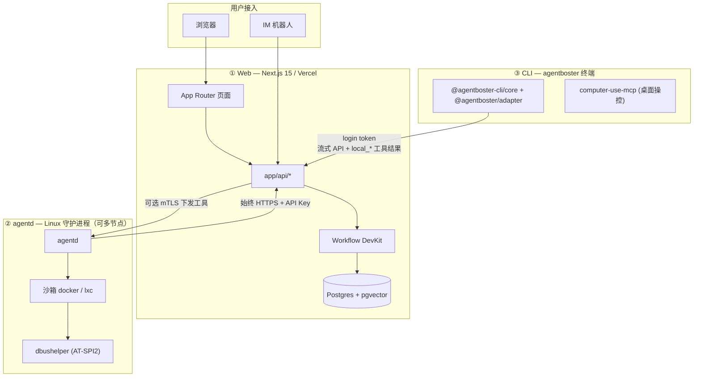

# AgentBoster (WIP)

<p align="center">
  
</p>

<p align="center">
  <a href="./README.EN.md">EN: README</a>
</p>

<p align="center">
  
  
  
  
  <a href="https://deepwiki.com/NekoSekaiMoe/agentboster">
    
  </a>
</p>

> 多端协作的 AI 平台 —— 浏览器 · 终端 · IM · 桌面，统一编排，沙箱内安全执行。

> [!NOTE]
> 在 1.0 发布前，功能与接口仍可能变化，升级兼容性不作保证。

三个可独立部署的部分：

- **Web（Next.js 15）**：浏览器 UI、会话、IM 接入、Workflow 持久化编排、L2 审批（Postgres）
- **agentd（Go）**：Linux 守护进程，沙箱内执行工具，L0/L1/L2 安全，多节点心跳
- **CLI（[`agentboster`](./subpackage/cli)，基于 [pi](https://github.com/earendil-works/pi)）**：终端编码 Agent；`agentboster login` 配对到 Web，模型调用与编排全由 Web 负责，CLI 只跑本机 `local_*` 工具

辅助子包：[computer-use-mcp](./subpackage/computer-use-mcp)（桌面操控）、[dbushelper](./subpackage/dbushelper)（AT-SPI2 无障碍）、[sdk](./subpackage/sdk)（跨层类型）。

---

## ✨ 为什么选 AgentBoster

| 🌐 多端触达 | 🏛️ 硬分层架构 |
|:---|:---|
| 浏览器、终端、IM（Telegram / Discord / Slack / 飞书 / Teams）、桌面 —— 同一会话全渠道续接 | Web 是唯一权威，agentd 节点与 CLI 都可随时丢弃、扩缩、重启，会话不中断 |

| ♻️ 持久化 Workflow | 🛡️ 三层安全防线 |
|:---|:---|
| LLM 调用与工具循环落地为可恢复步骤，执行端宕机也能**断点续跑** | L0 规则拦截 + L1 模型打分 + L2 人工授权，任一层可独立否决 |

| 🔒 沙箱执行 | 🚀 灵活部署 |
|:---|:---|
| `docker` / `docker-strict` / `lxc` 三档隔离，按档收紧文件系统/网络/能力位 | Vercel 一键部署，或完全自托管；三层可分开升级 |

---

## 🚀 5 分钟上手

**Web（Vercel）** —— 配置 `AUTH_SECRET` / `USERNAME` / `PASSWORD` / `BLOB_ACCESS`（生产加 `DATABASE_URL`，用 agentd 加 `AGENTD_API_KEY`），部署即可。

<p align="center">
  <a href="https://vercel.com/new/clone?repository-url=https://github.com/NekoSekaiMoe/agentboster&stores=[{%22type%22:%22blob%22},{%22type%22:%22integration%22,%22productSlug%22:%22upstash-kv%22,%22integrationSlug%22:%22upstash%22},{%22type%22:%22integration%22,%22protocol%22:%22storage%22,%22productSlug%22:%22neon%22,%22integrationSlug%22:%22neon%22}]&env=AUTH_SECRET,USERNAME,PASSWORD,BLOB_ACCESS,TAVILY_API_KEY,AGENTD_API_KEY&envDescription=Required:%20AUTH_SECRET,%20USERNAME,%20PASSWORD,%20BLOB_ACCESS.%20Optional:%20TAVILY_API_KEY%20(web%20search),%20AGENTD_API_KEY%20(daemon%20auth)&project-name=agentboster&repository-name=agentboster" target="_blank">
    
  </a>
</p>

**CLI（本机）**

```bash
cd subpackage/cli && yarn install && yarn build
node packages/coding-agent/dist/cli.js login   # 配对 Web 后端
```

**Daemon（Linux）**

```bash
cd subpackage/agentd && go build -o agentd ./cmd/agentd/
cp agentd.toml.example agentd.toml   # 编辑 base_url / clawless_api_key / sandbox
sudo ./agentd -config agentd.toml
```

---

## 🏗️ 平台架构



Web 负责编排与权威状态，agentd 负责沙箱执行与安全边界，CLI 负责本机终端；三者经 HTTPS 协作，可分开升级。

---

## 📚 相关文档

| 文档 | 内容 |
|------|------|
| [`README.EN.md`](./README.EN.md) | 英文 README |
| [`subpackage/README.md`](./subpackage/README.md) | 子包总览 |
| [`subpackage/agentd/README.md`](./subpackage/agentd/README.md) · [`subpackage/cli/README.md`](./subpackage/cli/README.md) | Daemon / CLI（含完整环境变量与命令） |
| [`subpackage/computer-use-mcp/README.md`](./subpackage/computer-use-mcp/README.md) · [`subpackage/dbushelper/README.md`](./subpackage/dbushelper/README.md) · [`subpackage/sdk/README.md`](./subpackage/sdk/README.md) | 桌面操控 / 无障碍 / 跨层 SDK |
| [`AGENTS.md`](./AGENTS.md) | 贡献者与开发说明 |

---

## 贡献

提交 PR 或发 Issue。项目采用 MIT 许可证。
