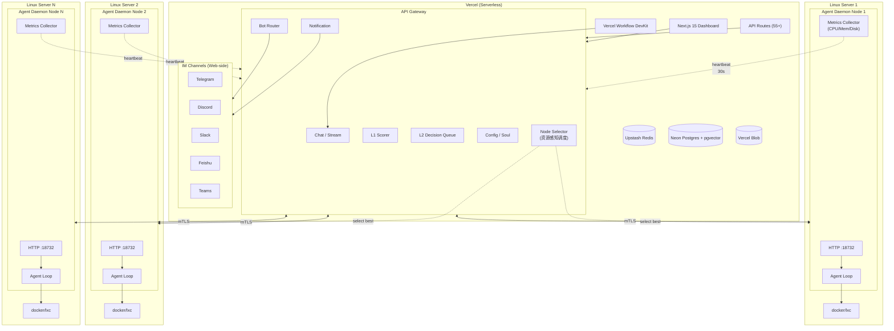

# AgentBoster (WIP)

<p align="center">
	
</p>

<p align="center">
	<a href="./README.EN.md">EN: README</a>
</p>

<p align="center">
	
	
	
	
</p>

> [!NOTE]
>
> 在版本号没有达到 1.0 之前，我建议你可以把本项目当作一个尝鲜，我们不保证向前的兼容性。
>
> Until version 1.0 is released, I suggest you treat this as a preview. We cannot guarantee backwards compatibility at this stage.


AgentBoster 是一个 **Serverless AI Agent 平台**，由两部分组成：

- **AgentBoster Web** — 基于 Next.js 15 的前端 Dashboard，部署在 Vercel 上，提供聊天界面、配置管理、IM Bot 适配、Vercel Workflow DevKit 驱动的持久化 Agent 执行
- **Agent Daemon** — 基于 Go 1.26 的 Linux 守护进程，运行在用户的 Linux 服务器上，提供沙箱执行、安全审查、任务调度。Daemon 不接触 IM，不发送通知；所有 IM 通知由 AgentBoster Web 处理

AgentBoster 拥有你对 AI Agent 的核心需求：Chat、Skills、Memory (RAG)、Soul、Multi-Channel Bot (Telegram/Discord/Slack/Feishu/Teams)、MCP、Sandbox、Workflow，而且是 **Serverless 的**。

---

## 架构

### 运行时架构



---

## 功能特性

### AgentBoster Web (Next.js)
- **Chat** — 多会话、流式响应、消息回溯、会话搜索/置顶、斜杠命令
- **Skills** — 技能动态加载（ClawHub 市场）
- **Memory** — 内置记忆、RAG 向量搜索长期记忆、会话记忆
- **Soul** — Agent 人格/身份管理，按会话定制
- **Config** — Provider、Channel、Agent、Tools、MCP、Autonomy、Appearance 配置
- **Sandbox** — Vercel Sandbox 沙箱管理与监控
- **Multi-Channel Bot** — Telegram、Discord、Slack、Feishu、Teams
- **Multi-Channel Notification** — 统一通知路由到各 IM 平台
- **Workflow** — Vercel Workflow DevKit 驱动的持久化 Agent 执行
- **MCP** — 内置 MCP 工具（Context7、Firecrawl、GitHub、Web）
- **Security** — L1 AI 评分、L2 用户授权决策队列
- **Audit & Monitoring** — 审计日志、运行时监控、Daemon 节点状态
- **Daemon Pairing** — 一键配对密钥，安全注册 Daemon
- **Multi-Node Scheduling** — 多节点智能调度，基于 CPU/内存/磁盘资源自动选择最佳节点

### Agent Daemon (Go)
- **CodeAct Agent Loop** — 工具调用、多步推理、Sub-agent 分支
- **18+ Tools** — 文件读写、Shell 执行、Git、Web 搜索/抓取、记忆、技能、媒体、CodeAct、Sub-agent、任务总结
- **三层安全** — L0 规则过滤 → L1 AI 评分 → L2 用户授权
- **统一决策队列** — L2 授权 + LLM 提问 + 冲突解决 + 任务分支
- **三种沙箱** — docker（轻量日常）、docker-strict（强隔离高风险）、lxc（持久化容器）
- **OS 级强制** — seccomp、capability drop、网络隔离、只读路径
- **Worker Pool** — 动态扩缩容工作池（任务/审查/沙箱/记忆/清理）
- **Session 管理** — LRU 淘汰、归档、Sub-agent 状态追踪、abort 控制
- **Webhook 回调** — 任务完成或需决策时回调 Web 端
- **Node Registration** — 节点注册、心跳上报、资源监控（CPU 型号/使用率、内存占用、磁盘占用）
- **Agent Self-Selection** — AI Agent 可查询节点状态并自主选择执行节点（仅多节点时可用）

### Agent Daemon 安装

```bash
go install github.com/clawless/agentd/cmd/agentd@latest
agentd -tui
agentd -gen-certs -cert-dir ./certs
agentd -config agentd.toml
```

如果从源码构建：

```bash
cd agentd
go build -ldflags "-X main.version=$(git describe --tags --always) -X main.buildTime=$(date -u +%Y-%m-%dT%H:%M:%SZ)" -o agentd ./cmd/agentd/
```

L1 安全层默认开启。未配置或健康检查失败时，所有通过 L0 的工具调用会进入 L2 用户授权；建议在 Web 配置中设置 L1 scorer model 以减少交互确认次数。`security.fail_open=false` 是默认值，只有显式设置为 `true` 才会在 L1 执行错误时放行。

### 集百家之长

AgentBoster 不是从零开始的创新，而是站在多个优秀项目的肩膀上，各取所长，缝合出一个全新的品类。

**ClawLess 是整个项目的基石。** AgentBoster 的全部前端——Next.js 全栈应用、Vercel Serverless 部署、多渠道 IM 接入、Vercel Sandbox 兜底、Vercel Workflow 工作流引擎、Neon Postgres 持久化、Upstash Redis 缓存——全部基于 ClawLess。点按钮部署、零成本启动、永远在线的前端体验，是 AgentBoster 区别于其他所有自托管 Agent 的核心优势。AgentBoster 在 ClawLess 之上叠加了 Agent Daemon 远程执行层，将其从"轻量聊天 Agent"升级为"安全异步 Task Agent"。

**从 Asika 继承骨架。** Event Bus + 动态 Worker Pool + Writer Actor 的并发架构，经过跨平台 PR 管理场景的生产级验证。Agent Daemon 的沙箱调度、子 Agent 并行、审查日志批量写入、多节点智能调度，全部跑在这套骨架上。Asika 的 13 个 Worker 在 PR 管理场景跑了两年没出过并发问题，AgentBoster 直接复用这份可靠性。Asika 的 Label Rules 和 Spam Detector 改造为 L0 规则引擎，Asika 的 Webhook Health Checker 和 Poller 模式改造为 Agent Daemon 心跳检测和节点健康监控。

**从 AstrBot 借鉴前端设计。** Chat UI 和 Settings UI 从 AstrBot 的 Vue Dashboard 中汲取设计灵感，让 AgentBoster 的聊天界面和配置管理界面达到了产品级体验。AstrBot 在中文 IM 生态中的 UI 打磨经验，帮助 AgentBoster 快速构建了用户友好的前端交互。

**从 Manboster 学习安全哲学。** Manboster 的 Hachimi 守门员证明了"AI 可以评估工具调用的安全性"。AgentBoster 借鉴了这个思路，但走了不同的路——不用专用守门员，而是用通用 Flash 模型做 L1 打分，加上 L0 规则引擎和 L2 时间窗口授权，形成三级梯度审查。Manboster 信任 Hachimi，AgentBoster 只信任用户。OS 级强制（cap-drop + seccomp-bpf + mount namespace + network namespace）在 Manboster 的 WASM 沙箱思路上进一步增强，将安全边界推到 Linux 内核层。

**从 Memoh 参考沙箱与记忆。** Memoh 的容器化 Workspace 和混合检索记忆引擎是开源 Agent 框架里做得最细的之一。AgentBoster 借鉴了 Memoh 的沙箱隔离思路，但把粒度从"一个 Bot 一个容器"改为"一个任务一个沙箱"——轻任务用 Docker，持久项目用 LXC。记忆系统借鉴了 Memoh 的混合检索和 LLM 提取提示词，但裁剪为适合 Task Agent 的结构化摘要记忆。

**从 Cahciua/Edelweiss 汲取上下文工程思路。** Cahciua 的 DCP 确定性上下文管线把 LLM 上下文当成纯函数状态机来维护，Edelweiss 在此基础上加入了子 Agent 和技能文件支持。AgentBoster 借鉴了"维护上下文的构造过程而非上下文本身"这一思路，用于会话压缩和长程任务摘要的确定性生成。

**从 Loong Recall 完善记忆系统。** 语义编码、双路检索融合、记忆类型分类、TTL 过期、冷热归档、记忆衰减——Loong Recall 为 AI 编程助手设计的记忆特性，AgentBoster 几乎全部跟进。AgentBoster 的记忆系统在功能完整度上和 Loong Recall 基本持平，在 Task Agent 特化需求上（Built-in Memory、Session Memory 版本管理、Daemon 独立记忆通道）超出更多。

**从 OpenCode 理解终端 Agent 的交互局限。** OpenCode 证明了终端里的 AI 编程助手可以非常高效，但也暴露了同步交互的局限——用户必须盯着终端等结果。AgentBoster 把交互范式从同步改为异步，从终端改为 IM，保留了 OpenCode 的执行能力，但解放了用户的时间。

**从 LobeHub 学习产品化思维。** LobeHub 的 Agent 团队协作、个人记忆结构化、可视化日程管理——这些产品化能力让 AgentBoster 从"能用的工具"变成"好用的产品"。监控标签页、审计日志查看器、L2 授权管理页面、任务历史页面、通知中心，这些前端增强全部从 LobeHub 的产品设计语言中汲取灵感。

**从 CyberGroupmate 借鉴沙箱内目录布局。** CyberGroupmate 的 `workspace/` 目录结构——记忆数据库、会话状态、技能文件、媒体资产、下载文件各自独立——为 AgentBoster 的 chroot/LXC 沙箱布局提供了参考模板。Agent 和用户都知道每个目录的用途，备份和迁移时一目了然。

**AgentBoster 不是"又一个 AI 助手"。** 它是 ClawLess 的全栈基础、Asika 的并发骨架、AstrBot 的前端设计、Manboster 的安全哲学、Memoh 的沙箱思路、Cahciua 的上下文工程、Loong Recall 的记忆系统、OpenCode 的交互反思、LobeHub 的产品思维、CyberGroupmate 的沙箱布局——这十者的缝合产物。缝合不是贬义词，缝合意味着不需要从零发明一切，意味着每个组件都经过其他项目的验证，意味着 AgentBoster 可以站在巨人的肩膀上，把省下来的精力全部投在差异化能力上——异步安全执行链。

---

## 技术栈

### AgentBoster Web
| 类别 | 技术 |
|------|------|
| 框架 | Next.js 15.5 (App Router, RSC) |
| UI | React 19, Tailwind CSS 3, shadcn/ui, Framer Motion, Lucide |
| 状态 | TanStack React Query |
| AI | Vercel AI SDK 6 (Anthropic/Google/OpenAI/OpenAI-compatible) |
| Chat SDK | @chat-adapter/* v4 (Telegram, Discord, Slack, Feishu, Teams) |
| 数据库 | Drizzle ORM + Neon Postgres (pgvector) |
| 缓存 | Upstash Redis |
| 存储 | Vercel Blob |
| 工作流 | Vercel Workflow DevKit + @workflow/ai |
| 沙箱 | Vercel Sandbox |
| MCP | @ai-sdk/mcp (Context7, Firecrawl, GitHub, Web) |
| 调度 | 多节点资源感知调度（CPU/内存/磁盘评分算法） |
| 工具 | Biome, TypeScript 6, Yarn |

### Agent Daemon
| 类别 | 技术 |
|------|------|
| 语言 | Go 1.26 (Linux-only) |
| HTTP | Gin 1.12 |
| 配置 | Viper (TOML) + 环境变量 |
| 事件 | Asika Event Bus |
| 工作池 | Asika Worker Pool (动态扩缩容) |
| 沙箱 | Docker + LXC |
| 安全 | seccomp, capability drop, cgroup |
| 通信 | mTLS + API Key |
| 监控 | CPU 型号采集、资源指标上报（30s 心跳） |

---

## 部署

### AgentBoster Web → Vercel

你不需要下载到本地，也不需要 VPS，你只需要：

- 一个 Vercel 账号（免费版即可）
- 一个和 OpenAI/Anthropic/Gemini 兼容的 API Key
- 点击下方按钮部署

<p align="center">
	<a href=https://vercel.com/new/clone?repository-url=https://github.com/NekoSekaiMoe/agentboster&stores=[{"type":"blob"},{"type":"integration","productSlug":"upstash-kv","integrationSlug":"upstash"},{"type":"integration","protocol":"storage","productSlug":"neon","integrationSlug":"neon"}]&env=AUTH_SECRET,USERNAME,PASSWORD,BLOB_ACCESS&envDescription=Do_not_disclose_AUTH_SECRET_USERNAME_PASSWORD._Set_BLOB_ACCESS_to_private_for_Vercel_Blob_private_stores.&project-name=agentboster&repository-name=agentboster target="_blank">
		
	</a>
</p>

### Agent Daemon → Linux 服务器

```bash
# 克隆仓库
git clone https://github.com/NekoSekaiMoe/agentboster.git
cd agentboster/agentd

# 编译（需要 Go 1.26+）
go build -o agentd ./cmd/agentd/

# 首次运行生成默认配置
./agentd -config agentd.toml

# 编辑配置后启动
vim agentd.toml
./agentd
```

---

---

## IM 命令

AgentBoster 支持通过 IM 渠道（Telegram/Discord/Slack/Feishu/Teams）使用以下命令：

### 会话管理
- `/start` - 显示欢迎消息和可用命令
- `/new` - 创建新会话
- `/sessions` - 列出所有会话
- `/session [id]` - 切换或显示当前会话
- `/switch <index|id>` - 切换到指定会话
- `/delete_session [id]` - 删除会话

### 执行控制
- `/stop` - 停止当前 workflow 运行
- `/cancel` - 取消当前请求
- `/retry` - 重试上一个失败的请求
- `/compact` - 请求上下文压缩

### 配置管理
- `/model [model-id]` - 显示或切换模型
- `/provider` - 管理模型提供商
- `/config [path] [value]` - 显示或设置配置
- `/lang [code]` - 切换语言（支持 en-US/zh-CN/zh-TW/ja/ko 等）

### 安全审查
- `/approve <toolCallId> [note]` - 批准待审工具调用
- `/reject <toolCallId> [note]` - 拒绝待审工具调用
- `/decisions` - 列出待决策项（L2 授权 + 提问）
- `/reset` - 重置会话状态，清除所有待审批决策

### 其他
- `/status` - 显示会话状态
- `/help` - 显示帮助信息
- `/version` - 显示版本信息
- `/id` - 显示当前会话和用户 ID
- `/init` - 生成或更新 AGENTS.md
- `/memory <query>` - 搜索记忆
- `/pair <code>` - 配对 IM 账号

所有命令响应支持多语言（根据用户设置的 `/lang` 自动切换）。

---

## 快速开始

### 1. 配置环境变量

部署时需要 `AUTH_SECRET`、`USERNAME`、`PASSWORD`、`BLOB_ACCESS` 环境变量。`AUTH_SECRET`、`USERNAME`、`PASSWORD` **不要泄漏**；`BLOB_ACCESS` 推荐填写 `private`。

### 2. 登录并配置

打开部署链接 → 登录 → 进入「Config」→ 添加 Provider（OpenAI Legacy）→ 设置 `Default Model` 和 `Embedding Model`。

### 3. 配置 Agent Daemon

在 `agentd.toml` 中配置：

```toml
[server]
listen = ":18732"
tls_cert_path = "./certs/server-cert.pem"
tls_key_path = "./certs/server-key.pem"
ca_path = "./certs/ca-cert.pem"
clawless_api_key = "sk-clawless-xxx"

[clawless]
base_url = "https://your-agentboster.vercel.app"
client_cert_path = "./certs/client-cert.pem"
client_key_path = "./certs/client-key.pem"
ca_path = "./certs/ca-cert.pem"

[sandbox]
default = "docker"
docker_socket = "unix:///var/run/docker.sock"
docker_image = "alpine:edge"
allowed_images = ["ubuntu:22.04", "ubuntu:24.04", "alpine:latest", "golang:1.22", "node:20", "python:3.12"]
os_enforce = true
network_isolate = true
```

### 4. 连接 IM

进入 Channel 配置 → 设置 IM Bot Token → 配置 Webhook → 设置白名单。

### 5. 开始聊天

在 Web Chat 或 IM 中与 Agent 对话。

---

## 沙箱

沙箱通过 `SelectSandbox` 策略自动选择：

| 类型 | 实现 | 隔离级别 | 持久化 | 默认资源 | 适用场景 |
|------|------|---------|--------|---------|---------|
| **docker** | DockerLightProvider | 中（OS 策略 + seccomp） | 否 (`--rm`) | 0.25 CPU / 256MB | 轻量日常任务、代码执行 |
| **docker-strict** | DockerProvider | 高（无网络、只读、cap-drop ALL） | 否 | 1.0 CPU / 512MB | 高风险/不可信代码、命令 |
| **lxc** | LXCPersistentProvider | 中（cgroup + OS 策略） | 是 | 1.0 CPU / 512MB | 需要持久化的长任务、git clone、编译 |

选择优先级：
1. 用户显式指定 → 2. 高风险命令 → `docker-strict` → 3. 需持久化 → `lxc` → 4. Agent 默认配置 → 5. 兜底 → `docker`

Docker light 默认镜像 `alpine:edge`，应用 OS 强制策略（cap-drop ALL + 选择性保留、seccomp、no-new-privileges、只读 rootfs、网络隔离）。Docker strict 使用镜像白名单、`--network none`、`--read-only`、`--pids-limit 128`。

LXC 持久化容器使用 `lxc-create`/`lxc-start`/`lxc-attach`，支持 init 命令、cgroup 资源限制、OS 级安全策略。支持 stop-only（保留 rootfs）和 full destroy 两种销毁模式。

---

## 安全

- **L0** — 预定义规则，直接拒绝危险命令（`rm -rf /`、`mkfs`、`dd if=`、`sudo` 等）
- **L1** — LLM 评分（local_ollama/remote API），对命令进行风险评分（低/中/高/严重），带缓存
- **L2** — 高风险命令需用户确认（pass_once / pass_until / reject_once / reject_until）
- **Decision Queue** — 统一决策队列，合并 L2 授权 + LLM 提问 + 冲突解决 + 任务分支
- **OS Enforcement** — seccomp 策略、capability drop（保留最少的必需 cap）、网络隔离、敏感路径掩码
- **Prompt Injection Defense** — System Prompt 内置注入防御
- **Docker 白名单** — strict 模式只允许白名单镜像
- **mTLS** — 双向 TLS 认证，Daemon 不存储 IM Token

---

## 开发

```bash
# Web (Next.js)
yarn install          # 安装依赖
yarn dev              # 启动开发服务器 (localhost:3000)
yarn run check        # Typecheck + Biome lint/format
yarn build            # 生产构建
yarn db:generate      # Drizzle 生成迁移
yarn db:push          # Drizzle 推送 schema
yarn db:studio        # Drizzle Studio

# Agent Daemon (Go)
cd agentd
go build -o agentd ./cmd/agentd/
./agentd -config agentd.toml
```

需要 `.env.local`（已 gitignore），包含 `DATABASE_URL`、`REDIS_URL` 等环境变量。

---

## 其他

如果你有任何想法或者发现了问题，请随时提交 Pull Request 或者在 Issues 中提出，欢迎任何形式的贡献。

前端 UI 基于 [ClawLess](https://github.com/Niapya/clawless) 修改而来，感谢 ClawLess 项目提供的 Dashboard 基础和灵感。

感谢 OpenClaw 和 Manus 的灵感来源，Vercel 作为部署平台，还有所有用到的开源库，以及**你**。

本项目使用 MIT License.
