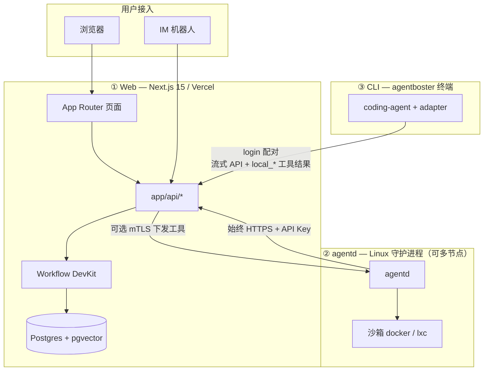
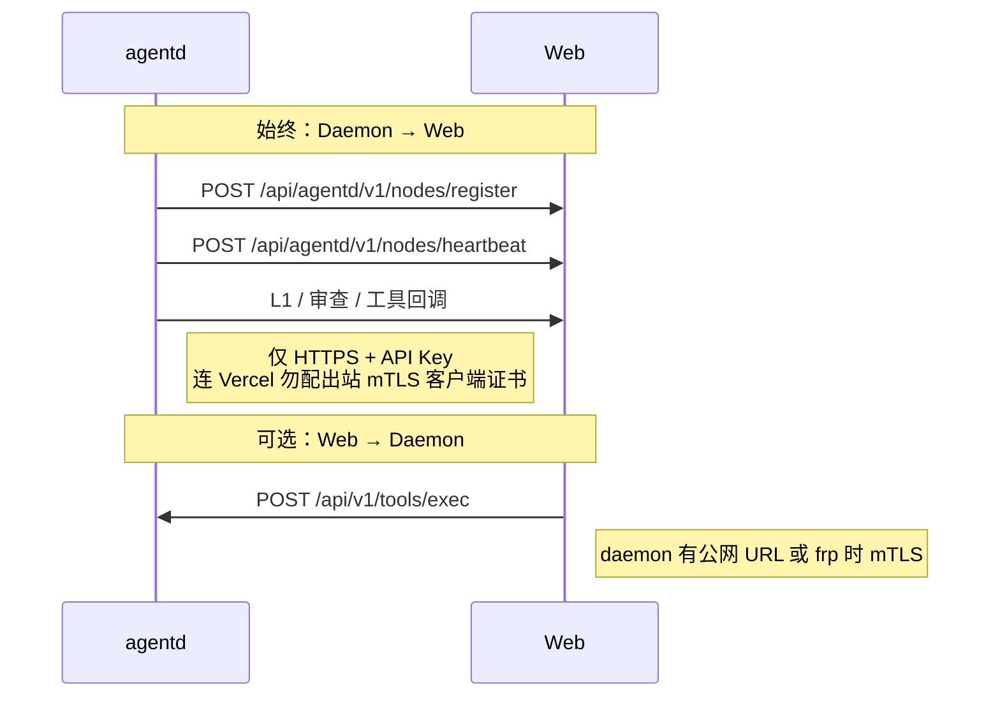
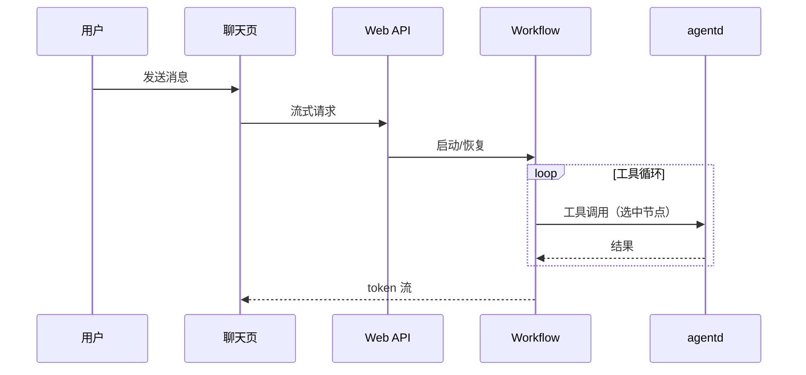
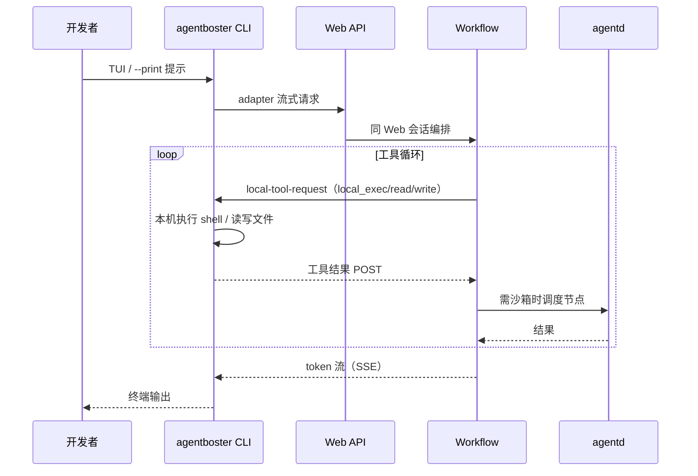

# AgentBoster (WIP)

<p align="center">
  
</p>

<p align="center">
  <a href="./README.EN.md">EN: README</a>
</p>

<p align="center">
  
  
  
  
</p>

> [!NOTE]
> 在 1.0 发布前，功能与接口仍可能变化，升级兼容性不作保证。

AgentBoster 是多端协作的 AI 平台，由 **三个可独立部署/安装的部分** 组成：

- **Web（Next.js 15）**：浏览器 UI、会话与配置、IM 接入、Workflow 持久化编排、L2 审批与节点注册（Postgres）
- **agentd（Go）**：Linux 守护进程，沙箱内执行工具、L0/L1/L2 安全、本地会话运行时与多节点心跳
- **CLI（`agentboster`）**：终端编码 Agent；通过 `agentboster login` 配对到 Web 后端，所有模型调用、工具执行、会话持久化都由 Web 编排，CLI 仅作为瘦客户端负责本地 TUI 与 `local_*` 工具（在本机执行 shell/读写文件）

Web 负责体验与编排，Daemon 负责执行隔离与安全边界，CLI 负责开发者本机终端场景；三者通过 HTTPS API 协作，部署环境可分开升级。

---

## 平台架构



### 职责划分

| 层级 | 主要负责 | 不负责 |
|------|----------|--------|
| **Web** | 会话、IM 路由、配置 UI、Workflow 状态、L2 交互、节点表 | 用户 VPC 内长期 shell（除非下发给 agentd） |
| **agentd** | 沙箱内 exec/文件/浏览器等工具、主机侧 L0/L1、本地缓存与指标 | 主库持久化（经 API 与 Web 同步） |
| **CLI** | TUI/打印模式、`agentboster login` 配对、本机 `local_*` 工具执行 | 服务端 IM、模型/工具编排、Workflow 权威状态 |

### 通信方向（必读）



- **Daemon → Web**：始终 `HTTPS` + `AGENTD_API_KEY`（与 `clawless_api_key` 一致）。部署在 Vercel 时，**不要**给该方向配置 `[clawless].ca_path` 等自定义 CA，否则会校验失败。
- **Web → Daemon**：仅当节点 URL 可达时；Web 侧使用 `AGENTD_CLIENT_*` 环境变量做 mTLS 客户端证书。

### 典型路径：Web 聊天



### 典型路径：CLI 会话



Web、IM、CLI 三条入口均汇聚到 **Web API + Workflow**；CLI 既是消费端，也是 `local_*` 工具的执行端。详见 [`cli/README.md`](./cli/README.md)。

---

## 当前仓库结构

```
app/                    # Next.js App Router（页面与 API）
  (auth)/              # 登录
  (chat)/              # 聊天、文件
  (config)/            # 系统配置
  (memory)/            # 记忆与 RAG
  (schedule)/          # 任务/日程
  (skill)/             # 技能
  api/                 # Web API（含 agentd 回调、IM webhook）
  .well-known/workflow/ # Workflow 回调免鉴权
components/             # React + shadcn
hooks/
lib/                    # 业务与基础设施（workflow、chat、db…）
types/
scripts/
agentd/                 # Go 守护进程（仅 Linux）
  cmd/agentd
  internal/
cli/                    # agentboster CLI monorepo
  packages/coding-agent   # 命令入口
  packages/agentboster-adapter  # 对接 Web
```

---

## 核心能力（精简）

### Web 侧

- 多会话流式聊天、搜索与斜杠命令
- 多渠道 Bot（Telegram/Discord/Slack/Feishu/Teams）与统一通知
- Skills、Provider、工具、MCP、Soul、审计与监控
- Workflow 持久化与 L1/L2 安全流
- RAG / 内置记忆；多节点调度（见 `MULTI-NODE-SCHEDULING.md`）

### Daemon 侧

- 多步 Agent 与 CodeAct 式工具循环
- 沙箱：`docker`、`docker-strict`、`lxc`
- L0 规则 → L1 打分 → L2 用户授权
- 节点注册、心跳、资源指标上报
- 事件总线与动态 worker pool

### CLI 侧

- 交互 TUI 与 `--print` 非交互
- `agentboster login` 写入 `~/.agentboster/config.json`，配对到 Web 后端
- 所有 LLM 调用、模型/工具编排、会话持久化都由 Web 负责；CLI 仅运行 `local_*` 工具（本机 shell / 读写文件）
- 打包：`cli/` 下 `npm run bundle` / `npm run package`

---

## 快速部署

### 1) Web（Vercel）

1. 配置 `AUTH_SECRET`、`USERNAME`、`PASSWORD`、`BLOB_ACCESS`
2. 生产环境配置 `DATABASE_URL`（Neon 等）
3. 使用 agentd 时设置 `AGENTD_API_KEY`
4. 可选 `TAVILY_API_KEY`（联网搜索）
5. 部署到 Vercel

### 2) Daemon（Linux）

```bash
cd agentd
go build -o agentd ./cmd/agentd/
cp agentd.toml.example agentd.toml
# 编辑 base_url、clawless_api_key、sandbox
sudo ./agentd -config agentd.toml
```

完整说明：[`agentd/README.md`](./agentd/README.md)。

### 3) CLI（本机）

```bash
cd cli
npm install
npm run build
node packages/coding-agent/dist/cli.js --help
agentboster login   # 使用 Web 时
```

完整说明：[`cli/README.md`](./cli/README.md)。

---

## 环境变量（Web）

| 变量 | 说明 |
|------|------|
| `AUTH_SECRET`、`USERNAME`、`PASSWORD` | 登录与 Cookie |
| `DATABASE_URL` | 生产必填 |
| `BLOB_ACCESS` / `BLOB_READ_WRITE_TOKEN` | 附件存储 |
| `AGENTD_API_KEY` | 与 daemon `clawless_api_key` 一致 |
| `AGENTD_CLIENT_CERT_PATH` 等 | 仅 Web 主动访问 daemon 时需要 |
| `TAVILY_API_KEY` | 可选 |

CLI 端无需 env 变量；登录信息写入 `~/.agentboster/config.json`。调试可设 `AGENTBOSTER_SESSION_ID`、`AGENTBOSTER_CLIENT_ID`（见 cli README）。

---

## 常用命令

| 范围 | 命令 |
|------|------|
| Web | `yarn dev`、`yarn build`、`yarn lint:check`、`yarn test`、`yarn db:push` |
| agentd | `go test ./...`、`go build -o agentd ./cmd/agentd/`（在 `agentd/`） |
| CLI | `npm run build`、`npm run check`（在 `cli/`） |

---

## IM 命令（节选）

`/start`、`/new`、`/session`、`/stop`、`/cancel`、`/retry`、`/model`、`/approve`、`/reject`、`/compact`、`/help`、`/memory`

---

## 相关文档

| 文档 | 内容 |
|------|------|
| [`README.EN.md`](./README.EN.md) | 英文 README（与本文同结构） |
| [`agentd/README.md`](./agentd/README.md) | 守护进程 |
| [`cli/README.md`](./cli/README.md) | 终端 CLI |
| [`AGENTS.md`](./AGENTS.md) | 贡献者与 OpenCode 说明 |

---

## 贡献

提交 PR 或发 Issue。项目采用 MIT 许可证。