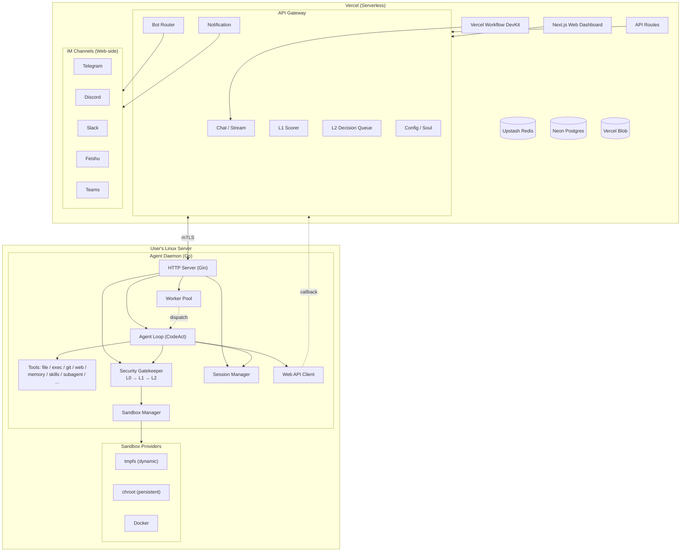

# AgentBoster (WIP)

<p align="center">
	
</p>

<p align="center">
	<a href="./README.EN.md">EN: README</a>
</p>

<p align="center">
	
	
	
	
</p>

> [!NOTE]
>
> 在版本号没有达到 1.0 之前，我建议你可以把本项目当作一个尝鲜，我们不保证向前的兼容性。
>
> Until version 1.0 is released, I suggest you treat this as a try. We cannot guarantee full backwards compatibility at this stage.


AgentBoster 是一个 **Serverless AI Agent 平台**，由两部分组成：

- **AgentBoster Web** — 基于 Next.js 的前端 Dashboard，部署在 Vercel 上，提供聊天界面、配置管理、Bot 适配器、安全审查、Vercel Workflow DevKit 驱动的持久化 Agent 执行
- **Agent Daemon** — 基于 Go 的 Linux 守护进程，运行在用户的 Linux 服务器上，提供沙箱执行、安全审查、任务调度。Daemon 不接触 IM，不发送通知；所有 IM 通知由 AgentBoster Web 处理

AgentBoster 拥有你对 AI Agent 的核心需求：Chat、Skills、Memory (RAG)、Soul、Multi-Channel Bot (Telegram/Discord/Slack/Feishu/Teams/QQ)、MCP、Sandbox 执行、Workflow，而且是 **Serverless 的**。

---

## 架构



---

## 项目结构

```
app/                     # Next.js App Router 页面 & API 路由
├── (auth)/              #   登录页面
├── (chat)/              #   聊天界面、文件、调度任务
├── (config)/            #   配置管理、监控、审计日志
├── (memory)/            #   记忆/RAG 管理
├── (schedule)/          #   调度管理
├── (skill)/             #   技能管理
├── api/                 #   公开 API 路由
│   ├── api/auth/        #     登录
│   ├── api/agentd/v1/   #     Daemon 回调 (L1 评分, L2 决策)
│   ├── api/bot/         #     IM Webhook (auth secret 嵌入路径)
│   ├── api/config/      #     配置、审计日志、监控
│   ├── api/notifications/#     通知管理
│   ├── api/sandbox/     #     沙箱工具
│   ├── api/pair/        #     Daemon 配对
│   └── api/soul/        #     Agent 人格管理
├── .well-known/workflow/ #   Vercel Workflow 回调（绕过认证中间件）
components/              # React 组件 (shadcn/ui)
lib/                     # 核心逻辑
├── ai/                  #   AI SDK Provider 工厂
├── auth/                #   认证配置
├── bot/                 #   Bot 适配器 & Webhook 路由
├── chat/                #   聊天传输、流式、斜杠命令
├── core/                #   基础设施: DB (Drizzle+Neon), KV (Redis), Blob, Sandbox
├── extra/               #   服务端业务逻辑: agent, channels, config, cron, memory, prompts, sandbox, security
├── mcp/                 #   内置 MCP 服务器 (Context7, Firecrawl, GitHub, Web)
├── memory/              #   记忆系统: 内置、RAG 长期、会话
├── security/            #   安全: L1 评分器、L2 决策队列
├── utils/               #   工具函数
└── workflow/            #   Vercel Workflow DevKit: Agent Workflow + 定时调度
hooks/                   # React Hooks (config draft, validation, mobile)
types/                   # TypeScript 类型定义 (config, memory, skills, workflow)
agentd/                  # Go Daemon (Linux 守护进程)
├── cmd/agentd/main.go   #   入口
└── internal/            #   内部包
    ├── agent/           #     LLM 循环、工具定义、上下文管理
    ├── sandbox/         #     沙箱提供者 (docker, docker_light, lxc_persistent)
    ├── security/        #     安全规则与执行 (L0/L1/L2)
    ├── session/         #     会话持久化、LRU、归档
    ├── worker/          #     任务分发 & 工作池
    ├── server/          #     HTTP 路由与中间件
    ├── clawless/        #     Web API 客户端
    ├── config/          #     配置加载与验证
    ├── certs/           #     mTLS 证书管理
    └── lifecycle/       #     启停编排
```

---

## 功能特性

### AgentBoster Web (Next.js)
- **Chat** — 多会话聊天，流式响应、消息回溯、会话搜索/置顶、斜杠命令
- **Skills** — 技能管理，动态加载（ClawHub 市场）
- **Memory** — 内置记忆、RAG 向量搜索长期记忆、会话记忆
- **Soul** — Agent 人格/身份管理，按会话定制
- **Config** — Provider、Channel、Agent、Tools、MCP、Autonomy 配置
- **Sandbox** — Vercel Sandbox 沙箱管理与监控
- **Multi-Channel Bot** — Telegram、Discord、Slack、Feishu、Teams、QQ
- **Multi-Channel Notification** — 统一通知路由到各 IM 平台
- **Workflow** — Vercel Workflow DevKit 驱动的持久化 Agent 执行
- **MCP** — 内置 MCP 工具（Context7、Firecrawl、GitHub、Web）
- **Security** — L1 AI 评分、L2 用户授权决策队列
- **Audit & Monitoring** — 审计日志、运行时监控、Daemon 节点状态
- **Daemon Pairing** — 一键生成配对密钥，安全注册 Daemon

### Agent Daemon (Go)
- **LLM Agent Loop** — CodeAct 模式、工具调用、多步推理、Sub-agent 分支
- **20+ Tools** — 文件读写、Shell 执行、Git、Web 搜索/抓取、记忆、技能、媒体、Sub-agent、任务总结等
- **三层安全防护** — L0 规则过滤 → L1 AI 评分 → L2 用户授权
- **统一决策队列** — L2 授权 + LLM 提问 + 冲突解决 + 任务分支，串行/并发混合调度
- **三种沙箱** — tmpfs（AI 动态评估大小）、chroot（持久化）、Docker（强隔离）
- **Webhook 回调** — 任务完成或需要用户决策时回调 AgentBoster Web，由 Web 端通知用户
- **Session 管理** — 会话持久化、LRU 淘汰、归档、Sub-agent 状态追踪、abort 控制
- **Worker Pool** — 任务分发与工作池（任务、审查、沙箱、清理、整理 Worker）

---

## 技术栈

### AgentBoster Web
| 类别 | 技术 |
|------|------|
| 框架 | Next.js 15 (App Router, RSC) |
| UI | React 19, Tailwind CSS 3, shadcn/ui, Framer Motion |
| 状态 | TanStack React Query |
| AI | Vercel AI SDK 6 (Anthropic, Google, OpenAI, OpenAI-compatible) |
| Chat 适配 | @chat-sdk (Telegram, Discord, Slack, Feishu, Teams, QQ) |
| 数据库 | Drizzle ORM + Neon Postgres (pgvector) |
| 缓存 | Upstash Redis |
| 存储 | Vercel Blob |
| 工作流 | Vercel Workflow DevKit |
| 沙箱 | Vercel Sandbox |
| MCP | 内置 MCP 服务器 (Context7, Firecrawl, GitHub, Web) |
| 工具 | Biome (lint/format), Yarn, Node.js |

### Agent Daemon
| 类别 | 技术 |
|------|------|
| 语言 | Go 1.26+ (Linux-only) |
| HTTP | Gin |
| 配置 | Viper (TOML) |
| 事件 | 自研 Event Bus |
| 工作池 | 自研 Worker Pool |
| 通信 | mTLS + API Key |

---

## Deploy

### AgentBoster Web → Vercel

你不需要下载到本地，也不需要 VPS，你只需要：

- 一个 Vercel 账号（免费版即可）
- 一个和 OpenAI/Anthropic/Gemini 兼容的 API Key
- 点击下方按钮部署

<p align="center">
	<a href=https://vercel.com/new/clone?repository-url=https://github.com/NekoSekaiMoe/agentboster&stores=[{"type":"blob"},{"type":"integration","productSlug":"upstash-kv","integrationSlug":"upstash"},{"type":"integration","protocol":"storage","productSlug":"neon","integrationSlug":"neon"}]&env=AUTH_SECRET,USERNAME,PASSWORD&envDescription=Do_not_disclose_them_and_keep_them_safe.&project-name=agentboster&repository-name=agentboster target="_blank">
		
	</a>
</p>

### Agent Daemon → Linux Server

在你的 Linux 服务器上：

```bash
# 克隆仓库
git clone https://github.com/Niapya/agentboster.git
cd agentboster/agentd

# 编译（需要 Go 1.26+）
go build -o agentd ./cmd/agentd/

# 首次运行生成默认配置
./agentd -config agentd.toml

# 编辑配置
vim agentd.toml

# 启动
./agentd
```

---

## Quick Start

### 1. 配置环境变量

部署时需要 `AUTH_SECRET`、`USERNAME`、`PASSWORD` 三个环境变量，**不要泄漏**。

### 2. 登录并配置

打开部署链接 → 登录 → 进入「Config」→ 添加 Provider（OpenAI Compatible）→ 设置 `Default Model` 和 `Embedding Model`。

### 3. 配置 Agent Daemon

在 `agentd.toml` 中配置：

```toml
[server]
listen = ":18732"
agentboster_api_key = "your-api-key"

[agentboster]
base_url = "https://your-agentboster.vercel.app"
client_cert_path = "/path/to/client.crt"
client_key_path = "/path/to/client.key"
ca_path = "/path/to/ca.crt"

[sandbox]
default = "tmpfs"
chroot_base = "/var/lib/agentd/chroots"
docker_socket = "unix:///var/run/docker.sock"
allowed_images = ["ubuntu:22.04", "ubuntu:24.04", "alpine:latest", "golang:1.22", "node:20", "python:3.12"]
```

### 4. 连接 IM

进入 Channel 配置 → 设置 IM Bot Token → 配置 Webhook → 设置白名单。

### 5. 开始聊天

在 Web Chat 或 IM 中与 Agent 对话。

---

## 沙箱

| 类型 | 隔离级别 | 持久化 | 大小策略 | 适用场景 |
|------|---------|--------|---------|---------|
| **tmpfs** | 低（内存目录） | 可选 | AI 动态评估 + Daemon 内存探测 | 轻量临时任务 |
| **chroot** | 中（文件系统隔离） | 总是持久 | rootfs 多来源（URL/本地/preset） | 需要持久文件系统的开发任务 |
| **Docker** | 高（完整容器隔离） | 可选 | 镜像白名单 + 资源限制 | 高风险命令、需要强隔离的任务 |

tmpfs 大小由 AI 评估（轻任务 15-50MB，中任务 50-200MB，重任务 200-500MB），Daemon 探测 zram → 物理内存 → swap 三级可用空间后决定最终分配。执行中空间不足时自动扩容（上限 = min(当前 × 3, 可用内存 × 60%)）。

chroot rootfs 支持 6 种来源（按优先级）：用户指定路径 → 用户指定 URL → presets → 本地预置 → 默认 URL 下载 → 复制宿主机二进制。下载的 rootfs 自动缓存，后台定期清理过期文件（默认 30 天）。

---

## Security

- **L0** — 预定义规则，直接拒绝危险命令（`rm -rf /`、`chmod 777` 等）
- **L1** — LLM 评分，对命令进行风险评分（低/中/高）
- **L2** — 高风险命令需用户通过 Web UI 或 IM 按钮确认（pass_once/pass_until/reject_once/reject_until）
- **Decision Queue** — 统一决策队列，L2 授权 + LLM 提问 + 冲突解决 + 任务分支
- **Prompt Injection Defense** — System Prompt 内置注入防御规则
- **Docker 白名单** — 只允许白名单中的镜像
- **mTLS** — AgentBoster Web ↔ Agent Daemon 双向 TLS 认证。Daemon 不存储任何 IM Token，不知道用户使用的 IM 平台

---

## Development

```bash
# Web (Next.js)
yarn install          # 安装依赖
yarn dev              # 启动开发服务器 (localhost:3000)
yarn check            # Typecheck + Biome lint/format
yarn build            # 生产构建
yarn db:generate      # Drizzle 生成迁移
yarn db:push          # Drizzle 推送 schema
yarn db:studio        # Drizzle Studio

# Agent Daemon (Go)
cd agentd
go build -o agentd ./cmd/agentd/
./agentd -config agentd.toml
```

需要 `.env.local` 文件（已 gitignore），包含 `DATABASE_URL`、`REDIS_URL` 等环境变量。详细变量列表见 CLAUDE.md。

---

## Others

我正在找工作，如果你对我有兴趣，请联系我。

如果你有任何想法或者发现了问题，请随时提交 Pull Request 或者在 Issues 中提出，欢迎任何形式的贡献。

前端 UI 基于 [ClawLess](https://github.com/Niapya/clawless) 修改而来，感谢 ClawLess 项目提供的 Dashboard 基础和灵感。

感谢 OpenClaw 和 Manus 的灵感来源，Vercel 作为部署平台，还有所有用到的开源库，以及**你**。

本项目使用 MIT License.
