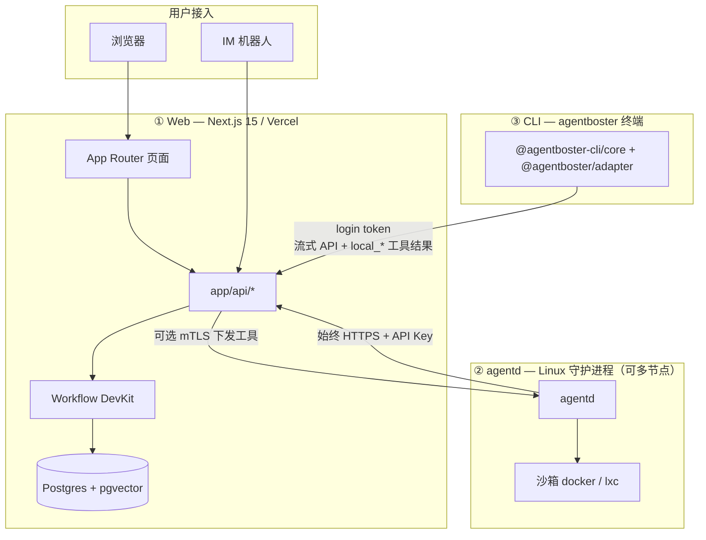

# AgentBoster (WIP)

<p align="center">
  
</p>

<p align="center">
  <a href="./README.EN.md">EN: README</a>
</p>

<p align="center">
  
  
  
  
  <a href="https://deepwiki.com/NekoSekaiMoe/agentboster">
    
  </a>
</p>

> [!NOTE]
> 在 1.0 发布前，功能与接口仍可能变化，升级兼容性不作保证。

AgentBoster 是多端协作的 AI 平台，由 **三个可独立部署/安装的部分** 组成：

- **Web（Next.js 15）**：浏览器 UI、会话与配置、IM 接入、Workflow 持久化编排、L2 审批与节点注册（Postgres）
- **agentd（Go）**：Linux 守护进程，沙箱内执行工具、L0/L1/L2 安全、本地会话运行时与多节点心跳
- **CLI（[`agentboster`](./subpackage/cli)，基于 [pi](https://github.com/earendil-works/pi)）**：终端编码 Agent；通过 `agentboster login` 配对到 Web 后端，所有模型调用、模型/工具编排、会话持久化都由 Web 负责，CLI 仅作为瘦客户端负责本地 TUI 与 `local_*` 工具（在本机执行 shell/读写文件）

Web 负责体验与编排，Daemon 负责执行隔离与安全边界，CLI 负责开发者本机终端场景；三者通过 HTTPS API 协作，部署环境可分开升级。

---

## 平台架构



### 职责划分

| 层级 | 主要负责 | 不负责 |
|------|----------|--------|
| **Web** | 会话、IM 路由、配置 UI、Workflow 状态、L2 交互、节点表 | 用户 VPC 内长期 shell（除非下发给 agentd） |
| **agentd** | 沙箱内 exec/文件/浏览器等工具、主机侧 L0/L1、本地缓存与指标 | 主库持久化（经 API 与 Web 同步） |
| **CLI** | TUI/打印模式、`agentboster login` 配对、本机 `local_*` 工具执行 | 服务端 IM、模型/工具编排、Workflow 权威状态 |

### 平台特性

AgentBoster 的工程取舍围绕四个主轴展开,贯穿 Web / agentd / CLI 三层。

#### 硬分层 —— Web 是唯一权威,执行端只做执行

会话状态、模型编排、工具路由、Workflow 运行时、凭证与审计日志全部归 **Web**(Next.js + Postgres + pgvector + Workflow DevKit)。`agentd` 与 CLI 都不带本地权威状态:

- **agentd** 是无状态执行节点 —— 注册、心跳、工具结果全部 POST 给 Web;自身只保留沙箱与本地缓存/指标,重启后从 Web 重新拉取节点身份。
- **CLI** 是瘦客户端 —— 不做模型推理、不持久化会话;本地 session 文件仅是 Web 数据的临时镜像(`SessionManager` 写 tmpdir,退出即清)。`--resume` / `/resume` 直接从 `GET /api/cli/sessions/[id]/messages` 拉远程消息重建上下文。

这种"执行端可丢弃"的约束,使得 agentd 节点和 CLI 进程都能水平扩缩、随时重启,而不影响会话连续性。

#### 强异步 —— Workflow 驱动,事件流回灌

所有 LLM 调用、工具循环、子代理编排都不直接跑在请求线程上,而是落地为 **Workflow DevKit 的可恢复步骤**:

- 用户提交 → `chatMain` 启动/恢复 workflow run → 持久化每一步 delta(`persistStepDeltaAndUsageStep`)到 `messages` 表。
- 工具调用经 L0/L1/L2 安全流后,通过事件总线派发(节点 `POST /api/agentd/v1/*` 回调,或 CLI 的 `local-tool-request` SSE)。
- 任一执行端宕机,wf 暂停等下一次 `route-message` / agentd 回调;恢复后从中断点续跑,而非重头开始。

CLI 的 `trigger: 'regenerate-message'` 复用同一条 chatMain:Web 侧 `deleteMessagesAfterUiMessageId` 截断下游 → 重跑,CLI 只负责把编辑后的文本和 `versions[]` 元数据 PATCH 上去。

#### 低耦合 —— 三层独立演进,契约窄

三层之间只通过**窄 HTTP 契约**通信,没有共享代码路径、共享 DB schema 或共享进程内状态:

| 方向 | 契约 | 鉴权 |
|------|------|------|
| CLI → Web | `POST /api/cli/chat` + `GET/PATCH /api/cli/{sessions,messages}/*` | Bearer `clawless-auth` + 设备吊销检查 |
| agentd → Web | `POST /api/agentd/v1/nodes/{register,heartbeat}` + 工具回调 | `AGENTD_API_KEY`(HTTPS) |
| Web → agentd | `POST /api/v1/tools/exec`(可选,仅当节点 URL 可达) | `AGENTD_CLIENT_*` mTLS |

- Web 不需要知道 agentd / CLI 的内部实现,只认 HTTP body 与事件 schema。
- agentd 是独立 Go module(`subpackage/agentd/`),CLI 是独立 Yarn Classic monorepo(`subpackage/cli/`),两者各有自己的 `AGENTS.md`、工具链与发版周期。
- 模型上下文窗口大小(`resolveModelContextLimit`)在 Web 一处解析后,经 `/api/cli/models` 下发给 CLI 与 IM,避免三层各自维护一份上下文表。

#### 强安全 —— 三层防线 + 双向鉴权

工具执行永远穿过**三层独立的安全评估**,任一层可独立否决:

| 层 | 位置 | 作用 |
|----|------|------|
| **L0** | 规则黑名单(执行端) | 静态拦截 `rm -rf /`、fork bomb 等已知危险模式 |
| **L1** | LLM 打分(agentd / Web) | 对命令做风险评分,超阈值上报或转 L2 |
| **L2** | 用户授权(Web UI / CLI TUI) | 高风险操作要求人工 approve/deny |

- **CLI `--yolo`** 跳过三层(用于可信 CI/`--print` 场景),但仅在 CLI 本机 `local_*` 工具上生效;经 Web 派发到 agentd 的工具仍走完整流程。
- **Web ↔ agentd** 默认 HTTPS + API Key;当节点具备公网 URL 或 frp 通道时,额外启用 mTLS 双向证书(`AGENTD_CLIENT_*`),Web 侧校验 daemon 证书、daemon 侧校验 Web 客户端证书。
- **Web ↔ CLI** 通过 `agentboster login` 设备配对颁发 token,支持服务端吊销(`withCliAuth` 每次请求校验设备状态);CLI 不接触用户主密码或 session cookie。
- agentd 沙箱隔离支持 `docker` / `docker-strict` / `lxc` 三档,文件系统、网络、能力位按档位收紧。

---

## 核心能力（精简）

### Web 侧

- 多会话流式聊天、搜索与斜杠命令
- 多渠道 Bot（Telegram/Discord/Slack/Feishu/Teams）与统一通知
- Skills、Provider、工具、MCP、Soul、审计与监控
- Workflow 持久化与 L1/L2 安全流
- RAG / 内置记忆；多节点调度（见 `lib/workflow/scheduled/dispatch.ts` 与 `app/api/agentd/v1/nodes/*`）

### Daemon 侧

- 多步 Agent 与 CodeAct 式工具循环
- 沙箱：`docker`、`docker-strict`、`lxc`
- L0 规则 → L1 打分 → L2 用户授权
- 节点注册、心跳、资源指标上报
- 事件总线与动态 worker pool

### CLI 侧

- 交互 TUI 与 `--print` 非交互
- `agentboster login` 写入 `~/.agentboster/config.json`，配对到 Web 后端
- 所有 LLM 调用、模型/工具编排、会话持久化都由 Web 负责；CLI 仅运行 `local_*` 工具（本机 shell / 读写文件）
- Yarn Classic monorepo：`packages/ai` → `packages/agent` → `packages/agentboster-adapter` → `packages/coding-agent`
- `packages/desktop` 是独立 Tauri 桌面应用，不在 CLI 根 workspace 构建链内
- 打包：`subpackage/cli/` 下 `yarn bundle` / `yarn package`

| CLI 包 | 作用 |
|--------|------|
| `@agentboster-cli/core` (`packages/coding-agent`) | `agentboster` bin、TUI/打印模式、本机工具、扩展、会话树、HTML 导出 |
| `@agentboster/adapter` (`packages/agentboster-adapter`) | 登录配置、远端模型目录、Web SSE 流、安全辅助函数 |
| `@agentboster-cli/agent` (`packages/agent`) | Agent loop 与 session primitives |
| `@agentboster-cli/ai` (`packages/ai`) | 类型与事件流接口、兼容 stub；不包含 provider SDK |
| `@agentboster-cli/desktop` (`packages/desktop`) | 独立 Tauri 桌面壳，私有包，不属于根 workspace |

---

## 快速部署

### 1) Web（Vercel）

1. 配置 `AUTH_SECRET`、`USERNAME`、`PASSWORD`、`BLOB_ACCESS`
2. 生产环境配置 `DATABASE_URL`（Neon 等）
3. 使用 agentd 时设置 `AGENTD_API_KEY` 和 `AGENTD_URL`
4. 可选 `TAVILY_API_KEY`（联网搜索）
5. 部署到 Vercel

<p align="center">
  <a href="https://vercel.com/new/clone?repository-url=https://github.com/NekoSekaiMoe/agentboster&stores=[{%22type%22:%22blob%22},{%22type%22:%22integration%22,%22productSlug%22:%22upstash-kv%22,%22integrationSlug%22:%22upstash%22},{%22type%22:%22integration%22,%22protocol%22:%22storage%22,%22productSlug%22:%22neon%22,%22integrationSlug%22:%22neon%22}]&env=AUTH_SECRET,USERNAME,PASSWORD,BLOB_ACCESS,TAVILY_API_KEY,AGENTD_URL,AGENTD_API_KEY&envDescription=Required:%20AUTH_SECRET,%20USERNAME,%20PASSWORD,%20BLOB_ACCESS.%20Optional:%20TAVILY_API_KEY%20(web%20search),%20AGENTD_URL%20(daemon%20connection,%20format:%20https://host:port),%20AGENTD_API_KEY%20(daemon%20auth)&project-name=agentboster&repository-name=agentboster" target="_blank">
    
  </a>
</p>

### 2) Daemon（Linux）

```bash
cd subpackage/agentd
go build -o agentd ./cmd/agentd/
cp agentd.toml.example agentd.toml
# 编辑 base_url、clawless_api_key、sandbox
sudo ./agentd -config agentd.toml
```

完整说明：[`subpackage/agentd/README.md`](./subpackage/agentd/README.md)。

### 3) CLI（本机）

```bash
cd subpackage/cli
yarn install
yarn build
node packages/coding-agent/dist/cli.js --help
node packages/coding-agent/dist/cli.js login   # 配对 Web 后端
```

完整说明：[`subpackage/cli/README.md`](./subpackage/cli/README.md)。

---

## 环境变量（Web）

| 变量 | 说明 |
|------|------|
| `AUTH_SECRET`、`USERNAME`、`PASSWORD` | 登录与 Cookie |
| `DATABASE_URL` | 生产必填 |
| `BLOB_ACCESS` / `BLOB_READ_WRITE_TOKEN` | 附件存储 |
| `AGENTD_API_KEY` | 与 daemon `clawless_api_key` 一致；支持逗号分隔多个值（如 `key1,key2`），用于多 daemon 或密钥轮换 |
| `AGENTD_URL` | **必填**（使用 agentd 时）：Web 服务器直连 daemon 的 URL，格式 `https://host:port`。未配置时 LLM 执行代码会 fallback 到 Vercel sandbox（功能受限） |
| `AGENTD_CLIENT_CERT_PATH`、`AGENTD_CLIENT_KEY_PATH`、`AGENTD_CA_PATH` | 可选 mTLS 证书路径；仅 Web 主动调用 daemon 时需要（直连模式）。配合 `AGENTD_URL` 使用 |
| `TAVILY_API_KEY` | 可选 |

CLI 端通常无需 env 变量；登录信息写入 `~/.agentboster/config.json`。可选调试/覆盖变量包括 `AGENTBOSTER_HOME`、`AGENTBOSTER_SESSION_ID`、`AGENTBOSTER_CLIENT_ID`、`AGENTBOSTER_MODEL`、`PI_OFFLINE`（见 CLI README）。

---

## 常用命令

| 范围 | 命令 |
|------|------|
| Web | `yarn dev`、`yarn build`、`yarn lint:check`、`yarn test`、`yarn db:push` |
| agentd | `go test ./...`、`go build -o agentd ./cmd/agentd/`（在 `subpackage/agentd/`） |
| CLI | `yarn build`、`yarn check:lint`、`yarn bundle`、`yarn package`（在 `subpackage/cli/`） |

---

## IM 命令（节选）

`/start`、`/new`、`/session`、`/stop`、`/cancel`、`/retry`、`/model`、`/approve`、`/reject`、`/compact`、`/help`、`/memory`

---

## 相关文档

| 文档 | 内容 |
|------|------|
| [`README.EN.md`](./README.EN.md) | 英文 README（与本文同结构） |
| [`subpackage/agentd/README.md`](./subpackage/agentd/README.md) | 守护进程 |
| [`subpackage/cli/README.md`](./subpackage/cli/README.md) | 终端 CLI |
| [`AGENTS.md`](./AGENTS.md) | 贡献者与 OpenCode 说明 |

---

## 贡献

提交 PR 或发 Issue。项目采用 MIT 许可证。
