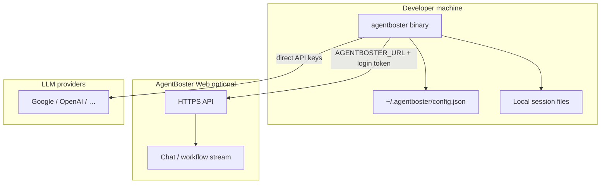
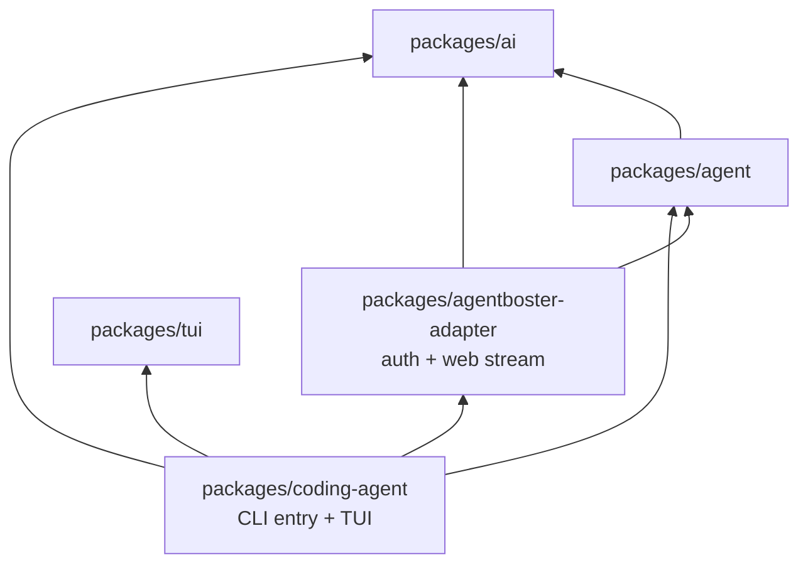
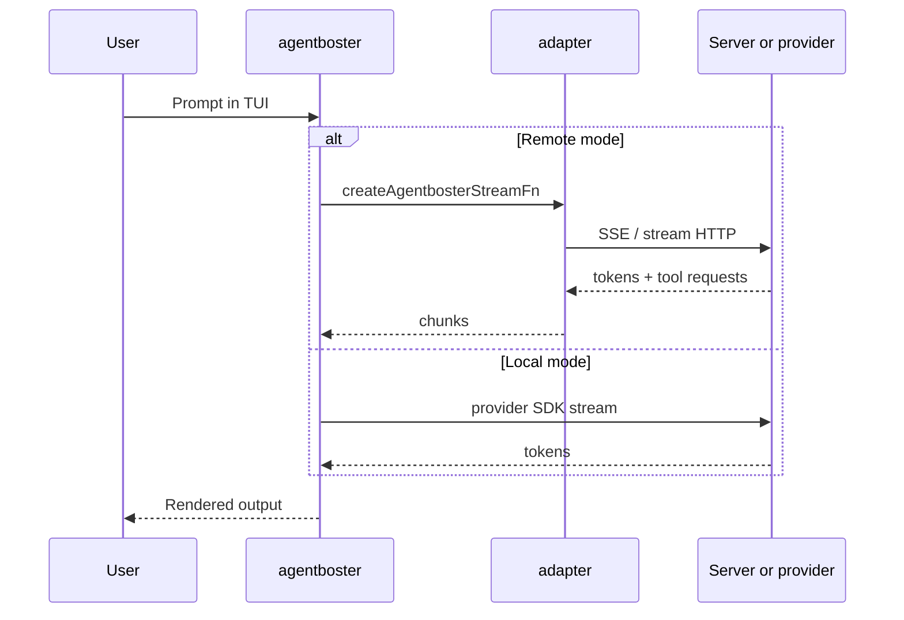
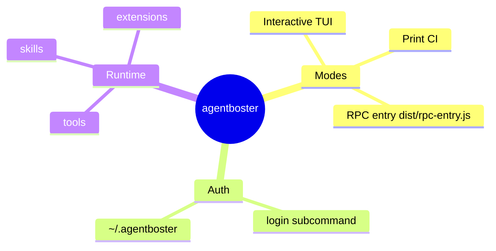
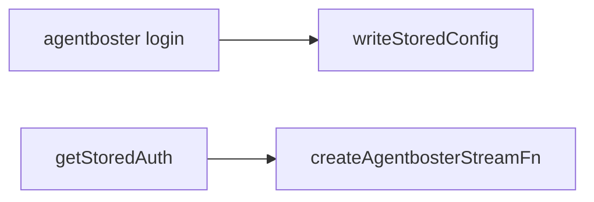
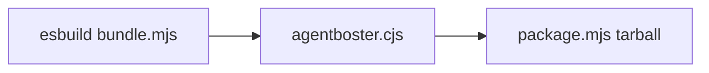
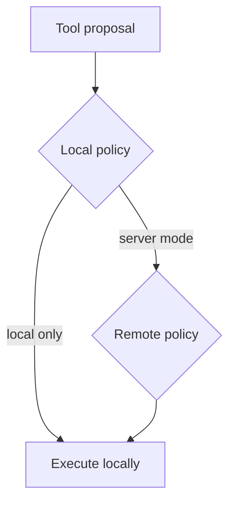
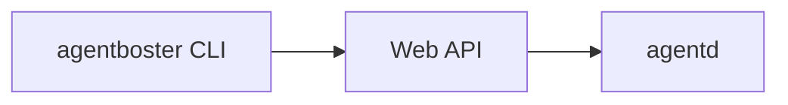

# AgentBoster CLI

The `cli/` workspace ships the **`agentboster`** terminal coding agent: an npm monorepo that composes LLM providers, agent orchestration, terminal UI, and an optional **AgentBoster server adapter** for remote sessions.

---

## Position in the platform



Use **local providers** for offline or bring-your-own-key workflows. Use **`agentboster login`** when the server should own models, policy, and tool routing.

---

## Monorepo architecture



| Package | Responsibility |
|---------|----------------|
| `@earendil-works/pi-coding-agent` | `agentboster` bin, interactive mode, extensions, export |
| `@agentboster/adapter` | Stored auth, `createAgentbosterStreamFn`, remote models |
| `@earendil-works/pi-agent-core` | Agent session primitives |
| `@earendil-works/pi-ai` | Provider registry, streaming |
| `@earendil-works/pi-tui` | Terminal rendering |

Build order is enforced by the root `package.json` `build` script (tui → ai → agent → adapter → coding-agent).

---

## Request paths (interactive)



Non-interactive `--print` skips TUI and writes final text to stdout (suitable for scripts and CI).

---

## Quick start (developers)

### Requirements

- **Node.js >= 22.19.0** (`engines` in `cli/package.json`)
- npm (workspaces)

### Install and build

```bash
cd cli
npm install
npm run build
```

### Run

```bash
cd packages/coding-agent
node dist/cli.js --help
node dist/cli.js --version
```

Development (TypeScript direct):

```bash
npx tsx src/cli.ts --help
```

### Quality gate

```bash
npm run check
```

Runs Biome, pinned-deps checks, `tsgo --noEmit`, and browser smoke tests.

---

## End-user usage

### Interactive session

```bash
agentboster
agentboster --model openai/gpt-4o-mini
agentboster --thinking medium
```

### One-shot (print mode)

```bash
agentboster -p "list top-level directories"
agentboster --print "explain package.json workspaces"
```

### Login (server mode)

```bash
agentboster login
agentboster login -u https://your-app.vercel.app --username you --password '***'
agentboster login -u https://your-app.vercel.app --pair-code ABCD1234
```

Writes `~/.agentboster/config.json` via `@agentboster/adapter` (`writeStoredConfig`).

### Environment for remote backend

```bash
export AGENTBOSTER_URL=https://your-app.vercel.app
export AGENTBOSTER_CLIENT_ID=my-laptop
export AGENTBOSTER_SESSION_ID=optional-fixed-id
agentboster
```

---

## CLI flags (reference)

| Flag | Short | Description |
|------|-------|-------------|
| `--help` | `-h` | Usage |
| `--version` | `-v` | Package version |
| `--provider` | | Default provider (often `google`) |
| `--model` | | Model id or `provider/model` |
| `--api-key` | | Inline API key (prefer login/config) |
| `--print` | `-p` | Non-interactive; stdout only |
| `--offline` | | No network (`PI_OFFLINE=1`) |
| `--session` | | Session id |
| `--continue` | | Continue last session |
| `--resume` | | Resume named session |
| `--tools` | `-t` | Allow-list tools |
| `--exclude-tools` | `-xt` | Deny-list tools |
| `--thinking` | | off / minimal / low / medium / high / xhigh |
| `--theme` | | Built-in or custom theme JSON |
| `--skill` | | Load skill definitions |
| `--extension` | | Load extension modules |

Run `agentboster --help` for the authoritative list (extensions add more flags).



---

## Configuration and auth storage

| Path | Content |
|------|---------|
| `~/.agentboster/config.json` | Server URL, bearer token, client metadata |
| `~/.agentboster/agent/auth.json` | Provider credentials (when used) |
| Project cwd | Session artifacts, local overrides |

`getStoredAuth()` / `clearStoredAuth()` live in `packages/agentboster-adapter/src/auth.ts`. OAuth flows in upstream pi are replaced with **`agentboster login`** in this fork.



---

## Adapter package (`@agentboster/adapter`)

Exports (see `packages/agentboster-adapter/src/index.ts`):

- **Auth:** `readStoredConfig`, `writeStoredConfig`, `getStoredAuth`, `clearStoredAuth`
- **Models:** `fetchRemoteModels`, `remoteModelsToPiModels`
- **Streaming:** `createAgentbosterStreamFn`, `openAgentbosterStream`
- **Security helpers:** `evaluateLocalCommand`, `formatToolRequest` (local policy hints)

When `AGENTBOSTER_URL` is set and stored auth exists, `main.ts` registers the `agentboster` provider in the model registry so pi-core routes streams through the Web API instead of a raw vendor key.

---

## Build, bundle, release

### Workspace scripts

| Script | Output |
|--------|--------|
| `npm run build` | Per-package `dist/` |
| `npm run clean` | Remove build artifacts |
| `npm run bundle` | `packages/coding-agent/dist/agentboster.cjs` |
| `npm run package` | `agentboster-cli-<version>.tar.gz` |

### Bundle flow



```bash
cd cli
npm run bundle
npm run package
tar xzf agentboster-cli-*.tar.gz
./agentboster --version
```

The bundle embeds themes, WASM (photon), export-html templates, and docs copies per `copy-binary-assets` in coding-agent.

---

## Environment variables

| Variable | Purpose |
|----------|---------|
| `AGENTBOSTER_URL` | Base URL for server-backed streaming |
| `AGENTBOSTER_SESSION_ID` | Pin session id |
| `AGENTBOSTER_CLIENT_ID` | Client label (default `local-cli`) |
| `AGENTBOSTER_MODEL` | Default remote model override |
| `PI_OFFLINE=1` | Disable network initialization |
| `PI_PACKAGE_DIR` | Override packaged asset root (Nix) |
| `PI_TIMING=1` | Log timing diagnostics |

Provider-specific keys may still use pi conventions when not using server auth.

---

## Interactive mode features (overview)

The coding-agent interactive layer (`modes/interactive/`) includes:

- Multi-turn chat with tool execution UI
- Model picker and mid-session **re-login** (hot-swap stream function)
- Themes (`theme/*.json`), markdown rendering via tui
- Skills and extensions discovery
- Session export to HTML (`core/export-html`)
- Optional doom/easter-egg assets shipped in bundle

Server re-login path refreshes `createAgentbosterStreamFn` when credentials change without restarting the binary.

---

## Security notes (local CLI)

- Tool execution on the **developer machine** is powerful: use `--tools` / `--exclude-tools` to limit surface
- `evaluateLocalCommand` in the adapter can pre-classify risky shell proposals (L0-style hints); server mode defers to Web/daemon policy
- Do not commit `~/.agentboster` contents or `--api-key` values into repos



---

## Testing

| Package | Runner |
|---------|--------|
| ai, agent, coding-agent (most) | Vitest `npm run test` |
| tui | Node `node --test` |

From repo root of `cli/`:

```bash
npm run check
```

Add tests next to changed modules; prefer regression tests for CLI parsing and stream adapters.

---

## Relationship to `agentd`

| Component | Runs where | Role |
|-----------|------------|------|
| **CLI** | User laptop / CI | UX, local tools, optional Web stream |
| **agentd** | Linux server | Sandboxed exec, L0–L2, long-running agents |

The CLI does **not** replace the daemon. Server-mediated tasks that need Docker/LXC/browser sandboxes execute on registered nodes after the Web workflow dispatches them.



---

## Troubleshooting

| Issue | Check |
|-------|--------|
| `command not found` | Build (`npm run build`) or use tarball `./agentboster` |
| `Not logged in` | Run `agentboster login`; verify `config.json` |
| Empty model list (remote) | `fetchRemoteModels` needs valid token and URL |
| Slow startup | Node version; disable accidental `PI_OFFLINE` |
| Wrong assets in bundle | Run full `npm run build` before `bundle` |
| Biome failures | `npm run check` from `cli/` root |

---

## Project conventions

See [`AGENTS.md`](AGENTS.md):

- TypeScript ESM, Biome formatter, Conventional Commits (`feat(cli):`, `fix(cli):`)
- Do not hand-edit `dist/` outputs
- Keep dependency changes intentional (review lockfile)

---

## RPC and automation

`packages/coding-agent/dist/rpc-entry.js` supports programmatic control (build marks it executable). Use for editor integrations or headless automation where TUI is not wanted.

---

## Examples directory

Packaged examples ship under `packages/coding-agent/examples/` (copied into release tarball). Use them as templates for extensions and custom tools.

---

## Versioning

Workspace `version` in `cli/package.json` is monorepo metadata; user-facing CLI version comes from **coding-agent** package (`agentboster --version`). Keep tarball name and `package.mjs` version in sync when releasing.

---

## Roadmap / fork notes

This tree is a **fork** of the pi coding-agent stack with AgentBoster-specific adapter and login flows:

- OAuth provider login paths are disabled in favor of `agentboster login`
- `agentboster` binary name replaces upstream `pi` branding in dist
- Remote streaming integrates with AgentBoster Web rather than only vendor APIs

---

## Related documentation

- [Root README](../README.EN.md) — platform architecture
- [`agentd/README.md`](../agentd/README.md) — Linux execution daemon
- [`AGENTS.md`](AGENTS.md) — monorepo dev guide

---

## FAQ

**Can I use only OpenAI locally?** Yes — set provider API keys in auth storage or flags without `AGENTBOSTER_URL`.

**Does print mode run tools?** Yes, when tools are enabled; ensure cwd and permissions are safe for CI.

**Where is the bin defined?** `packages/coding-agent/package.json` `bin` field → `dist/cli.js` (chmod +x in build).

**Nix users?** Set `PI_PACKAGE_DIR` so themes and README assets resolve outside node_modules layout.

---

*Target length: ~400 lines including diagrams.*