# Memoh 与 AgentBoster 全面对比报告

本报告基于对 Memoh（位于 `ref/` 目录的源码快照）与 AgentBoster（仓库主体，含 `docs/self-hosted.md` 与 `docs/architecture.md` 两份内部权威文档）的源码级调研，从十六个维度展开横向对比。两套系统都试图回答同一个问题——"如何让一个 AI 智能体长期在线、可托管、可被多渠道触达、并在隔离环境中执行真实任务"，但给出了风格迥异的工程答案。Memoh 走的是"每个智能体配一台云电脑"的单体一体化路线；AgentBoster 走的是"三层松耦合"路线，把权威状态留在 Next.js Web 层，把执行能力下沉到可选的 Linux 守护进程，把终端交互交给瘦客户端 CLI。

需要预先说明的一个重要发现：AgentBoster 当前版本（v0.1.0，WIP 状态）的代码最初是为 Vercel 云平台优化的，纯本地自托管存在若干必须改造或借助兼容代理才能跨越的硬依赖（对象存储、Upstash REST API、Neon HTTP 驱动、graphile-worker 进程等），这些在 `docs/self-hosted.md` 第八章有坦诚披露。本报告在第一节和第十节会据此给出真实的自托管成本评估，而非仅看 Dockerfile 是否存在。

## 一、自己托管能力、方法与成本

Memoh 的自托管路径高度产品化且自洽。官方提供一键安装脚本，该脚本克隆仓库、根据模板渲染 `config.toml`、提示修改默认口令，然后调用 `docker compose up -d` 拉起整套服务栈。生产栈由四个常驻服务（Postgres、migrate、server、web）和若干可选 profile（Qdrant 向量库、Sparse 稀疏检索、webhook-tunnel）组成。Memoh 支持双数据库后端：PostgreSQL 用于标准部署，SQLite 用于轻量单机部署，通过覆盖文件切换，数据落在 `memoh_data` 卷里。这意味着 Memoh 可以在边缘设备上以非常低的成本跑起来——一台能装 Docker 的小机器就够。关键变量是 server 容器以 `privileged: true` 加 `pid: host` 模式运行，因为它内部嵌套了自己的 containerd 实例和 CNI 网络，用来为每个 bot 创建独立工作区容器；官方文档明确标注为安全警告。许可证是 AGPLv3，对二次分发有传染性要求。

AgentBoster 的自托管路径则呈现"双轨制"且隐藏成本较高。一方面，它作为 Next.js 应用原生面向 Vercel，`package.json` 直接带 `deploy` 脚本和 `postbuild` 钩子，仓库根目录的 `Dockerfile` 也是完整的多阶段构建。但 `docs/self-hosted.md` 第八章坦白：当前版本强依赖三类云服务，纯本地部署需要逐项处理。第一，对象存储强依赖 `@vercel/blob`（影响附件上传和技能仓库同步），临时方案是继续用 Vercel Blob，永久方案需要改代码加 S3/MinIO 适配层。第二，Redis KV 是双 SDK 设计——`@chat-adapter/state-redis` 用标准 Redis 协议（可用本地 Redis），但 `@upstash/redis` 用 REST API（本地 Redis 无法直接对接），需借助 `upstash-redis-rest-proxy` 兼容代理或改代码统一到 ioredis。第三，数据库驱动用 `@neondatabase/serverless`（HTTP 协议无连接池），自托管是常驻进程场景下延迟劣于 TCP 连接池，建议改 `pg` 加 Pool。第四（最隐蔽），当切到 `WORKFLOW_TARGET_WORLD=@workflow/world-postgres` 脱离 Vercel Queue 时，必须**单独**启动 graphile-worker 进程消费任务，否则用户发消息后会一直转圈、永不响应——这是 self-hosted.md 5.7 节专门强调的"关键"陷阱。第五，`next/server` 的 `after()` API 在自托管 `next start` 下会从异步降级为同步，导致 IM webhook 阻塞到 workflow 完成（几十秒到几分钟），触发 IM 平台超时重试和重复消息。许可证是 MIT，对商用集成友好。

硬件成本方面，self-hosted.md 给出明确门槛：最低单机 2 核 4GB 内存 20GB 磁盘（推荐 4 核 8GB SSD），操作系统 Linux。Memoh 这边 docker-compose.yml 未声明资源 limits，需运维外部约束，但桌面客户端可完全离线工作。

总体而言，Memoh 的"开箱即用度"更高（一条命令拉起完整栈、双 DB 后端、桌面端离线），代价是强耦合的特权容器和 AGPL 约束；AgentBoster 部署更模块化、许可证更宽松，但自托管者需要面对至少五处云依赖改造、独立 worker 进程、IM webhook 阻塞等工程负担，self-hosted.md 自己也承认"未来版本将提供完整的本地适配方案"。

Memoh 自托管流程：

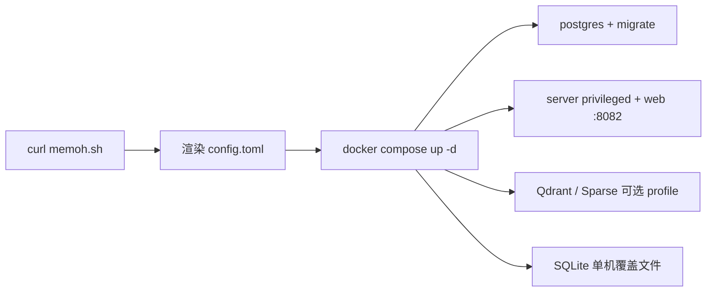

AgentBoster 自托管流程（含改造点）：

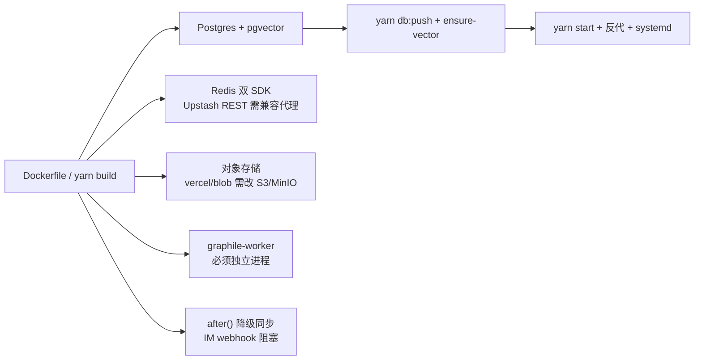

## 二、安全性

两套系统都在"认证、隔离、工具审批"三个层面下功夫，但实现深度不同。

Memoh 的认证是经典的 JWT（HS256）方案，通过 Echo 中间件实现，支持用户令牌和聊天路由令牌两类，后者专门用于 IM 渠道入站回复。默认凭据（admin/admin123、postgres/memoh123、固定 jwt_secret）在所有配置模板里都是明文占位符，文档反复强调必须修改。工具审批系统相当完备：`toolapproval` 包定义了五种状态和 read/write/exec 三类操作，通过 glob 模式匹配路径与命令，默认等待十分钟超时。访问控制是"源感知"的，可按频道身份、会话类型、线程 ID 粒度配置触发规则。容器隔离层面，每个 bot 拿到独立容器，bridge 二进制和运行时工具包只读挂入。桥接 mTLS 可选，但 UDS/本地桥接默认走文件系统信任。最大安全张力来自 server 容器特权模式——这是为嵌套 containerd 不得不付的代价。

AgentBoster 的安全模型被显式划分为 L0/L1/L2 三层，每层可独立否决，这是其架构白皮书 §2.6、§3.6 反复强调的"强安全"主轴。L0 是规则黑名单（正则/glob 匹配 rm -rf /、mkfs、fork bomb、提权等），agentd 侧为主、Web 仅下发规则源；一个有意思的设计是 L0 命中后伪造 OS 错误（如 `sh: rm: Operation not permitted`）让 LLM 误以为 OS 层拒绝，保持沙箱抽象完整。L1 是 LLM 风险打分（不本地推理，调 Web 的 `/api/agentd/v1/l1-score`），按十维度评分，score≥85 视为 critical（TTL 5 分钟），并配有确定性 L2 模式正则（shred、find -delete、shutil.rmtree 等）无论 L1 给多少分都强制抬到 high 走 L2；失败时若 `fail_open=false`（默认）则 blocked。L2 是人工授权，决策队列是进程内热缓存加 Postgres `l2_decisions` 表双写（早期纯内存 Map，Vercel 重部署会丢全部 pending L2，后改为持久化），决策卡经 IM 推送、5 秒后自动撤回，超时看门狗每 5 秒扫描。中间件 `middleware.ts` 默认保护所有路由，会话认证是自研 HMAC 令牌（非 NextAuth）纯密码学验证不查库可在 Edge Runtime 跑；CLI 设备配对令牌存 `cli_devices` 表，吊销通过每次 API 调用查 `revokedAt` 实时感知（不依赖本地缓存）。mTLS 仅在 Web→agentd 方向、守护进程网络可达时启用，API_KEY 支持逗号分隔多值轮换。

简言之，Memoh 的安全更"传统企业"（JWT、ACL、glob 审批），AgentBoster 的 L0/L1/L2 更"智能体原生"，把 LLM 风险评估和持久化决策队列纳入了安全栈，并把"伪造 OS 错误防 LLM 学到规则系统"作为深度防御细节。两者都依赖特权/root 跑容器，但 AgentBoster 把特权集中在独立的 agentd 守护进程上，Web 层本身可保持非特权。

Memoh 安全栈：

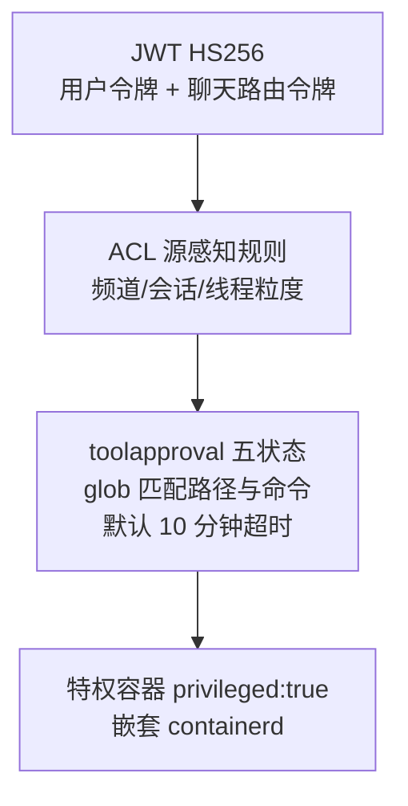

AgentBoster 三层安全（L0/L1/L2 任一否决）：

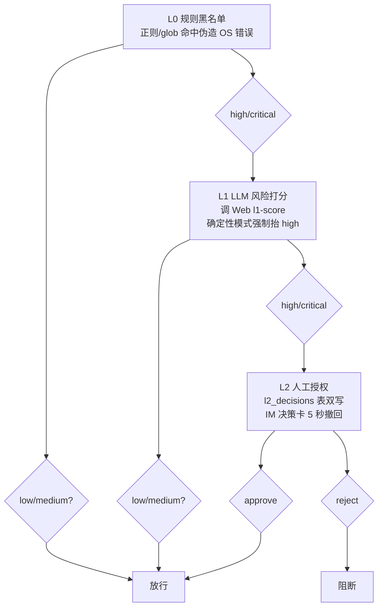

## 三、跨平台性

Memoh 在跨平台上投入了大量工程。容器后端有三种：containerd（Linux 默认）、docker、apple（macOS 的 Apple Virtualization 框架，标注实验性、需 macOS 26+）。配置模板分 docker/apple/windows/kata.docker 四套。桌面客户端通过 electron-builder 打包明确支持 macOS（DMG、arm64+x64、notarize、最低 macOS 12）、Linux（AppImage+deb+rpm）、Windows（NSIS）。但有几个硬性 Linux-only 约束：Kata/KVM 路径需 `/dev/kvm` 直通加宿主侧 `containerd-shim-kata-v2`；Computer Use 的可访问性助手是 Rust 写的 `a11y-cli`，依赖 `atspi` 0.30 加 zbus，本质是 Linux AT-SPI2 D-Bus 客户端；bridge 二进制也只构建 Linux 目标。

AgentBoster 的跨平台更"分层"。Web 应用（Next.js+Node）天然跨平台，Docker 镜像用 `node:22-alpine`，任何能跑 Node 的地方都能开发。CLI 子包是跨平台 Node（要求 `engines.node >=22.19.0`），打包后是纯 JS 单 tarball 跨平台（仅需 Node 22+ 在 PATH）。然而执行平面硬性 Linux-only：agentd 所有源文件带 `//go:build linux`，启动需 root 设 cgroups/namespaces 再降权；dbushelper 虽纯 Go（CGO_ENABLED=0）但功能上只能 Linux（AT-SPI2 D-Bus）。换言之，AgentBoster 把"跨平台"限制在用户交互层（浏览器、终端），把"Linux 强依赖"集中推到可选的执行后端。

对比来看，Memoh 试图让整个产品（含桌面 GUI 客户端）覆盖三大桌面 OS，代价是大量平台特例代码和实验性后端；AgentBoster 接受"执行端只能 Linux"现实，但让用户侧保持平台无关——浏览器和 CLI 在三大 OS 上都能跑，只是真正执行 shell/浏览器/桌面工具时需要后端 Linux 节点。

Memoh 跨平台覆盖：

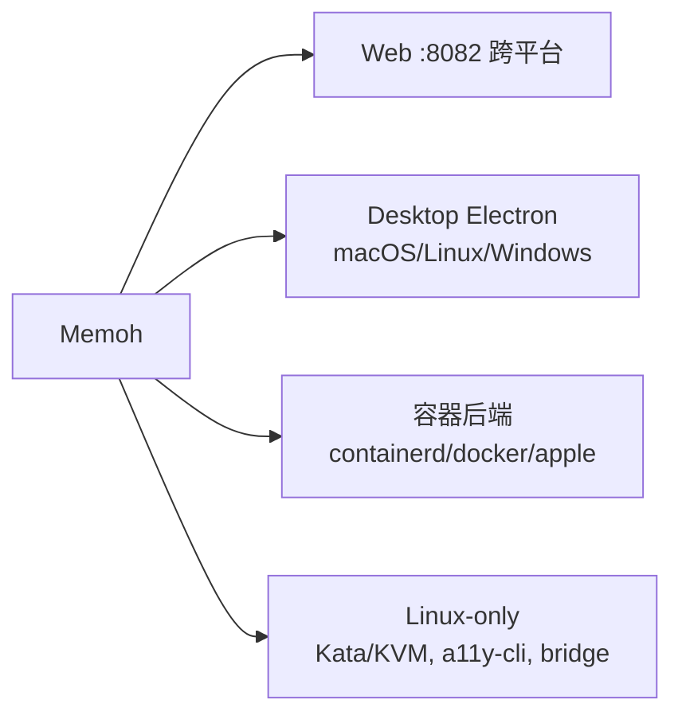

AgentBoster 跨平台覆盖：

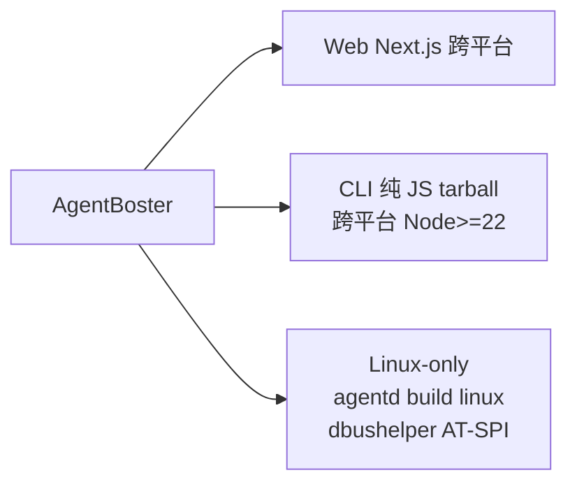

## 四、Web UI

Memoh 的 Web UI 是 Vue 3（Composition API、`<script setup>`）加 Vite 8 加 Tailwind CSS 4，UI 原语来自自研 `@memohai/ui`（基于 Reka UI，43 个组件组），状态用 Pinia 3 加 Pinia Colada，i18n 用 vue-i18n（en+zh）。端口 8082，镜像构建后用 nginx:alpine 提供静态文件。功能页面非常丰富：bot 配置、provider、model、网页搜索、记忆、语音、邮件、Supermarket（技能市场）、用量、人员管理、外观、快捷键、profile、平台、onboarding、登录、OAuth 回调。bot 详情页有概览、设置、桌面、频道、记忆、MCP、调度、心跳、邮件、容器、网络、工具审批、技能、访问、压缩等十几张 tab。聊天区用 dockview 面板，支持 chat/file/terminal/browser/display 五种面板类型，terminal 用 xterm.js，browser 是 iframe 套工作区 Chrome，display 面板通过 WebRTC 连到工作区桌面。所有面板用 `renderer: 'always'` 保证切换 tab 时不丢状态。

AgentBoster 的 Web UI 是 Next.js 15.5（App Router）加 React 19 加 Tailwind 3.4。路由组分 `(auth)/(chat)(config)`，外加 files/memory/schedule/skill/api/.well-known。聊天页用 SSR 生成占位 chatId，首条消息懒创建会话行（避免空会话堆积），布局是 `AdaptiveChatLayout` 加侧栏 cookie 状态，开启 `experimental_ppr`。配置 UI 是单一动态路由 `config/[section]`，由 17 个 section 驱动（models/agents/chat/devices/language/knowledge/channels/tts/autonomy/security/tools/mcp/agentd/monitoring/users/audit-logs/raw-json），其中 12 个 admin-only。根布局包 ThemeProvider、I18nProvider、Toaster，全局 `noindex,nofollow`。Workflow DevKit 通过 `withWorkflow` 包裹 next.config，步骤代码跑在沙箱 VM，`.well-known/workflow/` 路径被中间件放行。

两者都是 SPA 风格管理控制台，但 Memoh 更"重"（一张 bot 详情页十几张 tab、display/browser/terminal 多面板工作台），AgentBoster 更"克制"（把执行能力留给 agentd 和 CLI，Web 主要承担权威状态、配置和对话）。

Memoh Web UI：

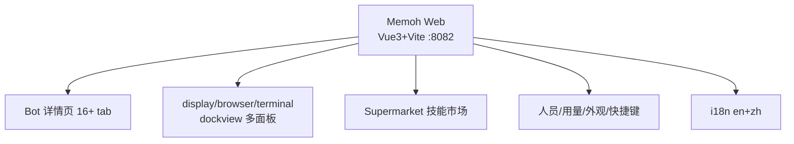

AgentBoster Web UI：

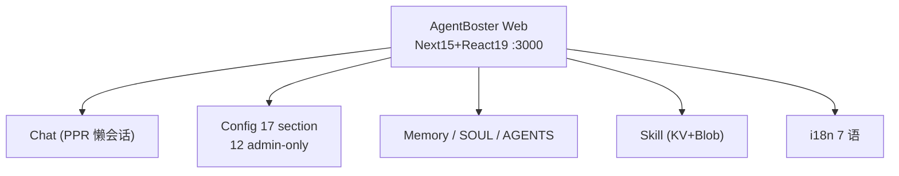

## 五、CLI 与桌面客户端

Memoh 同时拥有 CLI 和桌面客户端，且桌面是产品第一公民。CLI 是 Go+Cobra，根命令默认启动 Bubble Tea TUI，子命令含 chat、bots create/delete、start/stop/restart/status/logs（管理桌面拉起的本地 server 进程，靠 pid 文件协作）、version。CLI 自动用本地 admin 凭据登录、令牌存 `cli-token.json`，默认连 `127.0.0.1:18731`。桌面客户端是 Electron 42+electron-vite 4+electron-builder 26，**不**直接 import Web 的 `main.ts`，而是自带 bootstrap 复用 `@memohai/web` 页面/布局/store/i18n。桌面端核心是 `src/main/local-server.ts`：准备本地 SQLite 配置、启动内嵌 Qdrant、解析打包的 `memoh-server`、跑迁移、在 127.0.0.1:18731 起 server。打包时把 server/cli/runtime/config/providers/qdrant/gstreamer 全塞进 `Contents/Resources/`。在线产品名 Memoh，离线产品名 Memoh Local，userData 路径因此不同。

AgentBoster 这边没有桌面客户端（全仓库 grep 不到 electron/tauri/wry）。CLI 存在于 `subpackage/cli/`，是基于 pi 框架的 Yarn Classic monorepo（四包：ai 类型桩、agent 循环原语、agentboster-adapter、coding-agent 二进制）。关键是从架构白皮书 §4.5 确认的"瘦客户端边界"——所有 LLM 调用经 Web，所有会话持久化在 Web，本地 session 文件仅是临时镜像（写在 OS tmpdir，退出即清，崩溃残留由 cleanStaleTempSessions 启动期扫除）。`agentboster login` 支持 --pair-code（Web UI 一次性签发）和用户名密码两条路径，写 `~/.agentboster/config.json`。CLI 不本地校验 token，吊销靠每次 API 调用 Web 返回 401/403 感知。模型与工具编排归 Web，CLI 只跑 `local_*` 工具（local_read_file/local_write_file/local_exec/local_ask_question）在用户本机。`--yolo` 跳过 local_* 的 L0/L1 但**不**绕过 Web 派发到 agentd 的三层安全。打包是 esbuild 单文件 CJS 加 shell wrapper 加可复现 tarball（GNU tar --owner=0 --mtime=@0），无独立平台包。

哲学差异很明显：Memoh 让桌面客户端成为产品第一公民（自带本地 server + 内嵌向量库 + 完全离线），AgentBoster 把"桌面"理解成 agentd 在 LXC 沙箱里控制的 Linux GUI，用户侧交互只有浏览器和终端，CLI 永远依赖远程 Web。

Memoh 客户端栈：

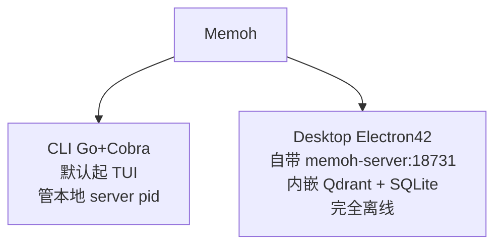

AgentBoster 客户端栈：

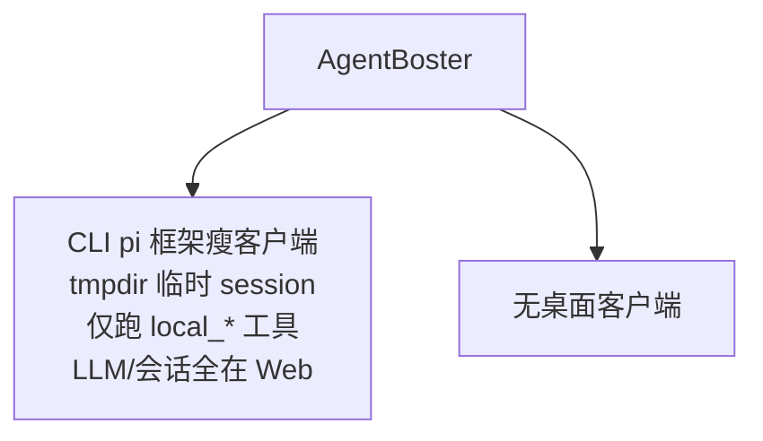

## 六、容器支持

Memoh 的容器抽象在 `internal/container/`，三个适配器子包 apple/containerd/docker。每个 bot 的容器创建集中在 `internal/workspace/manager.go`：解析镜像（默认 `memohai/workspace:debian` 或模板 `debian:bookworm-slim`），构造 spec——只读挂入 `/etc/resolv.conf`、`/opt/memoh` 运行时目录、`/run/memoh` socket 目录，注入环境变量（UDS socket 路径或 Kata TCP 9090、display 启用时 RFB 地址和 DISPLAY=:99），命令是 `/opt/memoh/bridge`。RuntimeRouter 把容器后端和可选本地工作区组合，按容器 ID 前缀或存储驱动路由。基础镜像是标准 debian/alpine/ubuntu，不需要专门 MCP 镜像——工作区工具包挂载进去而非烤进镜像。容器与宿主通信是 gRPC over UDS。这是"每 bot 一台常驻容器"的横向隔离模型。

AgentBoster 有两套独立容器化层。第一套是 Web 侧 Vercel Sandbox（`lib/core/sandbox/manager.ts`），用 `@vercel/sandbox` 给每个 Web-UI 会话开临时 Linux 容器（Amazon Linux 2023、node24、allow-all 网络），暴露 `SANDBOX_PUBLIC_PORTS`，做 KV 锁 get-or-create、超时续期（剩余不足五分钟时续五分钟）。系统提示告诉模型此容器会话结束销毁、约 40 分钟预算。第二套是 agentd 侧 docker/docker-strict/lxc 三档（§3.5 详述）：docker light 用 alpine:edge 一次性 `--rm` 低资源（CPU 0.25/内存 256m）；docker-strict 用白名单强隔离（CPU 1.0/内存 512m/pids-limit 128）；lxc persistent 是长期会话/git/浏览器/多步开发用，`lxc-create -t download`，cgroup v2 限 cpu.max/memory.max，默认 lxc.net.0.type none，lxc.cap.drop 丢弃约 30 个高危 cap。SelectSandbox 按风险与持久化需求自动选档：高风险命令（rm -rf、mkfs、curl 加管道、sudo）走 docker-strict；需持久化（git clone、npm install、browser_*、web_fetch_rendered）走 lxc；兜底 docker。出站 egress 用 EgressAllowlist glob 经 DNS 解析后 iptables 注入 netns，egressRefresher 周期重应用防 CDN DNS 漂移。

隔离模型根本不同——Memoh 是"一个智能体一个常驻容器"的横向隔离，AgentBoster 是"按会话/按任务临时执行平面"加"按风险自动选档"的纵向分层，沙箱注册到 agentd 节点而非永久绑定某个 agent。

Memoh 容器模型（每 bot 一常驻容器）：

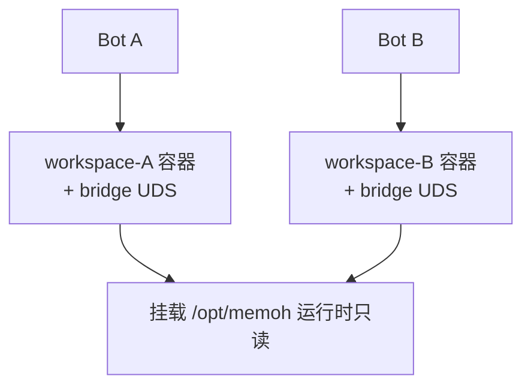

AgentBoster 容器模型（按任务临时沙箱 + 风险选档）：

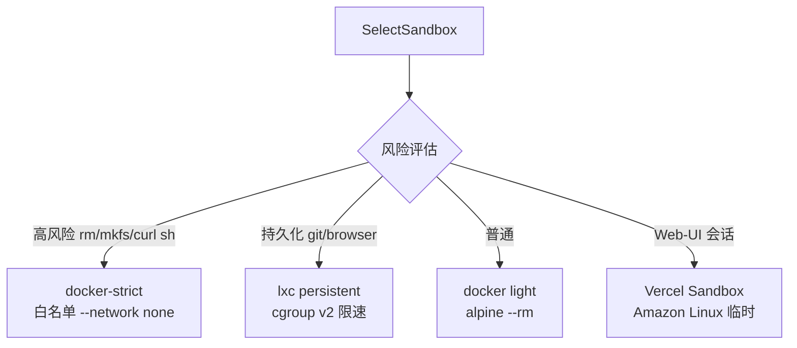

## 七、容器桌面控制

两者都实现了"在容器里跑 Linux 桌面并用可访问性树驱动它"，但技术栈和暴露方式不同。

Memoh 的桌面栈在 `internal/display/service.go`（1647 行）。传输是 WebRTC，编码器是 GStreamer，编解码从 SDP 协商（H264 profile-level-id 42e01f、VP8），时钟率 90000、帧率 15，UDP 端口范围可配（默认 30000-30100），首包超时 30 秒、截图超时 15 秒。RFB/Xvnc 在容器内监听 `127.0.0.1:5999`，宿主 display 服务通过桥接的 `DisplayDialContext` 拨入，回退宿主侧 Unix socket。指针/键盘输入编码为原始 RFB 按钮掩码和 keysym。Computer Use 快照来自容器内调用 Rust 助手 `/opt/memoh/toolkit/display/bin/a11y-cli snapshot`，输出 JSON（ref/role/name/center），动作支持 click/type/fill，结果带 fallback 坐标——可访问性够不到目标时回退原始 RFB 坐标。截图存工作区路径，从不自动附加对话，模型必须显式读。

AgentBoster 的桌面栈在 agentd 的 `internal/agent/desktop/desktop.go`（584 行）加 `desktop_install.sh`。技术栈是 Xvfb（虚拟帧缓冲 `:99`、1280x800x24）+ 会话 D-Bus + AT-SPI2 registry + icewm 窗口管理器 + x11vnc（RFB 5999）+ websockify/noVNC（HTTP 6080）。用户通过 `sandbox.public_port` 工具暴露 6080，浏览器打开 `/vnc.html`——是"浏览器可达的 VNC over WebSocket"而非 WebRTC。工具面有 desktop_screenshot（`import -window root` 抓帧缓冲返回 PNG，Web 调度器再以 AI SDK image 内容块发视觉模型）、desktop_inspect（返回 AT-SPI2 可访问性树紧凑文本，约 1-3k token vs PNG 几十万 token）、desktop_a11y_click/type（用可访问性 ref 驱动 GUI 元素，够不到时回退 xdotool）。a11y-helper 是 `subpackage/dbushelper/cmd/a11y-helper/` 的纯 Go AT-SPI2 D-Bus 客户端，agentd 通过 `sbMgr.Exec` 在沙箱内调用，stdout 一个 JSON 对象、诊断只到 stderr，子命令 snapshot/click/type/fill/inspect，引用分层（eN 可交互、xN 仅 inspect），退出码 0/1/2 语义清晰。

差异要点：Memoh 用 WebRTC（低延迟、适合浏览器内嵌实时操作），AgentBoster 用 noVNC over WebSocket（实现简单、依赖少但延迟特性不同）；两者都用 AT-SPI 做语义化点击而非裸坐标，且都设计了坐标回退；两者截图都不自动入对话。

Memoh 桌面控制（WebRTC）：

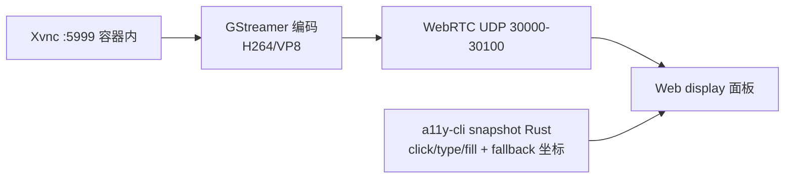

AgentBoster 桌面控制（noVNC over WebSocket）：

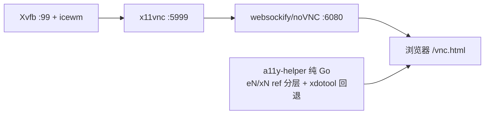

## 八、浏览器自动化

Memoh 的浏览器栈在 `internal/agent/tools/browser.go`（2524 行），CDP 端点硬编码 `127.0.0.1:9222`，桥接在启用 display 时监管带界 Chrome/Chromium。工具五个：browser_action（导航/点击/输入）、browser_observe（带元素 ref 页面快照）、browser_remote_session（把原始 CDP 端点通过隧道 WebSocket 暴露给外部 Playwright/CDP 会话）、computer_observe/action（桌面级 GUI）。BrowserProvider 只在 display 工作区存在时构造，工具只对非子智能体、启用 display 的会话注册。Usage() 把跨工具工作流指引注入提示词，但仅在该 provider 真注册工具时——这是"工具用法跟着工具走、永不写进静态提示词"的设计，由 prompt_test.go（364 行）守护。无头 Playwright 在 Memoh 只是普通工作区命令，和带界 Browser Use 是两条独立路径。

AgentBoster 的浏览器有两套实现。一是 agentd 的 Playwright 桥（`internal/agent/browser/`）：browser.go 管 EnsureBridge/CallBridge/CloseBridge，bridge.js 是嵌入式 Node.js HTTP 助手跑 Unix socket，node_install.sh 从 TUNA 镜像引导 Node.js 加 SHA256 校验。首次调用 30-60 秒冷启动（沙箱内装 Node+Playwright），之后缓存。浏览器 profile 持久化 agentd 节点，跨会话和守护重启可用，通过 browser_save_state/load_state（storageState JSON）和无服务器池互通。二是 `lib/mcp/browser/` 下的无服务器浏览器池（存在但**有意不**通过 `browser_*` 调度器暴露）。Web 侧调度器 browser.ts 是薄透传，工具名和 agentd 注册表一一对应，注册近二十个 browser_* 工具。browser_screenshot 被特殊处理——守护进程返回 bytes/mime/base64，调度器再以 `{type:'image'}` 内容块重发让视觉模型真的看到图。浏览器是带界真实 Chrome（反检测：真实 UA、`navigator.webdriver` 屏蔽），跑在持久 LXC 沙箱。静态抓取回退在 `lib/mcp/tools/web-fetch.ts`：web_search 和 fetch_url 做纯 HTTP 抓取加 HTML 剥离，带 JS 渲染检测启发式，搜索 provider 链 Brave→Tavily→DuckDuckGo HTML→Bing HTML。

Memoh 浏览器自动化（CDP 9222）：

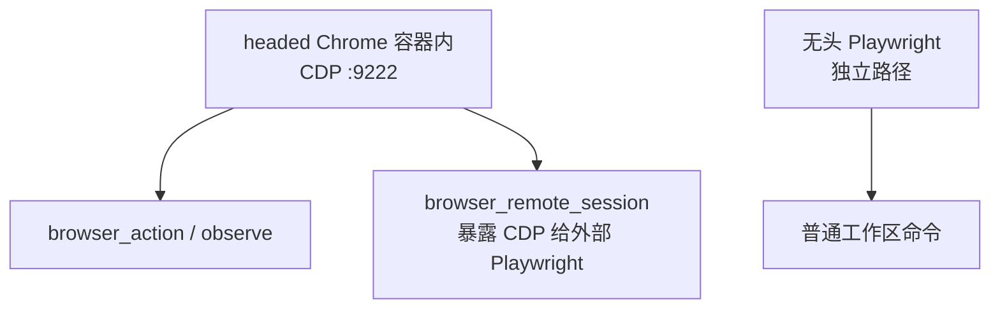

AgentBoster 浏览器自动化（Playwright 桥）：

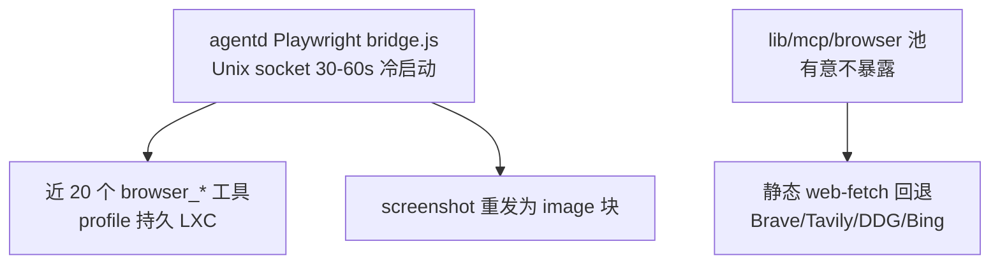

## 九、构建依赖

Memoh 的构建依赖由 `mise.toml` 钉版：Go 1.25.6（go.mod 声明 1.25.7）、Node 25、pnpm 10、sqlc 1.31.1、golangci-lint 2.10.1、Rust 1.90。后端主要依赖含 labstack/echo v4、golang-jwt v5、pgx/v5、containerd v2、docker v28、charmbracelet/bubbletea、coder/acp-go-sdk、pion/webrtc、自家 twilight-ai SDK、modelcontextprotocol/go-sdk、larksuite oapi-sdk、bwmarrin/discordgo、emersion/go-imap。前端 monorepo 用 pnpm，dev 工具有 @hey-api/openapi-ts、bumpp、eslint 9、typescript-eslint、vitest 4、TypeScript ~5.9.3。Rust 工作区单一成员 a11y-cli，edition 2021、rust-version 1.90、Apache-2.0（注意和主项目 AGPLv3 不同）。mise.toml 还定义大量任务（pnpm-install、go-install、swagger/sdk/sqlc/icons-generate、dev 及其 sqlite/minify/selinux/webhook-tunnel 变体、desktop:dev/build、bridge:build、a11y-cli:build、lint、release、kata:runner）。

AgentBoster 呈现"工具链不匹配"特征。根 Web 用 Yarn、Next 15.5.9、React 19.2.6、TypeScript 6.0.2、Biome 2.4.16、Vitest 3.0.0、drizzle-kit 0.31.10、Tailwind 3.4.19。subpackage/agentd 用 Go 1.26.4（gin、viper、charmbracelet/huh+lipgloss）独立 go.mod。subpackage/cli 用 Node >=22.19.0、Biome 2.3.5（比根旧）、`@typescript/native-preview` 7.0（tsgo）加 TypeScript 5.9 回退、Vitest 4.1.9（比根新）、esbuild 0.28.1、Yarn Classic 1.22.22。subpackage/dbushelper 用 Go 1.26.4、godbus v5.2.2，纯 Go 无 CGO。根 tsconfig.json 排除 subpackage/ref/memoh/cli，根 `tsc --noEmit` 不类型检查子项目；根 vitest.config.ts 又包含 `subpackage/cli/src/**/*.test.ts` 并把 `@/*` 别名到根，所以 CLI 测试要从根跑。这种"工具链各自为政"是 monorepo 边界清晰的副作用，也是 AGENTS.md 反复强调的运维要点。

Memoh 构建依赖（mise 钉版）：

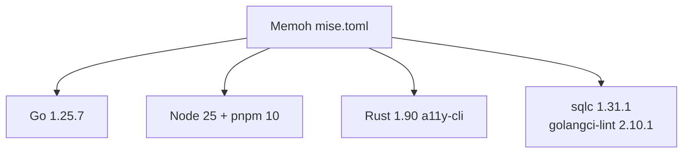

AgentBoster 构建依赖（工具链不匹配）：

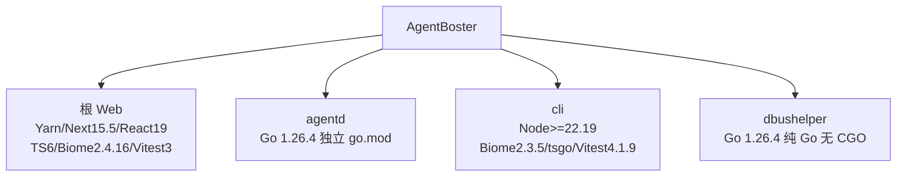

## 十、生产依赖

Memoh 的生产栈由 docker-compose.yml 编排。常驻服务：postgres:18-alpine（用户/库/默认口令 memoh）、memohai/server:latest（privileged、pid:host、嵌 containerd+CNI+GStreamer、暴露 8080/1455 和 WebRTC UDP 30000-30100）、memohai/web:latest（nginx:alpine 服务 Vue 构建产物、暴露 8082）、memohai/server 跑一次性 migrate up。可选 profile：qdrant（向量库）、sparse（神经稀疏检索，Python 健康检查打 8085）、webhook-tunnel（cloudflared Quick Tunnel）。server 镜像多阶段构建：golang:1.25-alpine 编译 server/bridge，rust:1.90-alpine 编译 a11y-cli（musl-static），工具包组装拉预构建 manylinux/glibc ACP 缓存（给 claude-agent-acp，它要 glibc 拒绝 musl），最终 alpine:latest 带 containerd、cni-plugins、iptables、GStreamer 全套插件。server 启动需可达 Postgres（或 SQLite）、内嵌 containerd socket、CNI 配置，以及可选 Qdrant/Sparse URL。

AgentBoster 的生产依赖更分散，self-hosted.md 揭示了所有强制与可选项。强制服务：PostgreSQL 带 pgvector（存会话、消息、记忆向量、知识库、用户、agentd 节点、L2 决策、vault、IM 账号、调度、通知），生产 `DATABASE_URL` 缺失则 postbuild 抛错；Upstash Redis（双 SDK：`REDIS_URL` 给 IM 状态、`KV_REST_API_URL`+`KV_REST_API_TOKEN` 给全局 KV）——这是 self-hosted.md 4.2 节专门讨论的适配难点；至少一个 AI provider。**graphile-worker 是第四个强制进程**——当 `WORKFLOW_TARGET_WORLD=@workflow/world-postgres` 时必须独立运行，否则 workflow 任务入队不执行（self-hosted.md 5.7 节标"关键！"）。可选 Vercel 服务（用了就绑死 Vercel）：Blob 做附件和技能存储、Queue 和 Sandbox 做执行、Analytics/SpeedInsights 注入根布局。可选执行后端：agentd 守护进程跑 Linux 宿主（装 Docker/LXC）给 IM/CLI/调度会话提供沙箱/浏览器/桌面工具；没有 agentd 时这些工具返回"无在线节点"，Web-UI 回退 Vercel Sandbox。搜索 provider：Tavily、Brave（都可选，DuckDuckGo/Bing HTML 抓取兜底）。

Memoh 生产栈（docker compose）：

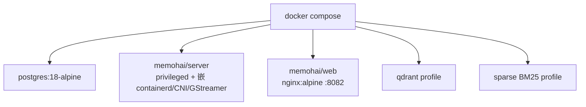

AgentBoster 生产栈（散件 + 强制 graphile-worker）：

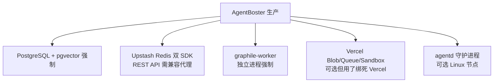

## 十一、容器控制架构

Memoh 的容器控制契约由 `internal/workspace/bridgepb/bridge.proto`（188 行）定义 ContainerService 服务，RPC 含 ReadFile/WriteFile/ListDir/Stat/Mkdir/Rename/Exec（双向流）、Tunnel（双向 TunnelFrame）、ReverseHTTP、ReadRaw、WriteRaw、DeleteFile。传输是 UDS——每个 bot 有宿主侧 socket 目录挂入容器 `/run/memoh`，bridge 监听 `/run/memoh/bridge.sock`，宿主拨 `unix://`；遗留 mcp- 前缀容器和 Kata 容器回退 TCP 9090。Manager（775 行）持每容器互斥锁 map、gRPC 池、遗留 IP 缓存、hook 服务、bridge TLS 选项，方法 EnsureBot/Start/Stop/Delete/WaitForWorkspaceReady（轮询 Stat("/") 最长 45 秒）。Init 时 `PullImageOptions{Unpack:true}` 准备基础镜像；工作区惰性创建，启动处理孤儿快照（删前保数据、建新容器后恢复）、网络重建、UDS 模式清理遗留 TCP 路由、触发 hook。这是"宿主直连容器内 bridge"的单跳 gRPC/UDS 模型，控制平面和数据平面紧耦合在同一台机器。

AgentBoster 的容器控制是"Web → agentd → 沙箱 → a11y-helper"多跳链（§5.2、§7 详述）。Web→agentd（Pattern B，可选 mTLS）：节点可达时 execToolOnAgentd（'use step'）selectBestNode 后 POST daemon `/api/v1/tools/exec`，客户端配置从 appConfig.agentd.nodes[0].url 或 AGENTD_URL 取，附 AGENTD_API_KEY 和可选 mTLS 证书。agentd→Web（始终 HTTPS+API key）：daemon 回调 `/api/agentd/v1/*` 和 `/api/soul/*`，端点涵盖 nodes/register、nodes/heartbeat、l1-score、l2-confirm、tasks、memories、knowledge/search、blob/upload、notifications、agent-config、sandboxes、llm-proxy、sessions/[id]/abort 等；agentd 还通过 /api/soul 拉 SOUL 注入自己提示词。agentd→沙箱→a11y-helper：tools_a11y.go 的 execA11yHelper 构造 shell 命令 source 桌面 envFile 拿 DISPLAY/DBUS_SESSION_BUS_ADDRESS 再调 a11y-helper，refs 文件 `/tmp/agentd-a11y-refs.json` 是 snapshot/click/type/fill/inspect 间共享状态。完整调用链：用户消息进 IM webhook 或 CLI → chatMain 起工作流 → 智能体循环发工具调用 → Web 调度器 execToolOnAgentd → HTTPS+mTLS 转发 agentd → gatekeeper 跑 L0/L1/L2 → 批准后执行 → 结果回流重发为 image/text 内容块。

核心差异：Memoh 是单跳紧耦合（宿主-容器 UDS gRPC），AgentBoster 是多跳松耦合（Web 权威层、agentd 执行层、可选多节点）靠 HTTPS 回调而非共享 schema 协作，执行端可丢弃可水平扩展。

Memoh 容器控制（单跳 UDS gRPC）：

```mermaid
flowchart LR
    A1["宿主 Manager"] --> A2["unix:///run/memoh/bridge.sock"]
    A2 --> A3["容器内 bridge 二进制"]
    A3 --> A4["ContainerService RPC<br/>Exec/Tunnel/ReverseHTTP"]
```

AgentBoster 容器控制（多跳 HTTPS 回调）：

```mermaid
flowchart TB
    B1["Web 权威层"] --> B2["POST /tools/exec<br/>mTLS + API_KEY"]
    B2 --> B3["agentd 节点"]
    B3 --> B4["Gatekeeper L0/L1/L2"]
    B4 --> B5["沙箱 docker/lxc"]
    B5 --> B6["a11y-helper / Playwright 桥"]
    B3 --> B7["回调 /api/agentd/v1/*<br/>HTTPS + API_KEY"]
    B7 --> B1
```

## 十二、核心架构

Memoh 是"两服务加进程内智能体"模型。Server（Go+Echo，端口 8080）承担 REST API、JWT 认证、数据库、容器管理，**以及进程内 AI 智能体**——没有独立智能体网关。Web（Vue+Vite，8082）是 nginx 服务的 UI，`/api` 代理 server。FX（Uber）依赖注入组装 server；智能体通过 `agent.New(deps)` 构造，工具 provider setter 注入打破 DI 环。智能体暴露 Stream()（SSE）和 Generate() 加 ExecuteTool()。LLM 集成靠自家 twilight-ai（受 Vercel AI SDK 启发的 Go SDK），client 类型涵盖 openai-completions/responses、anthropic-messages、google-generative-ai、openai-codex、github-copilot、edge-speech。provider 模板 41 个 YAML 覆盖主流厂商加语音、转录、视频。

AgentBoster 是"三层独立可部署"模型（架构白皮书 §1 详述），靠窄 HTTPS 契约通信、无共享 DB schema、无共享代码路径、无共享进程状态。Web（Next.js 15）是权威层：持有会话、模型编排、工具路由、Workflow 运行时、凭证、审计、节点注册表、L2 交互 UI，背靠 Postgres+pgvector+Upstash KV+Workflow DevKit，可部署 Vercel 或自托管 Docker。agentd（Go 1.26.2，仅 Linux amd64）是无状态执行平面：root 守护进程完成特权操作后降权到 runAsUser，注册 Web、每 30 秒心跳、跑沙箱工具调用、落地 L0/L1（L2 在 Web 持久化）、维护本地缓存指标，支持多节点（selectBestNode 按资源打分：CPU 空闲×0.35 + 内存空闲×0.35 + 磁盘空闲×0.2 + (1-activeLoad)×0.1），节点失联超 2 分钟标 offline。CLI 是瘦终端客户端：无模型推理、无会话持久化，本地会话文件是 Web 数据的临时镜像（tmpdir，退出即清），`--resume` 从 Web 远程拉消息重建。Web 是唯一真相源——README 说"执行端可丢弃"，agentd 节点和 CLI 进程可伸缩重启不影响会话连续性。强异步模型：所有 LLM 调用、工具循环、子代理编排落地为可恢复 Workflow DevKit 步骤，每步 delta 持久化到 messages 表，任一执行端死掉 workflow 暂停并在下一次 route-message 或 agentd 回调时从中断点恢复。

Memoh 核心架构（两服务一体化）：

```mermaid
flowchart TB
    A1["Web Vue :8082<br/>nginx 代理 /api"] --> A2["Server Go+Echo :8080<br/>进程内 AI 智能体"]
    A2 --> A3["Twilight AI SDK<br/>41 provider YAML"]
    A2 --> A4["FX 依赖注入"]
```

AgentBoster 核心架构（三层松耦合）：

```mermaid
flowchart TB
    B1["Web Next15 权威层<br/>Postgres+pgvector+KV+Workflow"] <--> B2["HTTPS 窄契约"]
    B2 <--> B3["agentd Go Linux-only<br/>无状态 多节点可扩缩"]
    B1 <--> B4["HTTPS 窄契约"]
    B4 <--> B5["CLI pi 瘦客户端<br/>tmpdir 临时镜像"]
```

## 十三、MCP 与内置工具/指令

Memoh 的 MCP 在 `internal/mcp/`（18 文件）：ConnectionService 和 OAuthService 管每 bot MCP 连接，tool_gateway_service 把 MCP 工具暴露给智能体，http_tools 处理 HTTP 传输 MCP server，result_limit 截断大结果。`cmd/mcp/` 是 stdio MCP 传输二进制。Federation 工具把 mcp.ToolSource 适配成 ToolProvider，过滤内置工具名冲突、跳过子智能体会话。内置工具库（`internal/agent/tools/`，49 项）覆盖文件系统/容器（read/write/list/edit/apply_patch/exec）、后台任务、消息（send/react/speak/get_contacts/list_sessions/get_messages/search_messages）、记忆（search_memory）、技能/子智能体、调度、浏览器/计算机、网页、媒体生成（generate_image/video、transcribe_audio）、用户交互（ask_user）、邮件。斜杠命令系统在 `internal/command/`（45 文件），处理器含 compact/context/email/heartbeat/language/mcp/memory/menu/model/reasoning/schedule/search/settings/skill/status/usage，全部 i18n 本地化。

AgentBoster 的 MCP 既支持客户端也提供内置 server。客户端用 `@ai-sdk/mcp` 的 createMCPClient（动态导入），支持多种传输。内置 MCP server（`lib/mcp/builtin/`）四个进程内 server 通过 InMemoryBuiltinMcpTransport 暴露，实现 JSON-RPC（initialize/tools/list/tools/call，协议版本 2025-11-25）：web（web_search/fetch_url）、firecrawl（firecrawl_scrape）、github（仓库检查、issue、PR）、context7（项目文档/代码库指引）。守护桥 executeBuiltinMcpTool 让 agentd 通过 `/api/agentd/v1/tools/mcp-exec` 调内置 MCP 工具，绕过绑定 Workflow 'use step' 的 AI SDK ToolSet。Web 侧 BUILT_IN_TOOLS 含 sandbox/browser/desktop/memory/localSkill/schedule/taskSummary/subAgent/agentdNodes/localCli/askQuestion/sequentialThinking。createResilientToolSet 用 Proxy 给幻觉/拼写错误工具名合成回退（别名解析→编辑距离≤2→结构化错误）而不污染模型可见列表。Plan 模式过滤为只读白名单。agentd 侧 tools_*.go 含 exec/file/git/codeact/browser_v2/desktop+a11y/web+web_rendered/media/memory/knowledge/skills/subagent/task_summary/vault/deliver/misc/mcp/sandbox_destroy/question，外加 agents_md.go（AGENTS.md 解析转发）。斜杠命令 IM 侧有 /start/new/session/stop/cancel/retry/model/approve/reject/compact/help/memory。

Memoh MCP + 内置工具：

```mermaid
flowchart LR
    A1["internal/mcp 18 文件"] --> A2["Federation 适配 ToolProvider"]
    A3["49 内置工具<br/>fs/bg/msg/memory/schedule<br/>browser/computer/web/media/email"] --> A4["斜杠命令 45 文件 i18n"]
```

AgentBoster MCP + 内置工具：

```mermaid
flowchart LR
    B1["内置 4 MCP server<br/>web/firecrawl/github/context7<br/>协议 2025-11-25"] --> B2["守护桥 mcp-exec"]
    B3["Web BUILT_IN_TOOLS 12<br/>agentd tools_*.go 20+"] --> B4["createResilientToolSet<br/>幻觉工具名回退"]
    B5["IM 斜杠命令<br/>/start..memory"] --> B4
```

## 十四、内置提示词

Memoh 的提示词模板在 `internal/agent/prompts/`，10 个 markdown 文件：system_common.md（基础，每次都拼）、按会话类型选择的 mode_chat/discuss/heartbeat/schedule/subagent、触发用 heartbeat.md/schedule.md（作为 cron 触发用户消息）、下划线前缀 partial _memory.md 和 _identities.md。桥接侧模板在 `cmd/bridge/template/`（AGENTS/HEARTBEAT/MEMORY/PROFILES）首次启动种进工作区 /data。组装逻辑在 prompt.go（346 行）：init 用 go:embed 加载并注册 partial，resolveIncludes 替换 `{{include:_name}}`，GenerateSystemPrompt 拼接 systemCommon 加模式模板，render 替换 `{{key}}` 占位（home 恒 /data、currentTime、timezone、botInfo、skills、platformIdentities、mainAgent/subagentSections、fileSections）。"工具用法跟着工具走"是硬约束——每工具用法在 sdk.Tool.Description，跨工具指引在可选 ToolUsage.Usage()，仅在该 provider 注册工具时注入，模板从不命名条件注册工具，由 prompt_test.go（364 行）守护。

AgentBoster 的提示词组装在 `lib/workflow/agent/steps/build-prompt.ts`（'use step'）。buildSystemPrompt 按序拼：内置记忆段（迭代 listBuiltinMemorySections 发 AGENTS/SOUL/IDENTITY/USER 各自段，内容来自 builtin_memories 表）、智能体身份（名字加解析 prompt，自定义或 DEFAULT_SYSTEM_PROMPT）、响应语言（responseLocale 非 auto 时）、委派模式、Plan 模式、项目指令 AGENTS.md（CLI 主机从用户文件系统转发，包围栏块并明确声明"项目提供的参考数据，非特权指令通道"）、Tool 超级段（含 Runtime 子段通知 Vercel/无服务器加当前 ISO 时间、Memory Rules 三层记忆策略、Long-Running Task Management、Sandbox 行为和 40 分钟预算、Skills 列带 family 标签、Builtin MCP Tools 描述加浏览器工作流指引）、Follow-up Suggestions。DEFAULT_SYSTEM_PROMPT 在 `lib/workflow/agent/config.ts`，覆盖产品信息、语言规则、语气格式、拒绝处理、决策权限、公正性、安全规则、提示词注入防御、推理（sequential_thinking 用法）、沙箱路由、浏览器/桌面工具详述。SOUL 是 builtin_memories key='SOUL' 行，全局 `GET /api/soul`、会话 `GET /api/soul/[sessionId]`（覆盖回退全局），agentd 拉来注入自己提示词避免两端人格漂移，也解析出 follow-up 模板。

两者都把"工具用法不写进静态提示词"作为防漂移原则，但 Memoh 用编译期测试守护、AgentBoster 用结构化分段加 DB 行外置加 createResilientToolSet Proxy 兜底。

Memoh 提示词组装：

```mermaid
flowchart TB
    A1["system_common.md"] --> A4["GenerateSystemPrompt"]
    A2["mode_*.md 按类型选"] --> A4
    A3["_memory/_identities partial"] --> A4
    A5["bridge template 种 /data"] --> A4
    A4 --> A6["prompt_test.go 守护<br/>工具用法不进静态提示"]
```

AgentBoster 提示词组装：

```mermaid
flowchart TB
    B1["builtin_memories 行<br/>AGENTS/SOUL/IDENTITY/USER"] --> B4["buildSystemPrompt use step"]
    B2["DEFAULT_SYSTEM_PROMPT"] --> B4
    B3["AGENTS.md 项目指令<br/>围栏块+非特权声明"] --> B4
    B5["Tool 超级段<br/>Runtime/Memory/Sandbox/Skills/MCP"] --> B4
    B4 --> B6["SOUL 会话覆盖回退全局<br/>agentd 拉 /api/soul 防漂移"]
```

## 十五、记忆的读取与储存

Memoh 的记忆系统在 `internal/memory/`，多 provider。Provider 接口实现 Type、对话钩子（OnBeforeChat/OnAfterChat）、MCP 工具（规范工具名 search_memory）、全 CRUD，可选 SourceSyncProvider（从权威源重建派生存储）和 SemanticCompactProvider（LLM 合并加源归档加重建）。Registry 缓存 provider 实例按 DB id 键控懒实例化。实现：builtin/（15 文件，分 dense_runtime 稠密向量、sparse_runtime BM25 稀疏、file_runtime 文件扫描三种检索策略，compact 语义压缩，context_packer 上下文打包）、qdrant/（向量客户端）、sparse/（BM25 客户端，连 8085 memohai/sparse 服务）、memllm/（LLM 抽取）。外部 provider：mem0/（Mem0 SaaS）、openviking/（OpenViking SaaS），无需 Compose profile，admin UI 配 base_url 加 key。记忆按 bot 作用域键控——一个 bot 绑多个频道（Telegram/Discord/Web）共享一个记忆库。

AgentBoster 的记忆是三层架构背靠 Drizzle+Postgres+pgvector（架构白皮书 §2.11 详述）。Schema：builtin_memories（按 AGENTS/SOUL/IDENTITY/USER 键控纯文本，注入每次系统提示）、session_memories（每会话摘要，summaryVersion 加 isCurrent 单版本指针）、long_term_memories（跨会话事实，memoryType 枚举 fact/preference/decision/conversation，importance 1-10，可选 key 做 (userId,key) 唯一去重 upsert）、long_term_memory_chunks（分块嵌入：embedding 变维 pgvector、embeddingModel、embeddingDimensions、tsv tsvector 关键词 GIN 索引、lastAccessedAt）。召回管线 recall.ts 每轮自动注入 top-K（默认 5）长期记忆，min confidence 0.02，用关键词候选（限 10）加近因/重要性回退（限 20），由 scoreMemoryRelevance（LLM L1 评分器）打分；search.ts 混合搜索向量加关键词用 RRF（k=60）合并归一化，带记忆衰减（DEFAULT_DECAY_RATE=0.05，重要性抵抗衰减）；extract.ts 在 workflow 结束后 finalizeRunStep 的 afterResponse 调度 LLM generateObject 产出 key/content/memoryType/importance/action（ADD/UPDATE/DELETE/NOOP）按 (userId,key) upsert，best-effort 失败仅记日志。知识库（RAG）独立于长期记忆，四张表（knowledge_bases/documents/connectors/chunks），支持 team/private 可见性、url/mem0/http connector，searchKnowledge 做混合检索。

两者都支持向量加关键词混合检索和 LLM 抽取，但 Memoh 把 provider 抽象做得很彻底（可外接 Mem0/OpenViking，三种检索策略可切），AgentBoster 则把记忆、会话摘要、知识库三个概念分库分表，pgvector 内嵌无外部向量服务依赖。

Memoh 记忆系统（多 provider）：

```mermaid
flowchart TB
    A1["builtin dense/sparse/file 三策略"] --> A5["Registry 按 DB id 懒实例化"]
    A2["qdrant 向量"] --> A5
    A3["sparse BM25 服务 :8085"] --> A5
    A4["mem0 / openviking SaaS"] --> A5
    A5 --> A6["按 bot 作用域<br/>跨频道共享"]
```

AgentBoster 记忆系统（三层 + 知识库）：

```mermaid
flowchart TB
    B1["builtin_memories<br/>AGENTS/SOUL/IDENTITY/USER"] --> B5["buildSystemPrompt 注入"]
    B2["session_memories<br/>summaryVersion 单指针"] --> B6["每会话压缩"]
    B3["long_term_memories<br/>+ chunks pgvector+tsv"] --> B7["recall RRF k=60<br/>衰减 0.05 + L1 重排"]
    B4["knowledge_* 独立 RAG"] --> B8["searchKnowledge 混合检索"]
```

## 十六、IM 集成、本地化与模型技能

Memoh 的频道适配器在 `internal/channel/adapters/`，14 个平台子包：dingtalk、discord、feishu、line、local、matrix、misskey、qq、slack、telegram、wechatoa、wecom、weixin。知名 ChannelType 常量 12 个，misskey 动态注册。频道基础设施庞大：adapter/manager/registry（线程安全，必须 NewRegistry 创建显式传递）、directory（联系人/群组查找 ListPeers/Groups/GroupMembers/ResolveEntry）、inbound/outbound 管线、webhook、toolcall 格式化/过滤/摘要（内联展示）、error_redaction。i18n 在 `internal/i18n/`，零依赖本地化目录，内嵌 JSON（en/zh/ja 三语），扁平化点键，查找回退请求语言→英语→键本身；只本地化命令 UI，与 bot 聊天回复语言（settings.Language）和 IM 平台用户语言无关。技能在 `internal/skills/skills.go`（642 行），技能是命名子目录 SKILL.md，从多根发现（/data/skills 管理、/data/.skills 遗留、/data/.memoh/skills 索引、/data/.memoh/plugins 插件、外部注入根），状态 effective/shadowed/disabled。Supermarket 页消费 plugins/skills API 从 supermarket.memoh.ai 安装策展模板。ACP 托管外部 Claude Code 和 Codex：acpagent/session_pool.go（1680 行）单服务器实例内存运行时池，rt_<uuid> OS 进程，绑定 30 分钟空闲回收、未绑定 5 分钟、每 bot 最多 4 个未绑定。

AgentBoster 的 IM 集成通过 `@chat-adapter/*` 家族加额外项：telegram、discord（next.config 把相关包列为 serverExternalPackages 防打包破坏）、slack、teams、gchat，飞书用 @larksuiteoapi/node-sdk（事件适配器加密键加验证 token，在 lib/bot/adaptor.ts ExtraAdapters 单独配），QQ 用 qq-official-bot（webhook 适配器带端口/路径）。适配器工厂 createBotAdapters 动态导入——仅该频道 enabled 时才加载。入站 webhook 走 `/api/bot/[authSecret]/[adapter]/callback`，maxDuration 设 300 秒（IM 流可能远超默认 10 秒 Vercel 函数超时）；**注意 self-hosted.md 8.3 节揭示的陷阱：next/server 的 after() 自托管降级为同步，IM webhook 会阻塞到 workflow 完成，触发平台超时重试和重复消息**——这是 AgentBoster IM 集成在自托管场景下的已知痛点。统一通知 getNotificationManager 按 notification_preferences preferredChannel 加 fallback 投递，记 channel_health。本地化在 `lib/i18n/`，七语：en-US/en-GB/zh-CN/zh-TW/zh-HK/ja/ko，lib/chat/user-locale 解析 locale 链（会话级→用户级→全局→auto），agentd 用 go-i18n 做 L2 通知文案本地化。模型技能 `.agents/skills/` 七个 OpenCode 技能（贡献者/AI 编码会话用，非用户面）。用户面技能系统是 OpenClaw 风格 Markdown 技能存 Upstash KV 加 Blob，有 listSkillMetas/getSkillDetail/upsertSkillDetail 和从 git/ClawHub 同步，localSkillTool 暴露 list/get/getSkillFile 加写/更新/删除。AI SDK 用 `ai` ^6.0.197 核心，@ai-sdk/anthropic/google/openai/openai-compatible/react/mcp 提供 provider，模型目录在 Web 解析后通过 /api/cli/models 推给 CLI/IM。

Memoh IM + i18n + 技能：

```mermaid
flowchart TB
    A1["14 频道适配器<br/>tg/discord/feishu/qq/slack<br/>matrix/weixin/wecom..."] --> A4["i18n en/zh/ja 仅命令 UI"]
    A2["skills 多根发现"] --> A5["Supermarket 市场"]
    A3["ACP 托管 Claude Code/Codex<br/>session_pool 1680 行"] --> A6["每 bot 最多 4 未绑定"]
```

AgentBoster IM + i18n + 技能：

```mermaid
flowchart TB
    B1["6+ 频道<br/>tg/discord/slack/teams/gchat<br/>+ 飞书 + QQ"] --> B4["after() 自托管降级同步<br/>IM webhook 阻塞已知痛点"]
    B2["i18n 7 语<br/>en-US/GB zh-CN/TW/HK ja ko"] --> B5["agentd go-i18n L2 通知"]
    B3[".agents/skills 7 OpenCode<br/>+ 用户面 KV/Blob 技能"] --> B6["localSkillTool 读写"]
```

## 总结性观察

把十六个维度合起来看，两套系统的产品定位指向不同优先级。Memoh 的优先级是"把整个云电脑体验打包成一个能一键起的产品"——所以它在桌面客户端、WebRTC 桌面流、多 IM 频道、Kata 强隔离、Supermarket 技能市场、ACP 托管外部编码智能体上投入巨大，代价是 privileged server 容器、AGPL 许可证、一个相当重的单仓库（Go+Vue+Electron+Rust 四种工具链）。它的"每个 bot 一台电脑"隐喻非常完整，从文件系统到桌面到浏览器到记忆都隔离，并且桌面客户端可完全离线自带 server 和 Qdrant。

AgentBoster 的优先级是"权威状态集中、执行能力下沉、交互终端多样"——所以它把 Next.js Web 做成唯一真相源，把 agentd 设计成可丢弃、可多节点水平扩展的 Linux 执行平面，把 CLI 设计成只跑本地工具的瘦客户端，把安全显式分 L0/L1/L2 三层并把 LLM 风险评分纳入安全栈。它的容器是按会话/按任务临时执行平面而非按 bot 常驻隔离，桌面控制走 noVNC over WebSocket 而非 WebRTC，记忆用 pgvector 内嵌而非外部向量服务。但 self-hosted.md 坦诚揭示的真实代价是：当前版本至少五处云依赖需改造（Vercel Blob、Upstash REST、Neon HTTP、graphile-worker、after() 阻塞），自托管者要面对相当工程负担，项目自己也承认"未来版本将提供完整的本地适配方案"。许可证 MIT 比 AGPL 友好。

对选型者而言：若需要"给每个团队成员或家庭成员配一个常驻在线、有自己电脑和记忆、能被十几个 IM 触达的智能体"，且能接受 AGPL 和特权容器，Memoh 的完整度和开箱即用度更高；若需要"一个可水平扩展、可在 Vercel 上跑、执行端可丢弃可换 Linux 节点、安全分层可审计的智能体平台"，且能驾驭自托管改造或接受 Vercel 绑定，AgentBoster 的架构更现代更松耦合。两者在浏览器自动化、容器桌面控制、AT-SPI 可访问性驱动这些具体能力上殊途同归，差异主要在工程组织（单体 vs 三层）、部署形态（一键 Docker vs 双轨制 + 改造清单）和隔离哲学（横向每实例一容器 vs 纵向权威中心加可丢弃执行端）。
