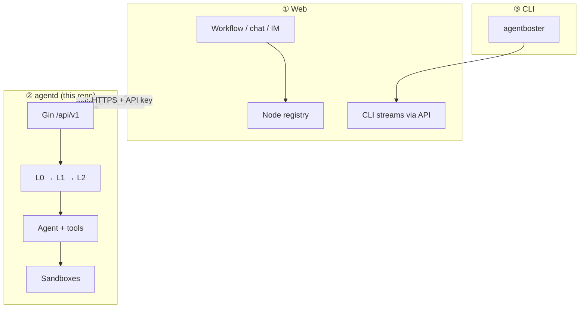
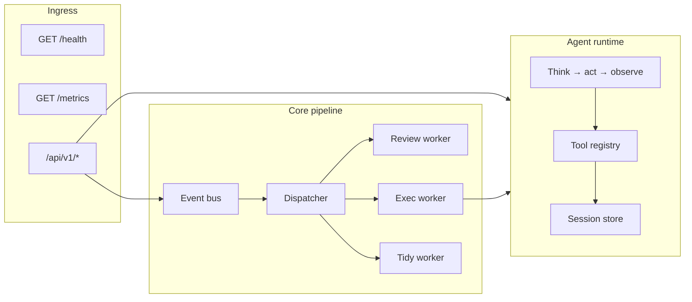
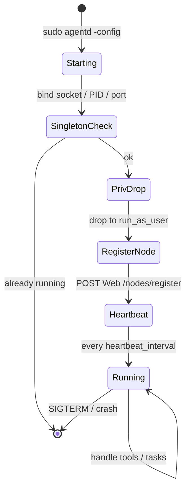
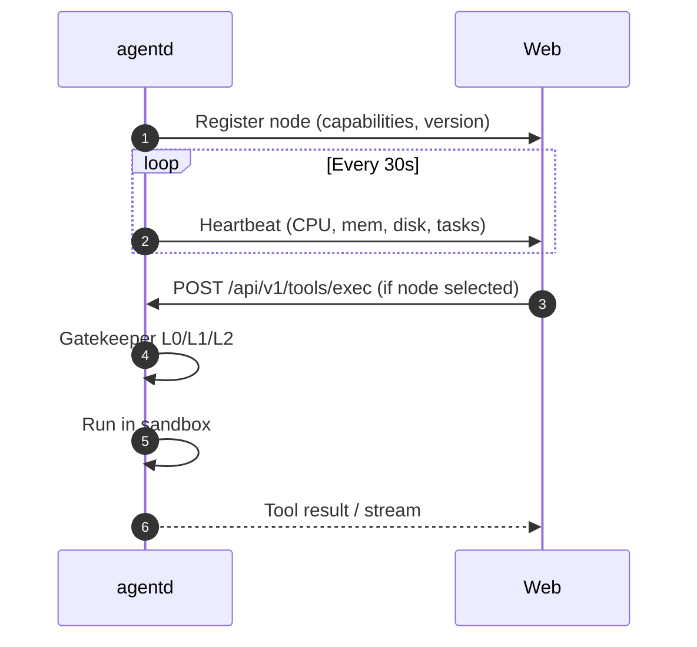
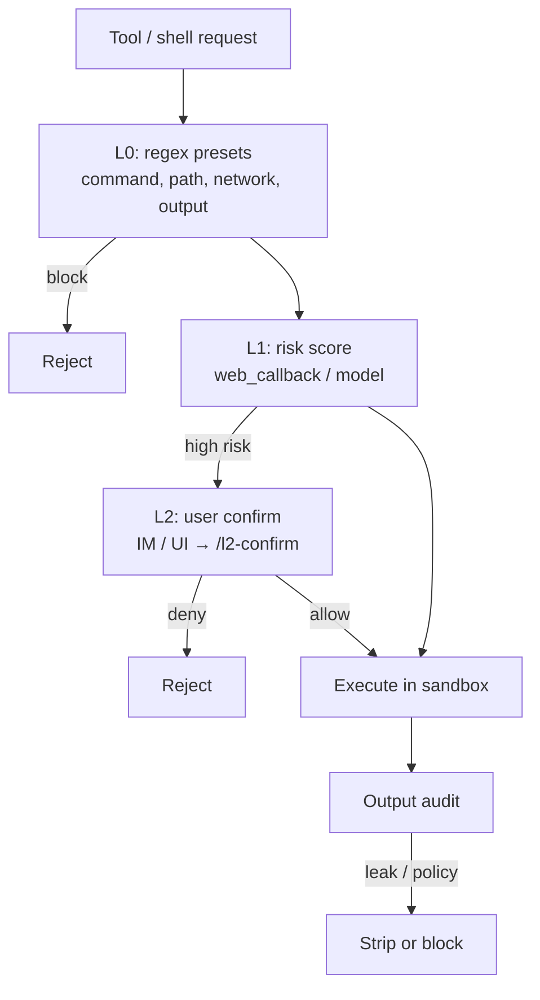
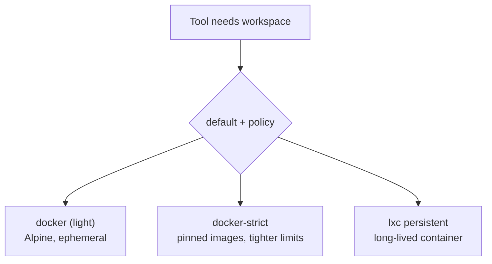
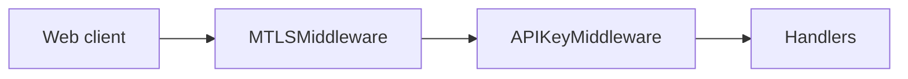
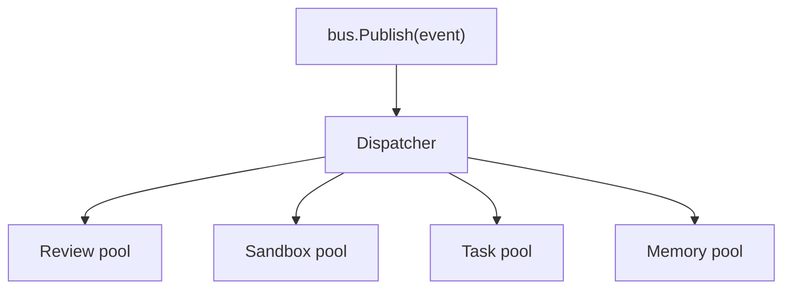
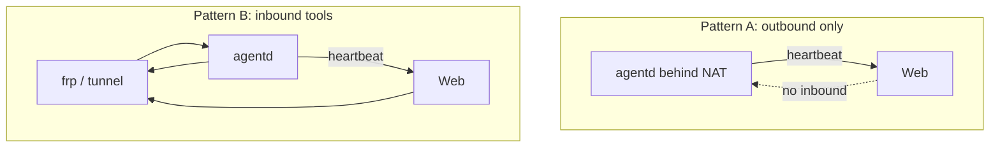

# Agent Daemon (`agentd`)

`agentd` is the Linux execution plane for AgentBoster. It runs agent tool calls inside sandboxes, enforces L0/L1/L2 security, maintains local session runtime state, and talks to the Web service over HTTPS.

---

## Role in the platform



The Web owns durable chat history, IM, and configuration. The daemon owns **process isolation**, **command execution**, and **host-side policy** before and after each tool invocation.

---

## Runtime architecture



### Process lifecycle



Startup requires **root** once (cgroups, namespaces, sandbox setup), then privileges drop to `[security].run_as_user` when configured.

---

## Communication directions

| Direction | Transport | When |
|-----------|-----------|------|
| Daemon → Web | `HTTPS` + `X-API-Key` | Always (heartbeat, L1, uploads, callbacks) |
| Web → Daemon | `HTTPS` + mTLS + API key | Daemon has reachable URL (public IP, frp, LAN) |



**Vercel rule:** leave `[clawless].client_cert_path`, `client_key_path`, and `ca_path` **empty** for outbound Daemon→Web calls. Custom CA bundles replace the system trust store and break Let's Encrypt on `*.vercel.app`.

---

## Security model



| Layer | Location | Purpose |
|-------|----------|---------|
| L0 | `internal/security/l0_rules` | Fast deterministic deny patterns |
| L1 | Web + `internal/security/gatekeeper` | ML/heuristic risk score |
| L2 | `internal/security/l2_auth` | Human time-boxed approval |
| OS | `internal/security/os_enforce` | seccomp, caps, mount policy in strict sandboxes |

`fail_open` in config controls whether L1 errors allow execution (default should stay **false** in production).

---

## Sandbox providers



| Provider | Typical use | Network |
|----------|-------------|---------|
| `docker` | Quick commands, small images | Often isolated (`network_isolate`) |
| `docker-strict` | Untrusted code, pinned base images | Isolated + OS enforce |
| `lxc` | Browser, git, multi-step dev sessions | Configurable; init_commands per distro |

Rootless Docker is recommended: set `docker_socket` to the unprivileged user socket and `run_as_user` to that user. Rootful `/var/run/docker.sock` requires explicit `allow_rootful_docker = true`.

Browser automation uses an in-sandbox Playwright bridge (`internal/agent/browser/`), aligned with Web-side browser MCP tools.

---

## Quick start

### Prerequisites

- Linux **amd64** (ARM binaries on x86 hosts fail with shell syntax errors)
- Go **1.26.2** for building
- Web URL reachable from the daemon host
- Docker and/or LXC as required by `[sandbox].default`

### Build

```bash
cd agentd
go build -o agentd ./cmd/agentd/
```

From repo root: `yarn build:agentd`.

### Shared secret

```bash
openssl rand -hex 32
```

| Side | Setting |
|------|---------|
| Web | `AGENTD_API_KEY=<hex>` |
| Daemon | `[server].clawless_api_key = "<same hex>"` |

### Minimal config (heartbeat-only node)

```bash
cp agentd.toml.example agentd.toml
```

```toml
[server]
listen           = ":18732"
clawless_api_key = "must match AGENTD_API_KEY"
# Leave tls_* empty if Web does not call this daemon directly

[clawless]
base_url         = "https://your-app.vercel.app"
client_cert_path = ""
client_key_path  = ""
ca_path          = ""
heartbeat_interval = "30s"

[sandbox]
default       = "docker"
docker_socket = "unix:///run/user/1001/docker.sock"

[security]
run_as_user = "agentd"
l1_enabled  = true
fail_open   = false
```

### Public inbound (frp / reverse proxy)

```toml
[server]
listen        = ":18732"
tls_cert_path = "./certs/server-cert.pem"
tls_key_path  = "./certs/server-key.pem"
ca_path       = "./certs/ca-cert.pem"
```

Generate certs:

```bash
sudo ./agentd -gen-certs ./certs
```

Install Web client cert paths in `AGENTD_CLIENT_CERT_PATH`, `AGENTD_CLIENT_KEY_PATH`, `AGENTD_CA_PATH`.

### Start and verify

```bash
sudo ./agentd -config agentd.toml
curl -s http://127.0.0.1:18732/health | jq .
curl -s http://127.0.0.1:18732/metrics | jq .
```

Use `https://` and `-k` only when server TLS is enabled.

---

## Configuration reference (highlights)

Environment overrides: `AGENTD_<SECTION>_<KEY>` (Viper), e.g. `AGENTD_SERVER_LISTEN=:28732`.

| Section | Keys | Notes |
|---------|------|-------|
| `[server]` | `listen`, `tls_*`, `clawless_api_key` | Inbound mTLS optional |
| `[clawless]` | `base_url`, `heartbeat_interval` | Outbound to Web only |
| `[security]` | `l1_*`, `run_as_user`, thresholds | L1 model often from Web UI |
| `[sandbox]` | `default`, `docker_*`, `lxc_*`, `network_isolate` | See `agentd.toml.example` |
| `[cache]` | `path`, `sync_interval` | Local blob + upstream sync |
| `[session]` | `max_count`, `timeout` | LRU eviction |
| `[worker]` / `[worker_pool]` | pool sizes, scale thresholds | Auto-scale goroutine pools |
| `[logging]` | `level`, `module` | Structured slog |

Full annotated template: [`agentd.toml.example`](agentd.toml.example).

---

## HTTP API

All JSON responses use:

```json
{ "success": true, "data": { }, "error": null }
```

### Public endpoints

| Method | Path | Description |
|--------|------|-------------|
| GET | `/health` | Status, uptime, active sandboxes/tasks |
| GET | `/metrics` | Worker pool metrics |

### Protected `/api/v1` (mTLS + API key)

Middleware order: CORS → request log → **mTLS** → **API key** (`clawless_api_key`).

| Area | Routes |
|------|--------|
| Tasks | `POST/GET/PUT /tasks`, `/tasks/:id` |
| Sessions | `GET/PUT/DELETE /sessions/:id`, list, switch, close, abort, destroy, status |
| Tools | `POST /tools/exec`, `/tools/exec/stream`, read, write, edit, ls, grep, glob, patch, git, web-fetch, web-search, memory-*, sandbox-install |
| Memory | `GET/POST /memories`, `DELETE /memories/:id` |
| Policy | `GET /l0-rules/:id`, `GET /agent-config/:id` |
| L2 | `POST /l2-confirm` |
| Sandboxes | `POST /sandboxes`, `PUT /sandboxes/:id` |
| LLM | `POST /llm-proxy` (when daemon proxies model calls) |
| Audit | `POST /review-logs` |

Source of truth: `internal/server/routes.go`.



---

## Agent loop and tools

The daemon implements a **CodeAct-style** loop: the model proposes actions; the runtime executes tools inside the active sandbox; observations return to the session transcript.

Typical tool families (registered in `internal/agent/tools_register.go`):

- Filesystem: read, write, edit, patch, ls, grep, glob
- Process: `exec`, `exec_batch` (parallel pool)
- VCS: git operations
- Web: fetch, search (rendered variants may install Chromium in LXC)
- Memory: search/save (synced with Web policy)
- Sub-agent: goroutine runner for delegated tasks
- Browser: Playwright bridge v2
- Media and sandbox package install helpers

Context compaction summarizes long transcripts before token limits; sub-agent state is tracked separately (`internal/session`).

---

## Workers and event bus



Events include task created/updated, exec requests, and periodic tidy jobs (`task_summary` config). Pool sizes can be fixed or auto-scaled from CPU count and channel utilization (`[worker_pool]`).

---

## Node registration and metrics

On startup, lifecycle code registers the node with the Web API and starts heartbeat goroutines. Payload includes:

- `node_id` (persistent file, default under `/var/run/`)
- Supported sandboxes, version, listen address
- CPU model, usage, memory/disk availability
- Active tasks and sandbox counts

The Web scheduler uses these fields when multiple nodes are online (see `lib/workflow/scheduled/dispatch.ts` and `app/api/agentd/v1/nodes/*` in the Web app).

---

## Operations

### CLI flags

```bash
./agentd -config agentd.toml
./agentd -gen-certs ./certs
./agentd -cert-dir ./certs
```

### systemd

```ini
[Unit]
Description=Agent Daemon
After=network.target docker.service

[Service]
Type=simple
ExecStart=/usr/local/bin/agentd -config /etc/agentd/agentd.toml
WorkingDirectory=/etc/agentd
Restart=on-failure
User=root

[Install]
WantedBy=multi-user.target
```

### Logging

Structured logs: `[module] [func:line] level message key=value`. Tune `[logging].level` (`debug` for sandbox diagnostics).

### Singleton lock

Three layers prevent duplicate daemons:

1. Unix socket `/var/run/agentd/agentd.sock`
2. PID file `/var/run/agentd/agentd.pid` with liveness probe
3. TCP bind probe on `server.listen`

The lock dir `/var/run/agentd/` is created as root at startup and chowned to
`[security].run_as_user` before the privilege drop, so the dropped-to user can
unlink the PID/socket files on shutdown (unlink needs write on the parent dir).

Survives `kill -9` and OOM: next start cleans stale artifacts when PID is dead.

---

## Development

```bash
go test ./...
go vet ./... && go build ./...
```

- **Linux only** — `//go:build linux`
- Bump version in `cmd/agentd/main.go` when changing HTTP contract or cache format
- OpenCode hints: [`AGENTS.md`](AGENTS.md)

---

## Troubleshooting

| Symptom | Fix |
|---------|-----|
| `connection refused` to Web | Fix `clawless.base_url`; do not point at down localhost |
| `x509: unknown authority` | Remove wrong `clawless.ca_path` on Vercel targets |
| `node register failed` | Match API keys; check firewall egress to 443 |
| Docker socket denied | Align `run_as_user` with socket owner or enable rootful opt-in |
| Web still uses Vercel sandbox | Register public node URL; confirm heartbeat `online` |
| L2 stuck | Confirm IM/UI reaches Web; Web calls `POST /l2-confirm` |
| High CPU | Lower `max_workers` or reduce `exec_batch` parallelism |

---

## Deployment patterns



Pattern A is enough for nodes that only pull work via polling callbacks (limited). Pattern B is required when Web must **push** synchronous tool RPC to a specific machine.

---

## Versioning and compatibility

- Daemon version is reported in `/health` and registration payload
- Web should tolerate unknown fields in JSON (forward-compatible clients)
- Changing tool request schemas requires coordinated Web + daemon deploy

---

## Related documentation

- [Root README](../README.EN.md)
- [`agentd.toml.example`](agentd.toml.example)
- [`AGENTS.md`](AGENTS.md) — contributor commands and mTLS gotchas
- [CLI README](../cli/README.md) — terminal client (separate from daemon)
- [`docs/agentd-deployment.md`](../../docs/agentd-deployment.md) — 部署与降权运维（startup/privilege-drop/runtime dirs/node_id）

(No separate layout map document — use source tree under `cmd/agentd` and `internal/` when navigating code.)

---

## FAQ

**Why root at startup?** cgroup, namespace, and sandbox creation need capabilities; the process drops to an unprivileged user for steady-state work.

**Can I run without Docker?** Use `lxc` only, or develop with reduced tooling — most file/exec tools expect a sandbox backend.

**Does daemon store Postgres?** No. Sessions and tasks sync through Web APIs; local paths under `[cache]` and `[session].store_path` are ephemeral/runtime.

**Is hot reload supported?** Config watch exists in `internal/config` but is not enabled in default `main.go`.

---

*Target length: ~400 lines including diagrams.*