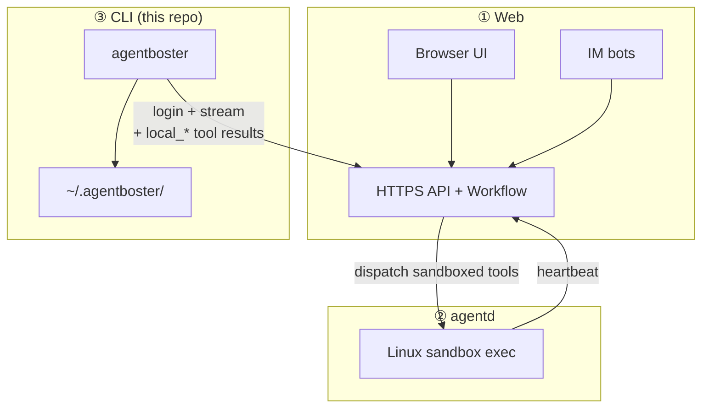
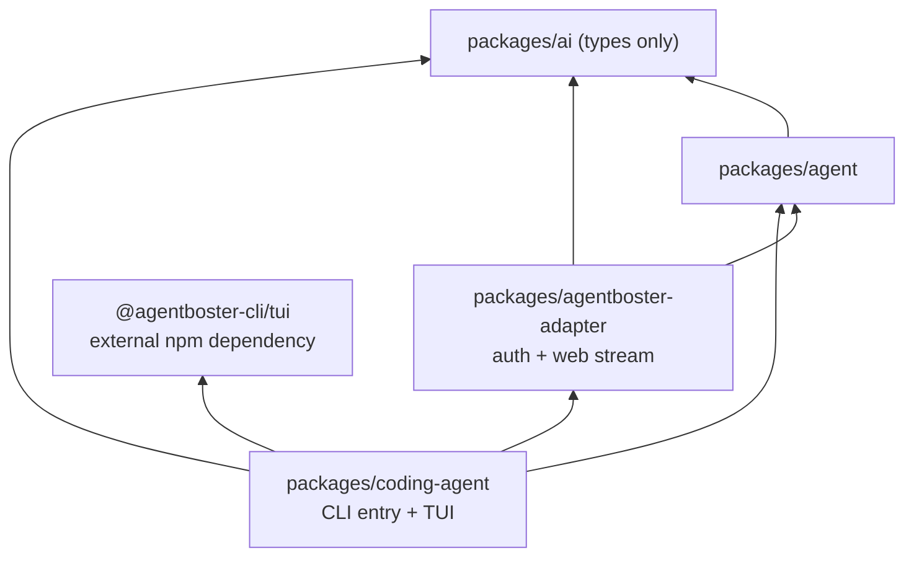
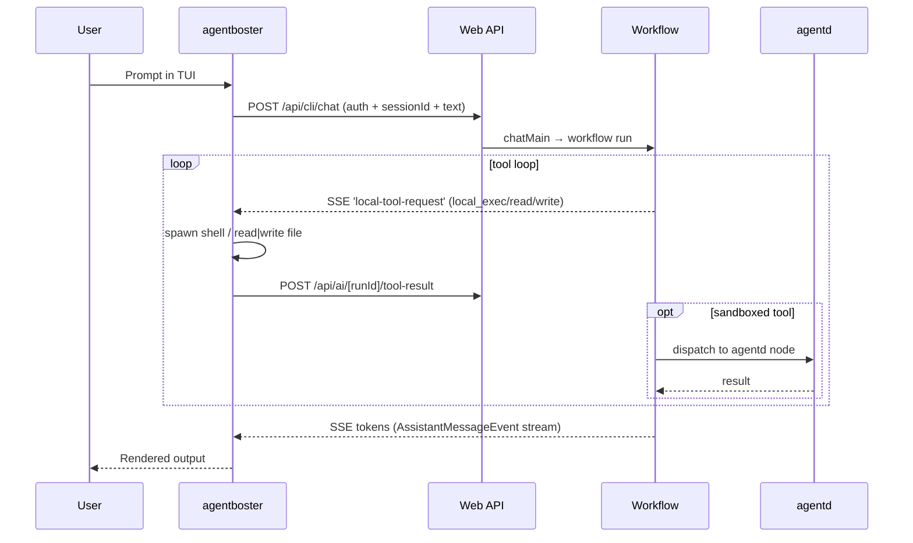

# AgentBoster CLI

The `cli/` workspace ships the **`agentboster`** terminal coding agent. It is a **thin client** of the AgentBoster platform: the Web backend owns models, API keys, tool routing, session persistence, and the workflow runtime; the CLI renders the TUI and executes `local_*` tools (shell / file I/O) on the user's machine.

There is **no direct provider mode** — every LLM call goes through `POST /api/cli/chat` on the Web backend. The provider SDKs (Anthropic / OpenAI / Google / Bedrock / Mistral / …) are intentionally absent from `packages/ai` (~90 MB of npm deps stripped).

This CLI is **based on [pi](https://github.com/earendil-works/pi)**, but new code should use the AgentBoster package names in this workspace. The TUI remains an external npm dependency (`@agentboster-cli/tui`).

---

## Position in the platform



---

## Monorepo architecture



| Package | Responsibility |
|---------|----------------|
| `@agentboster-cli/core` | `agentboster` bin, interactive mode, extensions, export |
| `@agentboster/adapter` | Stored auth, `createAgentbosterStreamFn`, remote models, remote sessions |
| `@agentboster-cli/agent` | Agent session primitives |
| `@agentboster-cli/ai` | Type surface + `compat` stubs (no provider SDKs) |
| `@agentboster-cli/tui` | Terminal rendering, resolved from npm |

Build order is enforced by the root `package.json` `build` script: `ai` → `agent` → `agentboster-adapter` → `coding-agent`.

---

## Request path



Non-interactive `--print` skips TUI and writes final text to stdout (suitable for scripts and CI).

---

## Quick start (developers)

### Requirements

- **Node.js >= 22.19.0** (`engines` in `subpackage/cli/package.json`)
- Yarn Classic (`yarn@1.22.22`)

### Install and build

```bash
cd subpackage/cli
yarn install
yarn build
```

### Run

```bash
# Direct from compiled dist
node packages/coding-agent/dist/cli.js --help

# Single-file bundle (no node_modules needed at runtime)
yarn bundle
node packages/coding-agent/dist/agentboster.cjs --help

# TypeScript direct (dev)
yarn tsx packages/coding-agent/src/cli.ts --help
```

### Quality gate

```bash
yarn check    # Biome check --write, then tsgo --noEmit
```

---

## End-user usage

### 1. Log in (required)

Pair the CLI with your AgentBoster Web deployment:

```bash
# Interactive
agentboster login

# Username + password
agentboster login -u https://your-app.vercel.app --username you --password '***'

# One-shot pair code (issued by the Web UI under /config/devices)
agentboster login -u https://your-app.vercel.app --pair-code ABCD-1234
```

Writes `~/.agentboster/config.json` via `@agentboster/adapter`. The token's device id (`jti`) is recorded in the Web DB so the user can revoke it from the Web UI.

### 2. Pick a model

The model catalog is fetched from `GET /api/cli/models`. Only models the Web backend has configured are selectable.

```bash
# Choose at startup
agentboster --model openai/gpt-4o-mini
agentboster --model anthropic/claude-sonnet-4:high

# Or inside the TUI
/model
Ctrl+P                       # cycle scoped models

# List what the server offers
agentboster --list-models
agentboster --list-models sonnet
```

Passing a model id that is not in the server catalog fails fast with `Model "X" is not in the server catalog. Allowed models: …` — the same restriction the IM `/model` command enforces.

### 3. Interactive session

```bash
agentboster
agentboster "List top-level directories"
agentboster @prompt.md "Implement this"
```

### 4. One-shot (print mode)

```bash
agentboster -p "list top-level directories"
agentboster --print "explain package.json workspaces"
```

### 5. Resume / fork / export

```bash
agentboster --continue              # continue last session (synced with Web)
agentboster --resume                # picker (Web-deleted sessions are hidden)
agentboster --session <id|path>     # exact session
agentboster --fork <id|path>        # branch off a previous turn
agentboster --export session.jsonl  # HTML export
```

---

## CLI flags (reference)

| Flag | Short | Description |
|------|-------|-------------|
| `--help` | `-h` | Usage |
| `--version` | `-v` | Package version |
| `--model <provider/model[:thinking]>` | | Model from server catalog |
| `--models <patterns>` | | Comma-separated patterns for `Ctrl+P` cycling |
| `--print` | `-p` | Non-interactive; stdout only |
| `--continue` | `-c` | Continue last session |
| `--resume` | `-r` | Resume named session |
| `--session <id\|path>` | | Use specific session |
| `--session-id <id>` | | Use exact session id, creating it if missing |
| `--fork <id\|path>` | | Fork at a previous turn |
| `--session-dir <dir>` | | Override session storage directory |
| `--no-session` | | Ephemeral session (not persisted) |
| `--name <name>` | `-n` | Set session display name |
| `--thinking <level>` | | off / minimal / low / medium / high / xhigh |
| `--tools <list>` | `-t` | Allow-list of tools |
| `--exclude-tools <list>` | `-xt` | Deny-list of tools |
| `--no-tools` | `-nt` | Disable all tools |
| `--no-builtin-tools` | `-nbt` | Disable built-in tools only |
| `--extension <path>` | `-e` | Load an extension |
| `--skill <path>` | | Load a skill |
| `--theme <path>` | | Load a theme |
| `--export <file>` | | Export session to HTML |
| `--list-models [search]` | | List server models |
| `--offline` | | Skip startup network ops |
| `--approve` / `--no-approve` | `-a` / `-na` | Trust project-local files |
| `--yolo` | | Skip L0/L1/L2 security scoring and user confirmation on `local_*` tools |

Run `agentboster --help` for the authoritative list (extensions add more flags).

> **Removed flags:** `--provider` and `--api-key` no longer exist. Provider selection happens via `--model <provider>/<id>`; API keys live exclusively on the Web backend.

---

## Configuration and auth storage

| Path | Content |
|------|---------|
| `~/.agentboster/config.json` | Server URL, bearer token, username |
| `~/.agentboster/agent/sessions/` | Local session jsonl (tree state + LLM context mirror) |

`getStoredAuth()` / `clearStoredAuth()` live in `packages/agentboster-adapter/src/auth.ts`. The upstream pi OAuth flow is replaced with **`agentboster login`**.

---

## Adapter package (`@agentboster/adapter`)

Exports (see `packages/agentboster-adapter/src/index.ts`):

- **Auth:** `readStoredConfig`, `writeStoredConfig`, `getStoredAuth`, `clearStoredAuth`
- **Models:** `fetchRemoteModels`, `remoteModelsToPiModels`
- **Streaming:** `createAgentbosterStreamFn`, `openAgentbosterStream` (SSE → pi `AssistantMessageEvent`)
- **Security helpers:** `evaluateLocalCommand`, `formatToolRequest` (local policy hints)

---

## Local tools (`local_*`)

These are the only tools the CLI executes on the user's machine. The Web workflow emits a `local-tool-request` SSE chunk; the CLI runs the command and POSTs the result back.

| Tool | Action |
|------|--------|
| `local_exec` | Run a shell command (user's `$SHELL`, cwd, env) |
| `local_read_file` | Read a file (absolute or cwd-relative) |
| `local_write_file` | Write/overwrite a file (creates parent dirs) |

Other tools (`readMemory`, `writeMemory`, sandbox `exec`, MCP tools, …) run on the Web workflow runtime or agentd — the CLI never touches them.

### Security gating

Each `local_*` invocation passes through `evaluateLocalCommand` in the adapter before executing. L0 blocks known-dangerous patterns; L2 asks for confirmation in the TUI when the command looks risky. Headless `--print` mode refuses anything that would require confirmation.

`--yolo` skips both tiers — every `local_*` invocation auto-approves with no scoring and no prompt. Useful for trusted `-p`/CI runs where the L2 prompt would otherwise auto-reject.

---

## Build, bundle, release

### Workspace scripts

| Script | Output |
|--------|--------|
| `yarn build` | Per-package `dist/` |
| `yarn clean` | Remove build artifacts |
| `yarn bundle` | `packages/coding-agent/dist/agentboster.cjs` (single file, all assets inlined) |
| `yarn package` | `agentboster-cli-<version>.tar.gz` (2 files: `agentboster` wrapper + `agentboster.cjs`) |

```bash
cd subpackage/cli
yarn bundle
yarn package
tar xzf agentboster-cli-*.tar.gz
./agentboster-cli-*/agentboster --version
```

The bundle embeds themes, export-HTML templates, vendored libs (marked/highlight), and the announcement PNG via esbuild loaders. The tarball is fully self-contained — target machine only needs Node.js >= 22.

---

## Environment variables

| Variable | Purpose |
|----------|---------|
| `AGENTBOSTER_HOME` | Override `~/.agentboster` (config + sessions root) |
| `AGENTBOSTER_SESSION_ID` | Pin session id (debugging) |
| `AGENTBOSTER_CLIENT_ID` | Override device label |
| `AGENTBOSTER_MODEL` | Default model override |
| `PI_OFFLINE=1` | Disable startup network ops |
| `PI_PACKAGE_DIR` | Override asset root (Nix/Guix) |
| `PI_TIMING=1` | Log timing diagnostics |

> Provider API keys (`ANTHROPIC_API_KEY`, `OPENAI_API_KEY`, …) are **not used** by this fork. Configure them in the Web backend instead.

---

## Session lifecycle (Web sync)

- **List / resume / delete:** mirrored via `/api/cli/sessions` — sessions deleted on the Web disappear from the CLI's `--resume` / `/resume` picker.
- **Title renames:** `--name`, `/name`, and the rename action in the session picker PATCH the Web session row.
- **Messages:** written by the Web workflow (`chatMain`) into the Postgres `messages` table. The CLI keeps an **ephemeral** jsonl mirror under `$(tmpdir)/agentboster-sessions/` (never under `~/.agentboster/`) for tree state (branch / rewind) and LLM context window. The mirror is deleted on exit; stale files from a crashed run are cleaned up at startup.
- **Compaction:** the CLI summarizes locally (through the adapter stream) and POSTs the result to `/api/cli/sessions/[id]/compact` so the Web DB stays consistent.

### Message versions (edit + regenerate)

Both the Web and the CLI use a **unified version model**: each message carries `metadata.versions[]` + `metadata.currentVersionIndex`, replacing the older split `editHistory` / `generationHistory`. The first time a `versions`-unaware client connects, the Web postbuild runs `scripts/migrate-message-versions.ts` (idempotent) to convert legacy fields and snapshot the paired assistant reply into `version.response`.

In the TUI tree selector, press `[` / `]` on a message with 2+ versions to cycle. The CLI updates its in-memory entry, re-renders, and PATCHes `/api/cli/messages/[id]/metadata` so the switch persists on the backend.

To **edit a historical user-message version and resend**: select the user message, cycle to the version you want with `[`/`]`, then press `e`. The version text fills the editor; on submit the CLI snapshots the paired assistant reply onto the old version, appends the edited text as a new version, PATCHes metadata, and POSTs the chat with `trigger: 'regenerate-message'`. The backend truncates the downstream messages and reruns — no separate endpoint.

---

## RPC and automation

`packages/coding-agent/dist/rpc-entry.js` supports programmatic control (build marks it executable). Use for editor integrations or headless automation where TUI is not wanted.

---

## Troubleshooting

| Issue | Fix |
|-------|-----|
| `command not found` | Build (`yarn build`), use the tarball `./agentboster`, or run `node …/agentboster.cjs` |
| `Not logged in` | `agentboster login` (the CLI cannot run without the Web backend) |
| `Model "X" is not in the server catalog` | Run `agentboster --list-models`; the id must match exactly |
| Empty model list | Check Web backend `/api/cli/models` and your token |
| `Tool <name> not found` | Internal error — the CLI no longer dispatches tools locally; report if seen |
| Bundle missing assets | `yarn build` before `yarn bundle` |

---

## Relationship to `agentd`

| Component | Runs where | Role |
|-----------|------------|------|
| **CLI** | User laptop / CI | UX, `local_*` tool execution |
| **agentd** | Linux server | Sandboxed exec, L0–L2, long-running agents |

The CLI does **not** replace the daemon. Server-mediated tasks that need Docker/LXC/browser sandboxes execute on registered agentd nodes after the Web workflow dispatches them.

---

## Project conventions

See [`AGENTS.md`](AGENTS.md):

- TypeScript ESM, Biome formatter, Conventional Commits (`feat(cli):`, `fix(cli):`)
- Do not hand-edit `dist/` outputs
- Keep dependency changes intentional (review lockfile)

---

## Related documentation

- [Root README](../../README.md) — platform architecture
- [`agentd/README.md`](../agentd/README.md) — Linux execution daemon
- [`AGENTS.md`](AGENTS.md) — monorepo dev guide
