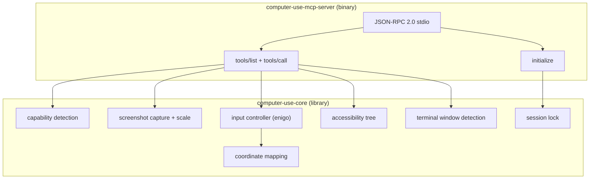

# Computer Use MCP Server

Cross-platform [MCP](https://modelcontextprotocol.io/) server that exposes computer-use tools — screenshots, mouse/keyboard input, and accessibility tree queries — over JSON-RPC 2.0 on stdio. Used by the AgentBoster CLI desktop app to let AI agents interact with the user's desktop.

---

## Architecture



### Crate layout

| Crate | Directory | What it does |
|-------|-----------|--------------|
| `computer-use-core` | `core/` | Platform-abstracted library: screenshot capture, input injection (enigo), accessibility tree reading, terminal window detection, coordinate mapping, session locking. No I/O — all side effects are in the server binary. |
| `computer-use-mcp-server` | `server/` | Thin MCP server binary. Reads JSON-RPC requests from stdin, dispatches to `computer-use-core`, writes responses to stdout. |

---

## Platform support

| Platform | Display | Input | Accessibility | Terminal masking |
|----------|---------|-------|---------------|-----------------|
| **macOS** | Quartz (always available) | enigo | AX API (`accessibility-sys`) — requires Accessibility permission | Per-window via `CGWindowListCopyWindowInfo` |
| **Windows** | Win32 (always available) | enigo | UIAutomation (`uiautomation` crate) | Per-window via `EnumWindows` class/title matching |
| **Linux** | X11 or Wayland (`DISPLAY` / `WAYLAND_DISPLAY`) | enigo | AT-SPI2 via `atspi` + `zbus` crates | Conservative fallback: masks bottom 1/3 of screen |

---

## MCP tools

The server exposes the following tools (conditional on capabilities):

| Tool | Description | Always available |
|------|-------------|------------------|
| `screenshot` | Capture and scale a monitor. Returns base64 PNG + metadata. | Yes (if display exists) |
| `mouse_move` | Move cursor to (x, y) in screenshot-scaled coordinates. | If display + accessibility |
| `mouse_click` | Click at (x, y). Supports left/right/middle/back/forward, single/double. | If display + accessibility |
| `mouse_drag` | Drag from one point to another. | If display + accessibility |
| `key_event` | Press a key, optionally with modifiers. | If display + accessibility |
| `type_text` | Type a string via simulated keystrokes. | If display + accessibility |
| `get_accessibility_tree` | Get the accessibility element at screen coordinates. | If display + accessibility |
| `get_focused_element` | Get the currently focused accessibility element. | If display + accessibility |

### Coordinate system

Input coordinates are in **screenshot-scaled space**. The server remembers the scale factor and monitor origin from the last `screenshot` call and maps input coordinates back to native screen pixels via `CoordMapper`. If no screenshot has been taken yet, the detected display scale factor is used as fallback.

---

## Terminal safety

By default (`allow_terminal_edit = false`), the server:

1. **Masks terminal windows** in screenshots so the model cannot read terminal content.
2. **Rejects input operations** when the foreground window is a terminal (macOS/Windows only; Linux lacks a reliable cross-desktop foreground-window API).

Set `allow_terminal_edit = true` in the `initialize` params to disable both protections.

---

## Session locking

Only one computer-use session can be active at a time. `ComputerUseLock` acquires an exclusive lock file (`~/.config/agentboster-cli/computer-use.lock` or `~/.config/agentboster-desktop/computer-use.lock`). Cross-checks the sibling app's lock to prevent CLI and desktop app from conflicting. Stale locks (dead PIDs) are automatically reclaimed.

---

## Build

```bash
cd subpackage/computer-use-mcp

# Debug build
cargo build

# Release binary
cargo build --release

# Run tests
cargo test
```

The binary is at `target/release/computer-use-mcp` (or `target/debug/computer-use-mcp`).

### Dependencies

Key dependencies (see `core/Cargo.toml` for full list):

| Crate | Purpose |
|-------|---------|
| `xcap` | Cross-platform screen capture |
| `enigo` | Cross-platform input simulation |
| `image` | PNG encoding and scaling |
| `rdev` | Global Escape key hook for abort |
| `serde` / `serde_json` | JSON serialization |
| `chrono` | Timestamps for lock files |

Platform-specific:

| Platform | Crates |
|----------|--------|
| macOS | `accessibility-sys`, `core-foundation`, `core-graphics` |
| Windows | `uiautomation`, `winapi` |
| Linux | `atspi`, `zbus`, `tokio` |

---

## Configuration

The server reads two environment variables at startup:

| Variable | Default | Purpose |
|----------|---------|---------|
| `CONFIG_DIR` | `~/.config/agentboster-cli` | Directory for the session lock file |
| `SESSION_ID` | `mcp-server` | Session identifier written to the lock file |

---

## MCP protocol

The server implements MCP protocol version `2024-11-05` over newline-delimited JSON-RPC 2.0 on stdio. Notifications (requests without `id`) are silently ignored.

### initialize response

```json
{
  "protocolVersion": "2024-11-05",
  "capabilities": { "tools": {}, "computerUse": { ... } },
  "serverInfo": { "name": "computer-use-mcp", "version": "0.1.0" },
  "settings": { "allow_terminal_edit": false }
}
```

The `computerUse` capability block includes: `hasDisplay`, `platform`, `displayServer`, `displayResolution`, `scaleFactor`, `accessibilityGranted`, `isAdmin`, `issues`.

---

## Escape hook

`EscapeHook` (in `safety.rs`) runs a background thread listening for global Escape key presses via `rdev`. Callers can poll `is_aborted()` and `reset()` the flag. This allows users to abort long-running computer-use operations.

---

## Related documentation

- [Root README](../../README.md) — platform architecture
- [`cli/README.md`](../cli/README.md) — terminal client (uses this MCP server for desktop features)
- [`dbushelper/README.md`](../dbushelper/README.md) — agentd's AT-SPI2 client (different from this crate's Linux accessibility backend)
