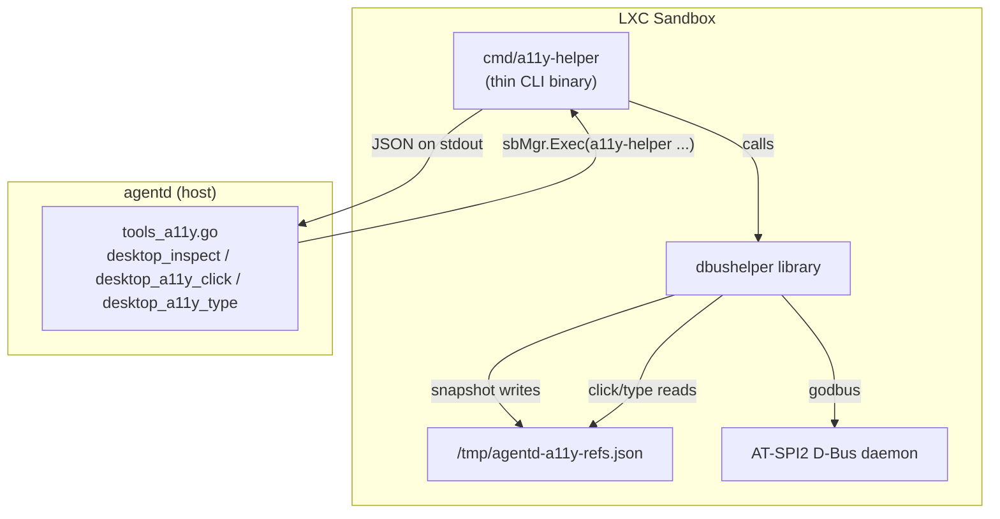
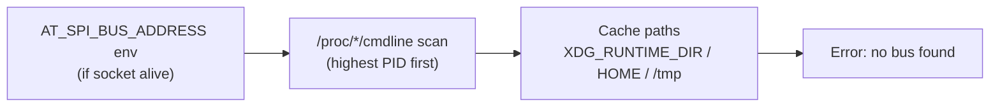

# dbushelper

Pure-Go client for the [AT-SPI2](https://gitlab.gnome.org/GNOME/at-spi2-core) accessibility D-Bus registry. Runs **inside** the agentd LXC sandbox and exposes the desktop accessibility tree to AI agents via structured JSON.

## Architecture



### Data flow

1. **agentd** calls `sbMgr.Exec("a11y-helper", "snapshot", "--limit", "300")` into the sandbox.
2. **a11y-helper** (the CLI) delegates to the **dbushelper** library.
3. The library discovers the AT-SPI bus address (env var → `/proc` scan → cache-path probe), connects via godbus, and walks the accessibility tree with an iterative DFS.
4. Accepted nodes are assigned short `eN` ref IDs and persisted to a refs file.
5. The CLI serializes the result as a single JSON object on stdout (exit 0) or prints diagnostics to stderr (exit 1).
6. For actions (`click`, `type`, `fill`), the library reads the refs file to resolve `eN` back to a `(bus_name, object_path)` pair and invokes the corresponding AT-SPI interface method.

### Bus discovery order



## Package layout

| File | Exports |
|------|---------|
| `conn.go` | `OpenBus`, `SocketAlive`, `DisplayNumber`, `CandidateCachePaths` |
| `atspi.go` | `RoleIsStructural`, `RoleIsInteractive`, `IsOnScreen`, role/state constants, AT-SPI interface wrappers |
| `snapshot.go` | `RunSnapshot`, `SnapshotOutput`, `SnapshotItem`, `Diagnostics`, `FormatLine`, `JsonQuote` |
| `action.go` | `RunClick`, `RunType`, `RunFill`, `RunInspect`, `InspectOutput`, `ActionOutput`, `Fallback`, `PreferredActionIndex` |
| `refs.go` | `RefEntry`, `RefKind`, `WriteRefs`, `AppendRefs`, `LookupRef`, `NormalizeRef`, `RefsPath` |
| `cmd/a11y-helper/main.go` | CLI binary — flag parsing, JSON serialization, exit codes |

The library has **no side effects** (no stdout, no `os.Exit`). JSON output and process lifecycle live exclusively in `cmd/a11y-helper/main.go`.

## Build

```bash
cd subpackage/dbushelper

# Library + CLI
go build ./...

# Unit tests (no D-Bus required)
go test ./...

# Static production binary
CGO_ENABLED=0 GOOS=linux GOARCH=amd64 \
  go build -trimpath -ldflags="-s -w" \
  -o agentd-a11y-helper ./cmd/a11y-helper
```

godbus is pure Go — `CGO_ENABLED=0` produces a fully static binary for any Linux distro.

## CLI usage

```
a11y-helper snapshot [--limit N]     # walk tree, emit JSON envelope
a11y-helper inspect <ref>            # expand the subtree of eN or xN
a11y-helper click <ref>              # AT-SPI DoAction on ref (eN only)
a11y-helper type <ref> <text>        # InsertText at caret (eN only)
a11y-helper fill <ref> <text>        # SetTextContents (replace, eN only)
```

All subcommands print a single JSON object on stdout. Diagnostics go to stderr only.

## Tiered snapshots

Snapshot output is tiered to keep LLM token cost down on deep trees: interactive widgets get a full line + an `eN` action ref, presentational containers get a folded line + an `xN` group ref.

```
- push button "Reload" [ref=e3] @120,80 28x28
- entry "Search" [ref=e4] @200,80 200x28
- panel "Advanced settings" [ref=x7, children=47, inspect to expand] @20,30 600x400
- list "Results" [ref=x8, children=120, inspect to expand] @20,80 600x500
```

Tier assignment is driven by `RoleIsInteractive` in `atspi.go` (push button / entry / menu item / check box / radio / link / list / table / spin button / toggle / text — the roles that typically expose an AT-SPI Action or EditableText interface). Everything else that survives the structural / geometry filters becomes a group.

The DFS still walks group subtrees so deep action nodes are never hidden — only the snapshot **line** for a group is folded. The LLM expands on demand:

```
a11y-helper inspect x7
```

`inspect` re-DFSes the subtree of `xN` (capped at `InspectLimit = 200`), assigns fresh `eN` / `xN` ids continuing the counters from the current refs file, and **appends** the new nodes to the refs index (atomically). Subsequent `click` / `type` / `fill` calls then resolve the expanded refs by id — no extra lookup round-trip.

This avoids the cost of re-snapshotting the whole desktop after every action (the Playwright-MCP pattern), which on AT-SPI would either hit `maxVisits` truncation or push ref-id churn. Per-action re-snapshot is also a poor fit because AT-SPI has no equivalent of a page-load event to signal "the tree has settled" — the desktop is shared mutable state.

### Refs ids

| Form | Kind | Where assigned | Legal targets |
|------|------|----------------|---------------|
| `eN` | action | `snapshot`, `inspect` (continued counter) | `click` / `type` / `fill` / `inspect` |
| `xN` | group | `snapshot`, `inspect` (continued counter) | `inspect` only — `click`/`type`/`fill` will fail with `ok=false` because the node does not expose an Action interface |

Both live in the same refs file (`/tmp/agentd-a11y-refs.json`) and are resolved by the same `LookupRef` call. `NormalizeRef` accepts `e3` / `E03` / `ref=e3` / `3` (→ `e3`) and `x12` / `X12` / `ref=x12` (→ `x12`).

## Release

The helper binary is distributed as a GitHub release asset, fetched on first `desktop_inspect` call by `install_a11y_helper_from_release` in the agentd install script.

**Asset naming contract** (must match the install script):

```
releases/download/<version>/agentd-a11y-helper-linux-<arch>-<version>
```

where `<arch>` ∈ {`amd64`, `arm64`}.

**To cut a release:**

1. Tag: `git tag v0.1.0 && git push origin v0.1.0`
2. The [`release`](../../.github/workflows/release.yml) workflow builds all artifacts automatically.
3. Update `AGENTD_A11Y_HELPER_VERSION` if needed.

Use `workflow_dispatch` for dry-run builds (upload step is skipped).

## Limitations

### Walk caps

The DFS walk is hard-capped to keep pathological trees (LibreOffice Calc exposes ~2^31 cells per sheet) from hanging the helper. Both caps are `const` in `snapshot.go` and not configurable at runtime:

| Cap | Value | Effect when hit |
|-----|-------|-----------------|
| `maxApps` | `32` | Only the first 32 top-level applications are descended into; the rest are ignored. |
| `maxVisits` | `8000` | Stops inspecting nodes mid-walk; `truncated=true` is set on the envelope. |
| `maxStack` | `4000` | Caps pending DFS nodes so a pathological wide tree (LibreOffice) cannot balloon memory before `maxVisits` catches up; remaining siblings are dropped and `truncated=true` is set. |
| `DefaultLimit` | `300` | Cap on **accepted** (returned) nodes per `snapshot`. Override per-call with `snapshot --limit N`. |
| `InspectLimit` | `200` | Cap on accepted nodes per `inspect` call. Lower than `maxVisits` because inspect is meant to be a cheap "drill into one branch" round-trip. |

When any cap is hit, `SnapshotOutput.Truncated` is `true` and `Diagnostics` carries the exact `visited` / `accepted` / `apps` counts so the caller can tell "empty desktop" apart from "walk cut short".

### Node filtering

`describe` in `snapshot.go` drops nodes before they ever reach the output, in this order:

1. **Off-screen** — nodes whose AT-SPI state set contains neither `SHOWING` (28) nor `VISIBLE` (30). Counted under `Diagnostics.SkippedState`. Note `IsOnScreen` accepts either flag: GTK sets both, Chromium sets only `SHOWING`.
2. **Structural roles** — `InvalidRole(0)`, `Unknown(1)`, `Filler(47)`, `Separator(56)`, `Application(5)`, `DesktopFrame(17)`, `DesktopIcon(16)` (see `RoleIsStructural`). Counted under `Diagnostics.SkippedRole`. **The node is dropped but its subtree is still walked**, so descendants of an `Application` root still surface.
3. **Empty geometry + empty name** — nodes where `width <= 0 && height <= 0 && name == ""`. Counted under `Diagnostics.SkippedGeometry`. Rationale: a node the model can neither click (no box) nor identify (no name) carries no actionable signal. Popups / virtual children with a name but no extents are kept.

If a widget you expect is missing from a snapshot, check these three counters first.

### CoordType

Bounding boxes are always returned in **absolute screen coordinates** (`CoordType.Screen`, `atspi.go`). Window-relative extents would be useless for cross-app consumers. This means the host must NOT apply a window offset when replaying `fallback` coordinates via xdotool.

### Action fallback semantics

`click` / `type` / `fill` return an `ActionOutput` with `ok` indicating whether the AT-SPI call succeeded. **On failure the JSON still exits 0 and carries a `fallback` block** = `{x, y}` = bounding-box center of the ref (see `RefEntry.Center()`, saturating math so a 2^31-wide extent does not overflow). The host (agentd) replays the action against those coordinates via **xdotool** (XTest injection on the Xvfb display — see `internal/agent/desktop/desktop.go::Click`); RFB/VNC injection is deliberately not used.

If the ref is entirely absent from the index (e.g. stale refs file), no fallback coordinate can be synthesized — the envelope carries `ok=false`, an `error` string, and **no** `fallback` block.

### Caret fallback for `type`

`RunType` reads `CaretOffset` from the AT-SPI Text interface; if that call fails or returns negative, the insert position falls back to `0` (start of field). There is no end-of-field heuristic.

### Refs file

- Default path: `/tmp/agentd-a11y-refs.json`.
- Override with `AGENTD_A11Y_REFS` (used by the test suite to isolate per-test indices).
- `snapshot` **atomically overwrites** it (marshal to a temp file in the same directory, then rename); `click`/`type`/`fill` only read it. This guarantees a concurrent reader either sees the prior complete index or the new one, never a half-written file — important because agentd's workflow interleaves `desktop_inspect` (write) with `desktop_a11y_click`/`desktop_a11y_type` (read).
- If a snapshot is regenerated between an action call, ref IDs are invalidated and the action will miss.

### Exit codes

| Code | Meaning |
|------|---------|
| `0` | Success, **or** per-action failure (JSON envelope with `ok=false`, `fallback` block when available). |
| `1` | Catastrophic: a11y bus unreachable, refs file unreadable, JSON serialization failure. Diagnostics on stderr. |
| `2` | Usage error (unknown subcommand, missing `<ref>`/`<text>`). |

The host must therefore decide success vs. action-failure by inspecting the JSON `ok` field, **not** by the exit code alone.

## AT-SPI coverage

| App class | Coverage |
|-----------|----------|
| GTK3 / GTK4 (XFCE, GNOME apps) | High |
| Chromium ≥ 90 / Electron | High (requires `--force-renderer-accessibility`) |
| Firefox | Likely works, untested |
| Qt5 / Qt6 | Invisible to AT-SPI — see "Qt support" below |
| LibreOffice | Pathological — truncated by `maxVisits=8000` |
| Raw X11 apps (xterm, Motif) | Invisible to AT-SPI; `fallback` coordinate returned, host replays via xdotool |

### Qt support

Qt5/Qt6 applications do **not** expose themselves to the AT-SPI2 registry by default — three layers have to line up, and none of them currently do inside the agentd sandbox:

1. **Runtime env var (missing).** Qt only loads its `linuxaccessibility` bridge plugin when `QT_ACCESSIBILITY=1` (Qt5) or `QT_LINUX_ACCESSIBILITY_ALWAYS_ON=1` (Qt6) is set in the process environment. The desktop stack launch script (`internal/agent/desktop/desktop.go::startStack`) exports `DBUS_SESSION_BUS_ADDRESS`, `DISPLAY`, and `NO_AT_BRIDGE=0` — but `NO_AT_BRIDGE` is a GTK flag (it disables GTK's AT-SPI bridge when set to `1`) and has no effect on Qt. So Qt apps start with their a11y bridge unloaded and never register on the bus.
2. **Qt runtime deps (not installed).** `desktop_install.sh` deliberately installs a GTK-/Qt-free stack — `icewm` is picked precisely because it has "no GTK/Qt deps", and no Qt packages (`qt5-base` / `qt6-base` / `libQt5Gui` / platform plugins) appear in any distro's `PKGS` list. Even with `QT_ACCESSIBILITY=1`, a Qt app would fail to find its `accessible/` / `platforms/` plugin directories and abort at startup.
3. **No toolkit-specific adapter in dbushelper.** `dbushelper` walks the AT-SPI registry generically (no Qt knowledge in `atspi.go` / `snapshot.go`). When Qt's bridge is off, the app's bus name never appears as a child of `org.a11y.atspi.Registry`, so the walker simply doesn't see it — there is no error, just an empty subtree.

**To enable Qt support** (untested path): install Qt runtime + platform plugins in the sandbox image, append `export QT_ACCESSIBILITY=1` (or `QT_LINUX_ACCESSIBILITY_ALWAYS_ON=1` for Qt6) to the env file written by `startStack`, and relaunch the Qt app from that env. Once the app registers on the a11y bus, dbushelper will pick it up with no further changes.
