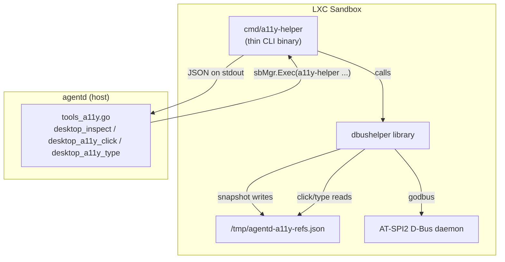
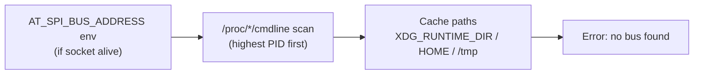

# dbushelper

Pure-Go client for the [AT-SPI2](https://gitlab.gnome.org/GNOME/at-spi2-core) accessibility D-Bus registry. Runs **inside** the agentd LXC sandbox and exposes the desktop accessibility tree to AI agents via structured JSON.

## Architecture



### Data flow

1. **agentd** calls `sbMgr.Exec("a11y-helper", "snapshot", "--limit", "300")` into the sandbox.
2. **a11y-helper** (the CLI) delegates to the **dbushelper** library.
3. The library discovers the AT-SPI bus address (env var → `/proc` scan → cache-path probe), connects via godbus, and walks the accessibility tree with an iterative DFS.
4. Accepted nodes are assigned short `eN` ref IDs and persisted to a refs file.
5. The CLI serializes the result as a single JSON object on stdout (exit 0) or prints diagnostics to stderr (exit 1).
6. For actions (`click`, `type`, `fill`), the library reads the refs file to resolve `eN` back to a `(bus_name, object_path)` pair and invokes the corresponding AT-SPI interface method.

### Bus discovery order



## Package layout

| File | Exports |
|------|---------|
| `conn.go` | `OpenBus`, `SocketAlive`, `DisplayNumber`, `CandidateCachePaths` |
| `atspi.go` | `RoleIsStructural`, `IsOnScreen`, role/state constants, AT-SPI interface wrappers |
| `snapshot.go` | `RunSnapshot`, `SnapshotOutput`, `SnapshotItem`, `Diagnostics`, `FormatLine` |
| `action.go` | `RunClick`, `RunType`, `RunFill`, `ActionOutput`, `Fallback`, `PreferredActionIndex` |
| `refs.go` | `RefEntry`, `WriteRefs`, `LookupRef`, `NormalizeRef`, `RefsPath` |
| `cmd/a11y-helper/main.go` | CLI binary — flag parsing, JSON serialization, exit codes |

The library has **no side effects** (no stdout, no `os.Exit`). JSON output and process lifecycle live exclusively in `cmd/a11y-helper/main.go`.

## Build

```bash
cd subpackage/dbushelper

# Library + CLI
go build ./...

# Unit tests (no D-Bus required)
go test ./...

# Static production binary
CGO_ENABLED=0 GOOS=linux GOARCH=amd64 \
  go build -trimpath -ldflags="-s -w" \
  -o agentd-a11y-helper ./cmd/a11y-helper
```

godbus is pure Go — `CGO_ENABLED=0` produces a fully static binary for any Linux distro.

## CLI usage

```
a11y-helper snapshot [--limit N]     # walk tree, emit JSON envelope
a11y-helper click <ref>              # AT-SPI DoAction on ref
a11y-helper type <ref> <text>        # InsertText at caret
a11y-helper fill <ref> <text>        # SetTextContents (replace all)
```

All subcommands print a single JSON object on stdout. Diagnostics go to stderr only.

## Release

The helper binary is distributed as a GitHub release asset, fetched on first `desktop_inspect` call by `install_a11y_helper_from_release` in the agentd install script.

**Asset naming contract** (must match the install script):

```
releases/download/<version>/agentd-a11y-helper-linux-<arch>-<version>
```

where `<arch>` ∈ {`amd64`, `arm64`}.

**To cut a release:**

1. Tag: `git tag v0.1.0 && git push origin v0.1.0`
2. The [`release`](../../.github/workflows/release.yml) workflow builds all artifacts automatically.
3. Update `AGENTD_A11Y_HELPER_VERSION` if needed.

Use `workflow_dispatch` for dry-run builds (upload step is skipped).

## Limitations

### Walk caps

The DFS walk is hard-capped to keep pathological trees (LibreOffice Calc exposes ~2^31 cells per sheet) from hanging the helper. Both caps are `const` in `snapshot.go` and not configurable at runtime:

| Cap | Value | Effect when hit |
|-----|-------|-----------------|
| `maxApps` | `32` | Only the first 32 top-level applications are descended into; the rest are ignored. |
| `maxVisits` | `8000` | Stops inspecting nodes mid-walk; `truncated=true` is set on the envelope. |
| `maxStack` | `4000` | Caps pending DFS nodes so a pathological wide tree (LibreOffice) cannot balloon memory before `maxVisits` catches up; remaining siblings are dropped and `truncated=true` is set. |
| `DefaultLimit` | `300` | Cap on **accepted** (returned) nodes. Override per-call with `snapshot --limit N`. |

When any cap is hit, `SnapshotOutput.Truncated` is `true` and `Diagnostics` carries the exact `visited` / `accepted` / `apps` counts so the caller can tell "empty desktop" apart from "walk cut short".

### Node filtering

`describe` in `snapshot.go` drops nodes before they ever reach the output, in this order:

1. **Off-screen** — nodes whose AT-SPI state set contains neither `SHOWING` (28) nor `VISIBLE` (30). Counted under `Diagnostics.SkippedState`. Note `IsOnScreen` accepts either flag: GTK sets both, Chromium sets only `SHOWING`.
2. **Structural roles** — `InvalidRole(0)`, `Unknown(1)`, `Filler(47)`, `Separator(56)`, `Application(5)`, `DesktopFrame(17)`, `DesktopIcon(16)` (see `RoleIsStructural`). Counted under `Diagnostics.SkippedRole`. **The node is dropped but its subtree is still walked**, so descendants of an `Application` root still surface.
3. **Empty geometry + empty name** — nodes where `width <= 0 && height <= 0 && name == ""`. Counted under `Diagnostics.SkippedGeometry`. Rationale: a node the model can neither click (no box) nor identify (no name) carries no actionable signal. Popups / virtual children with a name but no extents are kept.

If a widget you expect is missing from a snapshot, check these three counters first.

### CoordType

Bounding boxes are always returned in **absolute screen coordinates** (`CoordType.Screen`, `atspi.go`). Window-relative extents would be useless for cross-app consumers. This means the host must NOT apply a window offset when replaying `fallback` coordinates via xdotool.

### Action fallback semantics

`click` / `type` / `fill` return an `ActionOutput` with `ok` indicating whether the AT-SPI call succeeded. **On failure the JSON still exits 0 and carries a `fallback` block** = `{x, y}` = bounding-box center of the ref (see `RefEntry.Center()`, saturating math so a 2^31-wide extent does not overflow). The host (agentd) replays the action against those coordinates via **xdotool** (XTest injection on the Xvfb display — see `internal/agent/desktop/desktop.go::Click`); RFB/VNC injection is deliberately not used.

If the ref is entirely absent from the index (e.g. stale refs file), no fallback coordinate can be synthesized — the envelope carries `ok=false`, an `error` string, and **no** `fallback` block.

### Caret fallback for `type`

`RunType` reads `CaretOffset` from the AT-SPI Text interface; if that call fails or returns negative, the insert position falls back to `0` (start of field). There is no end-of-field heuristic.

### Refs file

- Default path: `/tmp/agentd-a11y-refs.json`.
- Override with `AGENTD_A11Y_REFS` (used by the test suite to isolate per-test indices).
- `snapshot` **atomically overwrites** it (marshal to a temp file in the same directory, then rename); `click`/`type`/`fill` only read it. This guarantees a concurrent reader either sees the prior complete index or the new one, never a half-written file — important because agentd's workflow interleaves `desktop_inspect` (write) with `desktop_a11y_click`/`desktop_a11y_type` (read).
- If a snapshot is regenerated between an action call, ref IDs are invalidated and the action will miss.

### Exit codes

| Code | Meaning |
|------|---------|
| `0` | Success, **or** per-action failure (JSON envelope with `ok=false`, `fallback` block when available). |
| `1` | Catastrophic: a11y bus unreachable, refs file unreadable, JSON serialization failure. Diagnostics on stderr. |
| `2` | Usage error (unknown subcommand, missing `<ref>`/`<text>`). |

The host must therefore decide success vs. action-failure by inspecting the JSON `ok` field, **not** by the exit code alone.

## AT-SPI coverage

| App class | Coverage |
|-----------|----------|
| GTK3 / GTK4 (XFCE, GNOME apps) | High |
| Chromium ≥ 90 / Electron | High (requires `--force-renderer-accessibility`) |
| Firefox | Likely works, untested |
| Qt5 / Qt6 | Requires `linuxaccessibility` plugin; not configured |
| LibreOffice | Pathological — truncated by `maxVisits=8000` |
| Raw X11 apps (xterm, Motif) | Invisible to AT-SPI; `fallback` coordinate returned, host replays via xdotool |
