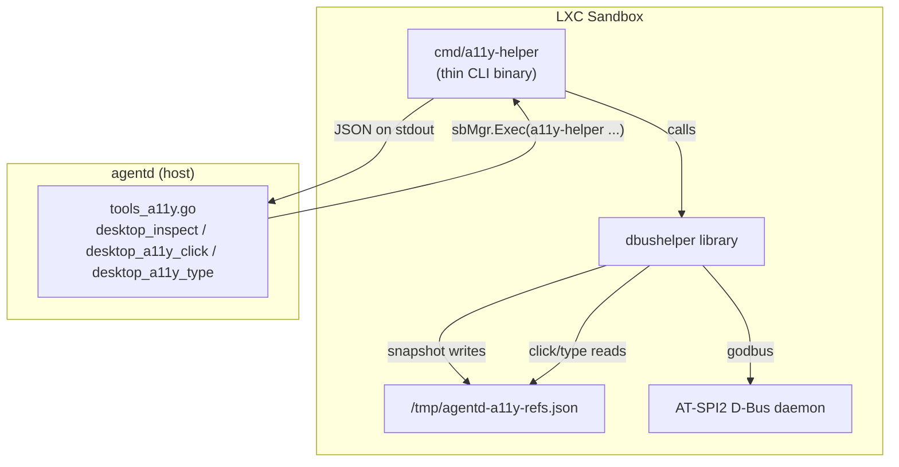
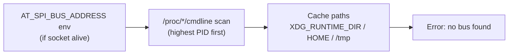

# dbushelper

Pure-Go client for the [AT-SPI2](https://gitlab.gnome.org/GNOME/at-spi2-core) accessibility D-Bus registry. Runs **inside** the agentd LXC sandbox and exposes the desktop accessibility tree to AI agents via structured JSON.

## Architecture



### Data flow

1. **agentd** calls `sbMgr.Exec("a11y-helper", "snapshot", "--limit", "300")` into the sandbox.
2. **a11y-helper** (the CLI) delegates to the **dbushelper** library.
3. The library discovers the AT-SPI bus address (env var → `/proc` scan → cache-path probe), connects via godbus, and walks the accessibility tree with an iterative DFS.
4. Accepted nodes are assigned short `eN` ref IDs and persisted to a refs file.
5. The CLI serializes the result as a single JSON object on stdout (exit 0) or prints diagnostics to stderr (exit 1).
6. For actions (`click`, `type`, `fill`), the library reads the refs file to resolve `eN` back to a `(bus_name, object_path)` pair and invokes the corresponding AT-SPI interface method.

### Bus discovery order



## Package layout

| File | Exports |
|------|---------|
| `conn.go` | `OpenBus`, `SocketAlive`, `DisplayNumber`, `CandidateCachePaths` |
| `atspi.go` | `RoleIsStructural`, `IsOnScreen`, role/state constants, AT-SPI interface wrappers |
| `snapshot.go` | `RunSnapshot`, `SnapshotOutput`, `SnapshotItem`, `Diagnostics`, `FormatLine` |
| `action.go` | `RunClick`, `RunType`, `RunFill`, `ActionOutput`, `Fallback`, `PreferredActionIndex` |
| `refs.go` | `RefEntry`, `WriteRefs`, `LookupRef`, `NormalizeRef`, `RefsPath` |
| `cmd/a11y-helper/main.go` | CLI binary — flag parsing, JSON serialization, exit codes |

The library has **no side effects** (no stdout, no `os.Exit`). JSON output and process lifecycle live exclusively in `cmd/a11y-helper/main.go`.

## Build

```bash
cd subpackage/dbushelper

# Library + CLI
go build ./...

# Unit tests (no D-Bus required)
go test ./...

# Static production binary
CGO_ENABLED=0 GOOS=linux GOARCH=amd64 \
  go build -trimpath -ldflags="-s -w" \
  -o agentd-a11y-helper ./cmd/a11y-helper
```

godbus is pure Go — `CGO_ENABLED=0` produces a fully static binary for any Linux distro.

## CLI usage

```
a11y-helper snapshot [--limit N]     # walk tree, emit JSON envelope
a11y-helper click <ref>              # AT-SPI DoAction on ref
a11y-helper type <ref> <text>        # InsertText at caret
a11y-helper fill <ref> <text>        # SetTextContents (replace all)
```

All subcommands print a single JSON object on stdout. Diagnostics go to stderr only.

## Release

The helper binary is distributed as a GitHub release asset, fetched on first `desktop_inspect` call by `install_a11y_helper_from_release` in the agentd install script.

**Asset naming contract** (must match the install script):

```
releases/download/<version>/agentd-a11y-helper-linux-<arch>-<version>
```

where `<arch>` ∈ {`amd64`, `arm64`}.

**To cut a release:**

1. Tag: `git tag v0.1.0 && git push origin v0.1.0`
2. The [`release`](../../.github/workflows/release.yml) workflow builds all artifacts automatically.
3. Update `AGENTD_A11Y_HELPER_VERSION` if needed.

Use `workflow_dispatch` for dry-run builds (upload step is skipped).

## AT-SPI coverage

| App class | Coverage |
|-----------|----------|
| GTK3 / GTK4 (XFCE, GNOME apps) | High |
| Chromium ≥ 90 / Electron | High (requires `--force-renderer-accessibility`) |
| Firefox | Likely works, untested |
| Qt5 / Qt6 | Requires `linuxaccessibility` plugin; not configured |
| LibreOffice | Pathological — truncated by `maxVisits=8000` |
| Raw X11 apps (xterm, Motif) | Invisible to AT-SPI; `xdotool` fallback used |
